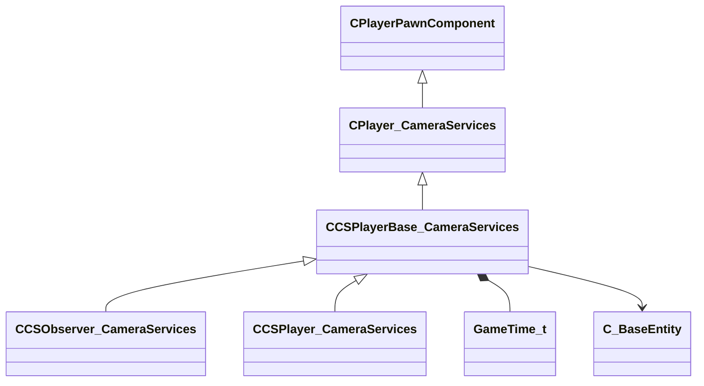

[Schemas](../../schemas.md) / [client](../client.md) / CCSPlayerBase_CameraServices

# CCSPlayerBase_CameraServices

**Kind:** class · **Size:** 680 bytes (`0x2a8`) · **Align:** 255 · **Module:** client

**Inherits from:** [CPlayer_CameraServices](../client/CPlayer_CameraServices.md)

**Derived by:** [CCSObserver_CameraServices](../client/CCSObserver_CameraServices.md), [CCSPlayer_CameraServices](../client/CCSPlayer_CameraServices.md)

**Relationships:**

## Memory layout

28 fields (6 declared here, 22 inherited). Offsets are absolute from the object base.

| Offset | Field | Type | From | Annotations |
|--------|-------|------|------|-------------|
| `0x8` | `__m_pChainEntity` | [CNetworkVarChainer](../entity2/CNetworkVarChainer.md) | [CPlayerPawnComponent](../server/CPlayerPawnComponent.md) | `MNotSaved` |
| `0x30` | `m_pComponentGraphController` | [CAnimGraphControllerPtr](../server/CAnimGraphControllerPtr.md) | [CPlayerPawnComponent](../server/CPlayerPawnComponent.md) |  |
| `0x48` | `m_vecCsViewPunchAngle` | QAngle | [CPlayer_CameraServices](../client/CPlayer_CameraServices.md) |  |
| `0x54` | `m_nCsViewPunchAngleTick` | [GameTick_t](../entity2/GameTick_t.md) | [CPlayer_CameraServices](../client/CPlayer_CameraServices.md) |  |
| `0x58` | `m_flCsViewPunchAngleTickRatio` | float32 | [CPlayer_CameraServices](../client/CPlayer_CameraServices.md) |  |
| `0x60` | `m_PlayerFog` | [C_fogplayerparams_t](../client/C_fogplayerparams_t.md) | [CPlayer_CameraServices](../client/CPlayer_CameraServices.md) |  |
| `0xa0` | `m_hColorCorrectionCtrl` | CHandle< [C_ColorCorrection](../client/C_ColorCorrection.md) > | [CPlayer_CameraServices](../client/CPlayer_CameraServices.md) |  |
| `0xa4` | `m_hViewEntity` | CHandle< [C_BaseEntity](../client/C_BaseEntity.md) > | [CPlayer_CameraServices](../client/CPlayer_CameraServices.md) |  |
| `0xa8` | `m_hTonemapController` | CHandle< [C_TonemapController2](../client/C_TonemapController2.md) > | [CPlayer_CameraServices](../client/CPlayer_CameraServices.md) |  |
| `0xb0` | `m_audio` | audioparams_t | [CPlayer_CameraServices](../client/CPlayer_CameraServices.md) |  |
| `0x128` | `m_PostProcessingVolumes` | C_NetworkUtlVectorBase< CHandle< [C_PostProcessingVolume](../client/C_PostProcessingVolume.md) > > | [CPlayer_CameraServices](../client/CPlayer_CameraServices.md) |  |
| `0x140` | `m_flOldPlayerZ` | float32 | [CPlayer_CameraServices](../client/CPlayer_CameraServices.md) |  |
| `0x144` | `m_flOldPlayerViewOffsetZ` | float32 | [CPlayer_CameraServices](../client/CPlayer_CameraServices.md) |  |
| `0x148` | `m_CurrentFog` | fogparams_t | [CPlayer_CameraServices](../client/CPlayer_CameraServices.md) |  |
| `0x1b0` | `m_hOldFogController` | CHandle< [C_FogController](../client/C_FogController.md) > | [CPlayer_CameraServices](../client/CPlayer_CameraServices.md) |  |
| `0x1b4` | `m_bOverrideFogColor` | bool[5] | [CPlayer_CameraServices](../client/CPlayer_CameraServices.md) |  |
| `0x1b9` | `m_OverrideFogColor` | Color[5] | [CPlayer_CameraServices](../client/CPlayer_CameraServices.md) |  |
| `0x1cd` | `m_bOverrideFogStartEnd` | bool[5] | [CPlayer_CameraServices](../client/CPlayer_CameraServices.md) |  |
| `0x1d4` | `m_fOverrideFogStart` | float32[5] | [CPlayer_CameraServices](../client/CPlayer_CameraServices.md) |  |
| `0x1e8` | `m_fOverrideFogEnd` | float32[5] | [CPlayer_CameraServices](../client/CPlayer_CameraServices.md) |  |
| `0x1fc` | `m_hActivePostProcessingVolume` | CHandle< [C_PostProcessingVolume](../client/C_PostProcessingVolume.md) > | [CPlayer_CameraServices](../client/CPlayer_CameraServices.md) |  |
| `0x200` | `m_angDemoViewAngles` | QAngle | [CPlayer_CameraServices](../client/CPlayer_CameraServices.md) |  |
| `0x290` | `m_iFOV` | uint32 |  |  |
| `0x294` | `m_iFOVStart` | uint32 |  |  |
| `0x298` | `m_flFOVTime` | [GameTime_t](../entity2/GameTime_t.md) |  |  |
| `0x29c` | `m_flFOVRate` | float32 |  |  |
| `0x2a0` | `m_hZoomOwner` | CHandle< [C_BaseEntity](../client/C_BaseEntity.md) > |  |  |
| `0x2a4` | `m_flLastShotFOV` | float32 |  |  |
