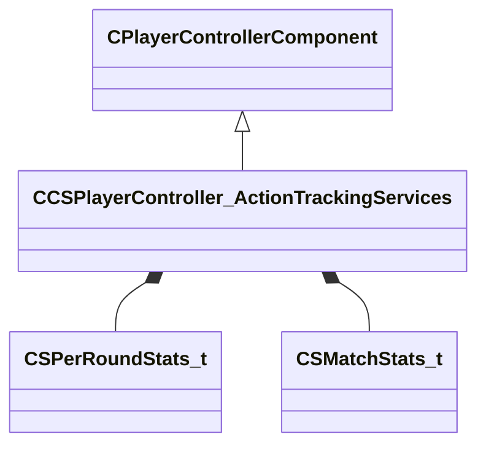

[Schemas](../../schemas.md) / [client](../client.md) / CCSPlayerController_ActionTrackingServices

# CCSPlayerController_ActionTrackingServices

> Source: **Build 25000182** · 2026-08-28 · `windows-x86_64` · schema `0.10.0`

Scoreboard / stat-tracking component of CCSPlayerController: per-round and per-match kill and damage statistics.

**Kind:** class · **Size:** 312 bytes (`0x138`) · **Align:** n/a (unspecified) · **Module:** client

**Twin:** [CCSPlayerController_ActionTrackingServices (server)](../server/CCSPlayerController_ActionTrackingServices.md)

**Inherits from:** [CPlayerControllerComponent](../server/CPlayerControllerComponent.md)

**Relationships:**

## Memory layout

6 fields (5 declared here, 1 inherited). Offsets are absolute from the object base.

| Offset | Field | Type | From | Annotations |
|--------|-------|------|------|-------------|
| `0x8` | `__m_pChainEntity` | [CNetworkVarChainer](../entity2/CNetworkVarChainer.md) | [CPlayerControllerComponent](../server/CPlayerControllerComponent.md) | `MNotSaved` |
| `0x40` | `m_perRoundStats` | C_UtlVectorEmbeddedNetworkVar< [CSPerRoundStats_t](../client/CSPerRoundStats_t.md) > |  | List of per-round statistics accumulated over the match. |
| `0xa8` | `m_matchStats` | [CSMatchStats_t](../client/CSMatchStats_t.md) |  | Aggregated per-match statistics for this player. |
| `0x128` | `m_iNumRoundKills` | int32 |  | Kills this player has scored in the current round. |
| `0x12c` | `m_iNumRoundKillsHeadshots` | int32 |  | Headshot kills this player has scored in the current round. |
| `0x130` | `m_flTotalRoundDamageDealt` | float32 |  | Total damage this player has dealt in the current round. |
