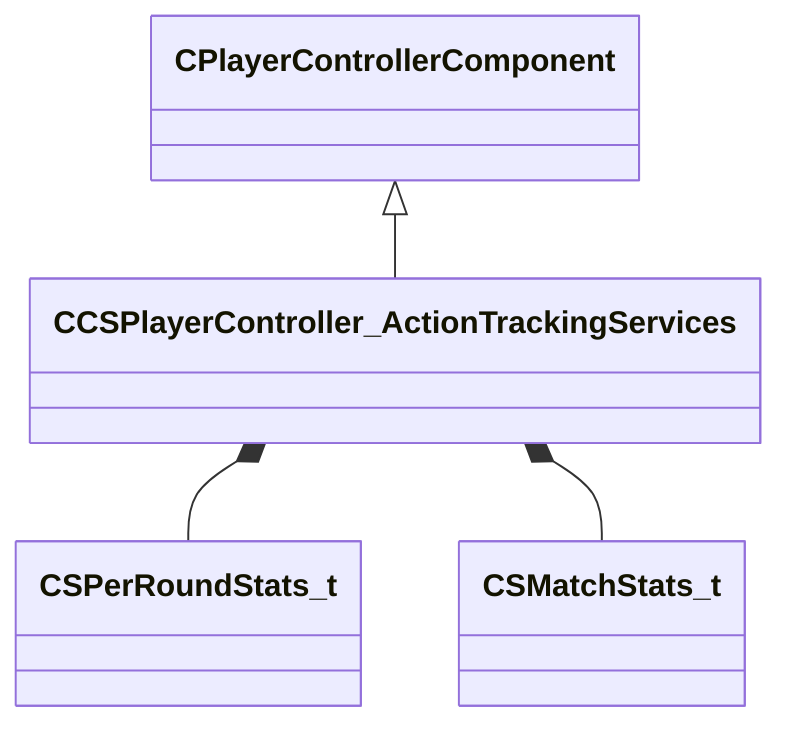

[Schemas](../../schemas.md) / [client](../client.md) / CCSPlayerController_ActionTrackingServices

# CCSPlayerController_ActionTrackingServices

**Kind:** class · **Size:** 312 bytes (`0x138`) · **Align:** 255 · **Module:** client

**Inherits from:** [CPlayerControllerComponent](../server/CPlayerControllerComponent.md)

**Relationships:**

## Memory layout

6 fields (5 declared here, 1 inherited). Offsets are absolute from the object base.

| Offset | Field | Type | From | Annotations |
|--------|-------|------|------|-------------|
| `0x8` | `__m_pChainEntity` | [CNetworkVarChainer](../entity2/CNetworkVarChainer.md) | [CPlayerControllerComponent](../server/CPlayerControllerComponent.md) | `MNotSaved` |
| `0x40` | `m_perRoundStats` | C_UtlVectorEmbeddedNetworkVar< [CSPerRoundStats_t](../client/CSPerRoundStats_t.md) > |  |  |
| `0xa8` | `m_matchStats` | [CSMatchStats_t](../client/CSMatchStats_t.md) |  |  |
| `0x128` | `m_iNumRoundKills` | int32 |  |  |
| `0x12c` | `m_iNumRoundKillsHeadshots` | int32 |  |  |
| `0x130` | `m_flTotalRoundDamageDealt` | float32 |  |  |
