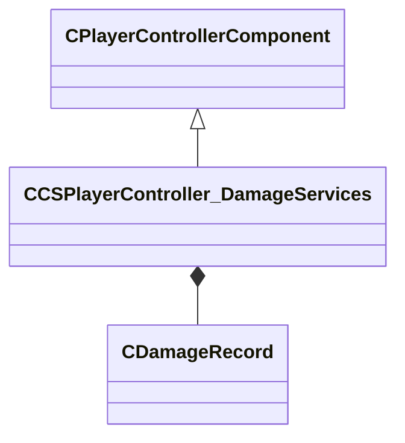

[Schemas](../../schemas.md) / [client](../client.md) / CCSPlayerController_DamageServices

# CCSPlayerController_DamageServices

> Source: **Build 25000182** · 2026-08-28 · `windows-x86_64` · schema `0.10.0`

Damage-log component of CCSPlayerController, backing the end-of-round 'damage given / taken' report.

**Kind:** class · **Size:** 176 bytes (`0xb0`) · **Align:** n/a (unspecified) · **Module:** client

**Twin:** [CCSPlayerController_DamageServices (server)](../server/CCSPlayerController_DamageServices.md)

**Inherits from:** [CPlayerControllerComponent](../server/CPlayerControllerComponent.md)

**Relationships:**

## Memory layout

3 fields (2 declared here, 1 inherited). Offsets are absolute from the object base.

| Offset | Field | Type | From | Annotations |
|--------|-------|------|------|-------------|
| `0x8` | `__m_pChainEntity` | [CNetworkVarChainer](../entity2/CNetworkVarChainer.md) | [CPlayerControllerComponent](../server/CPlayerControllerComponent.md) | `MNotSaved` |
| `0x40` | `m_nSendUpdate` | int32 |  |  |
| `0x48` | `m_DamageList` | C_UtlVectorEmbeddedNetworkVar< [CDamageRecord](../client/CDamageRecord.md) > |  | Per-opponent damage records shown on the round-end damage report. |
