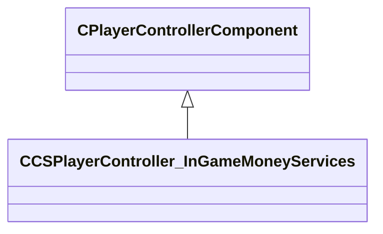

[Schemas](../../schemas.md) / [client](../client.md) / CCSPlayerController_InGameMoneyServices

# CCSPlayerController_InGameMoneyServices

**Kind:** class · **Size:** 80 bytes (`0x50`) · **Align:** 255 · **Module:** client

**Inherits from:** [CPlayerControllerComponent](../server/CPlayerControllerComponent.md)

**Relationships:**

## Memory layout

5 fields (4 declared here, 1 inherited). Offsets are absolute from the object base.

| Offset | Field | Type | From | Annotations |
|--------|-------|------|------|-------------|
| `0x8` | `__m_pChainEntity` | [CNetworkVarChainer](../entity2/CNetworkVarChainer.md) | [CPlayerControllerComponent](../server/CPlayerControllerComponent.md) | `MNotSaved` |
| `0x40` | `m_iAccount` | int32 |  |  |
| `0x44` | `m_iStartAccount` | int32 |  |  |
| `0x48` | `m_iTotalCashSpent` | int32 |  |  |
| `0x4c` | `m_iCashSpentThisRound` | int32 |  |  |
