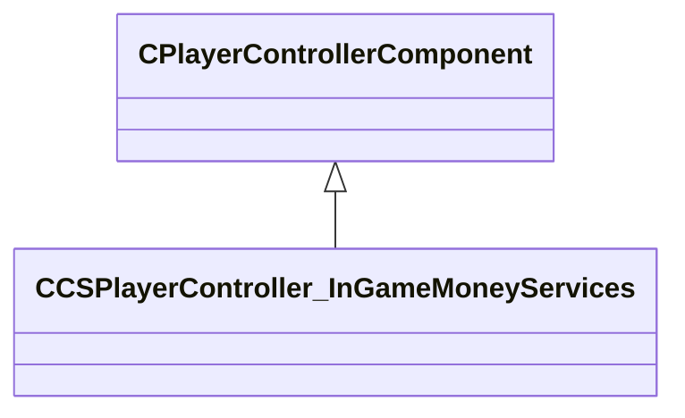

[Schemas](../../schemas.md) / [client](../client.md) / CCSPlayerController_InGameMoneyServices

# CCSPlayerController_InGameMoneyServices

> Source: **Build 25000182** · 2026-08-28 · `windows-x86_64` · schema `0.10.0`

Economy component of CCSPlayerController: the player's buy-menu balance and cash-spend accounting.

**Kind:** class · **Size:** 80 bytes (`0x50`) · **Align:** n/a (unspecified) · **Module:** client

**Twin:** [CCSPlayerController_InGameMoneyServices (server)](../server/CCSPlayerController_InGameMoneyServices.md)

**Inherits from:** [CPlayerControllerComponent](../server/CPlayerControllerComponent.md)

**Relationships:**

## Memory layout

5 fields (4 declared here, 1 inherited). Offsets are absolute from the object base.

| Offset | Field | Type | From | Annotations |
|--------|-------|------|------|-------------|
| `0x8` | `__m_pChainEntity` | [CNetworkVarChainer](../entity2/CNetworkVarChainer.md) | [CPlayerControllerComponent](../server/CPlayerControllerComponent.md) | `MNotSaved` |
| `0x40` | `m_iAccount` | int32 |  | Current in-game money (buy-menu balance), in dollars. |
| `0x44` | `m_iStartAccount` | int32 |  | Money the player held at the start of the current round. |
| `0x48` | `m_iTotalCashSpent` | int32 |  | Cumulative money the player has spent across the whole match. |
| `0x4c` | `m_iCashSpentThisRound` | int32 |  | Money spent so far in the current round. |
