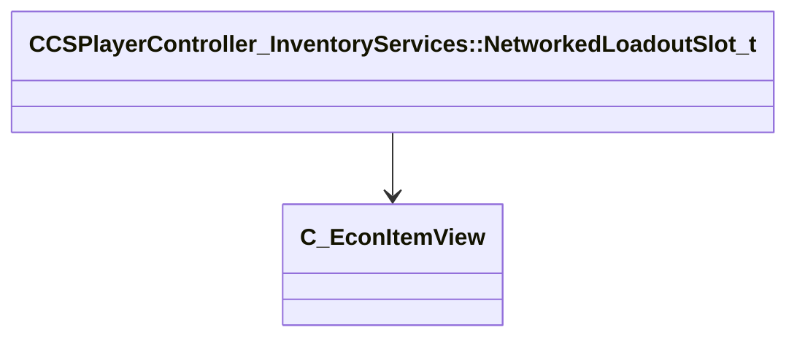

[Schemas](../../schemas.md) / [client](../client.md) / CCSPlayerController_InventoryServices::NetworkedLoadoutSlot_t

# CCSPlayerController_InventoryServices::NetworkedLoadoutSlot_t

> Source: **Build 25000182** · 2026-08-28 · `windows-x86_64` · schema `0.10.0`

**Kind:** class · **Size:** 200 bytes (`0xc8`) · **Align:** n/a (unspecified) · **Module:** client

**Twin:** [CCSPlayerController_InventoryServices::NetworkedLoadoutSlot_t (server)](../server/CCSPlayerController_InventoryServices.NetworkedLoadoutSlot_t.md)

**Relationships:**

## Memory layout

3 fields (3 declared here, 0 inherited). Offsets are absolute from the object base.

| Offset | Field | Type | From | Annotations |
|--------|-------|------|------|-------------|
| `0x0` | `pItem` | [C_EconItemView](../client/C_EconItemView.md)* |  |  |
| `0x8` | `team` | uint16 |  |  |
| `0xa` | `slot` | uint16 |  |  |
