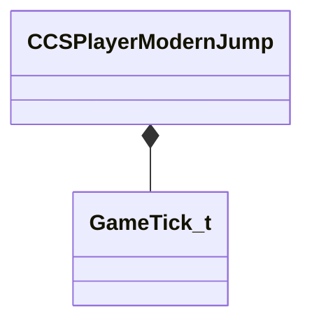

[Schemas](../../schemas.md) / [client](../client.md) / CCSPlayerModernJump

# CCSPlayerModernJump

**Kind:** class · **Size:** 56 bytes (`0x38`) · **Align:** 255 · **Module:** client

**Relationships:**

## Memory layout

9 fields (9 declared here, 0 inherited). Offsets are absolute from the object base.

| Offset | Field | Type | From | Annotations |
|--------|-------|------|------|-------------|
| `0x10` | `m_nLastActualJumpPressTick` | [GameTick_t](../entity2/GameTick_t.md) |  |  |
| `0x14` | `m_flLastActualJumpPressFrac` | float32 |  |  |
| `0x18` | `m_nLastUsableJumpPressTick` | [GameTick_t](../entity2/GameTick_t.md) |  |  |
| `0x1c` | `m_flLastUsableJumpPressFrac` | float32 |  |  |
| `0x20` | `m_nLastLandedTick` | [GameTick_t](../entity2/GameTick_t.md) |  |  |
| `0x24` | `m_flLastLandedFrac` | float32 |  |  |
| `0x28` | `m_flLastLandedVelocityX` | float32 |  |  |
| `0x2c` | `m_flLastLandedVelocityY` | float32 |  |  |
| `0x30` | `m_flLastLandedVelocityZ` | float32 |  |  |
