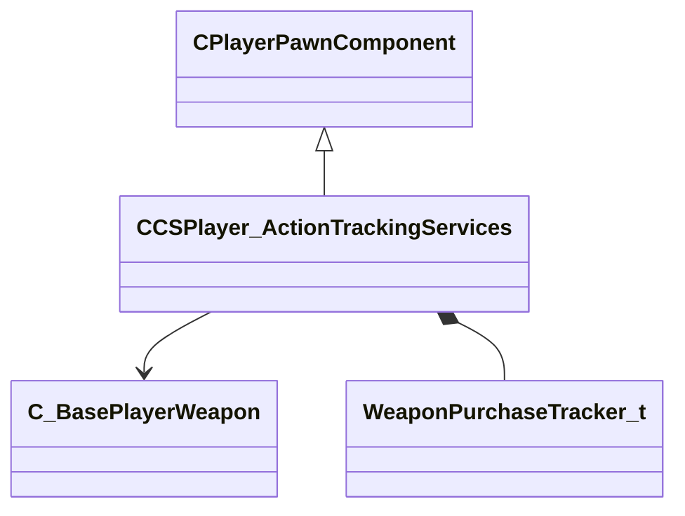

[Schemas](../../schemas.md) / [client](../client.md) / CCSPlayer_ActionTrackingServices

# CCSPlayer_ActionTrackingServices

> Source: **Build 25000182** · 2026-08-28 · `windows-x86_64` · schema `0.10.0`

Component tracking scoring-relevant actions: weapon purchases and hostage rescue status.

**Kind:** class · **Size:** 304 bytes (`0x130`) · **Align:** n/a (unspecified) · **Module:** client

**Twin:** [CCSPlayer_ActionTrackingServices (server)](../server/CCSPlayer_ActionTrackingServices.md)

**Inherits from:** [CPlayerPawnComponent](../server/CPlayerPawnComponent.md)

**Relationships:**

## Memory layout

6 fields (4 declared here, 2 inherited). Offsets are absolute from the object base.

| Offset | Field | Type | From | Annotations |
|--------|-------|------|------|-------------|
| `0x8` | `__m_pChainEntity` | [CNetworkVarChainer](../entity2/CNetworkVarChainer.md) | [CPlayerPawnComponent](../server/CPlayerPawnComponent.md) | `MNotSaved` |
| `0x30` | `m_pComponentGraphController` | [CAnimGraphControllerPtr](../server/CAnimGraphControllerPtr.md) | [CPlayerPawnComponent](../server/CPlayerPawnComponent.md) |  |
| `0x48` | `m_hLastWeaponBeforeC4AutoSwitch` | CHandle< [C_BasePlayerWeapon](../client/C_BasePlayerWeapon.md) > |  |  |
| `0x4c` | `m_bIsRescuing` | bool |  | True while the player is escorting a hostage to the rescue zone. |
| `0x50` | `m_weaponPurchasesThisMatch` | [WeaponPurchaseTracker_t](../client/WeaponPurchaseTracker_t.md) |  | WeaponPurchaseTracker_t recording which weapons were bought during the match (used for match-stats). |
| `0xc0` | `m_weaponPurchasesThisRound` | [WeaponPurchaseTracker_t](../client/WeaponPurchaseTracker_t.md) |  | WeaponPurchaseTracker_t recording which weapons were bought this round (used for in-round stats and economy tracking). |
