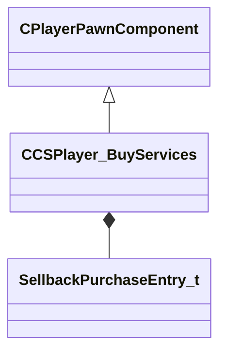

[Schemas](../../schemas.md) / [client](../client.md) / CCSPlayer_BuyServices

# CCSPlayer_BuyServices

Component that records the player's sellback-eligible purchases for the current round.

**Kind:** class · **Size:** 176 bytes (`0xb0`) · **Align:** 255 · **Module:** client

**Inherits from:** [CPlayerPawnComponent](../server/CPlayerPawnComponent.md)

**Relationships:**

## Memory layout

3 fields (1 declared here, 2 inherited). Offsets are absolute from the object base.

| Offset | Field | Type | From | Annotations |
|--------|-------|------|------|-------------|
| `0x8` | `__m_pChainEntity` | [CNetworkVarChainer](../entity2/CNetworkVarChainer.md) | [CPlayerPawnComponent](../server/CPlayerPawnComponent.md) | `MNotSaved` |
| `0x30` | `m_pComponentGraphController` | [CAnimGraphControllerPtr](../server/CAnimGraphControllerPtr.md) | [CPlayerPawnComponent](../server/CPlayerPawnComponent.md) |  |
| `0x48` | `m_vecSellbackPurchaseEntries` | C_UtlVectorEmbeddedNetworkVar< [SellbackPurchaseEntry_t](../client/SellbackPurchaseEntry_t.md) > |  | Vector of SellbackPurchaseEntry_t structs; each entry represents a weapon or equipment purchase that can still be sold back before freeze time expires. |
