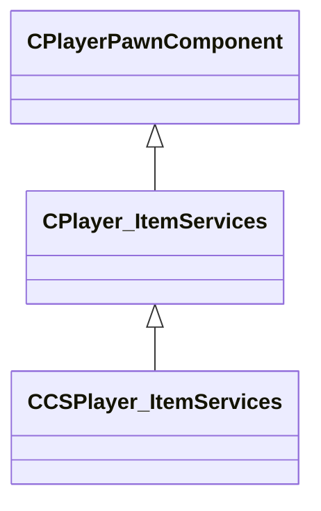

[Schemas](../../schemas.md) / [client](../client.md) / CCSPlayer_ItemServices

# CCSPlayer_ItemServices

Component tracking the utility items the player is carrying.

**Kind:** class · **Size:** 80 bytes (`0x50`) · **Align:** 255 · **Module:** client

**Inherits from:** [CPlayer_ItemServices](../client/CPlayer_ItemServices.md)

**Relationships:**

## Memory layout

4 fields (2 declared here, 2 inherited). Offsets are absolute from the object base.

| Offset | Field | Type | From | Annotations |
|--------|-------|------|------|-------------|
| `0x8` | `__m_pChainEntity` | [CNetworkVarChainer](../entity2/CNetworkVarChainer.md) | [CPlayerPawnComponent](../server/CPlayerPawnComponent.md) | `MNotSaved` |
| `0x30` | `m_pComponentGraphController` | [CAnimGraphControllerPtr](../server/CAnimGraphControllerPtr.md) | [CPlayerPawnComponent](../server/CPlayerPawnComponent.md) |  |
| `0x48` | `m_bHasDefuser` | bool |  | True while the player carries a defuse kit. |
| `0x49` | `m_bHasHelmet` | bool |  | True while the player is wearing a helmet (Kevlar + Helmet). |
