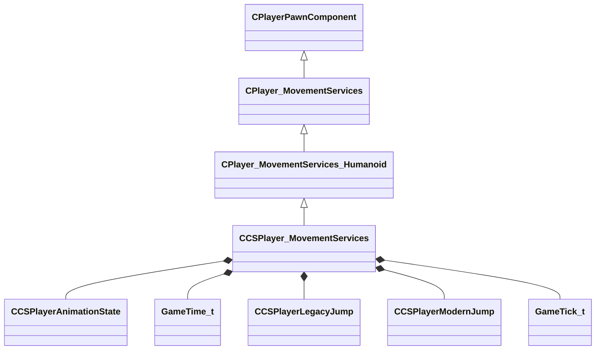

[Schemas](../../schemas.md) / [client](../client.md) / CCSPlayer_MovementServices

# CCSPlayer_MovementServices

**Kind:** class · **Size:** 4064 bytes (`0xfe0`) · **Align:** 255 · **Module:** client

**Inherits from:** [CPlayer_MovementServices_Humanoid](../client/CPlayer_MovementServices_Humanoid.md)

**Relationships:**

## Memory layout

75 fields (49 declared here, 26 inherited). Offsets are absolute from the object base.

| Offset | Field | Type | From | Annotations |
|--------|-------|------|------|-------------|
| `0x8` | `__m_pChainEntity` | [CNetworkVarChainer](../entity2/CNetworkVarChainer.md) | [CPlayerPawnComponent](../server/CPlayerPawnComponent.md) | `MNotSaved` |
| `0x30` | `m_pComponentGraphController` | [CAnimGraphControllerPtr](../server/CAnimGraphControllerPtr.md) | [CPlayerPawnComponent](../server/CPlayerPawnComponent.md) |  |
| `0x48` | `m_nImpulse` | int32 | [CPlayer_MovementServices](../client/CPlayer_MovementServices.md) |  |
| `0x50` | `m_nButtons` | [CInButtonState](../server/CInButtonState.md) | [CPlayer_MovementServices](../client/CPlayer_MovementServices.md) | `MNotSaved` |
| `0x70` | `m_nQueuedButtonDownMask` | uint64 | [CPlayer_MovementServices](../client/CPlayer_MovementServices.md) |  |
| `0x78` | `m_nQueuedButtonChangeMask` | uint64 | [CPlayer_MovementServices](../client/CPlayer_MovementServices.md) |  |
| `0x80` | `m_nButtonDoublePressed` | uint64 | [CPlayer_MovementServices](../client/CPlayer_MovementServices.md) |  |
| `0x88` | `m_pButtonPressedCmdNumber` | uint32[64] | [CPlayer_MovementServices](../client/CPlayer_MovementServices.md) | `MNotSaved` |
| `0x188` | `m_nLastCommandNumberProcessed` | uint32 | [CPlayer_MovementServices](../client/CPlayer_MovementServices.md) | `MNotSaved` |
| `0x190` | `m_nToggleButtonDownMask` | uint64 | [CPlayer_MovementServices](../client/CPlayer_MovementServices.md) |  |
| `0x1a0` | `m_flCmdForwardMove` | float32 | [CPlayer_MovementServices](../client/CPlayer_MovementServices.md) |  |
| `0x1a4` | `m_flCmdLeftMove` | float32 | [CPlayer_MovementServices](../client/CPlayer_MovementServices.md) |  |
| `0x1a8` | `m_flCmdUpMove` | float32 | [CPlayer_MovementServices](../client/CPlayer_MovementServices.md) |  |
| `0x1ac` | `m_flMaxspeed` | float32 | [CPlayer_MovementServices](../client/CPlayer_MovementServices.md) |  |
| `0x1b0` | `m_arrForceSubtickMoveWhen` | float32[4] | [CPlayer_MovementServices](../client/CPlayer_MovementServices.md) |  |
| `0x1c0` | `m_flForwardMove` | float32 | [CPlayer_MovementServices](../client/CPlayer_MovementServices.md) |  |
| `0x1c4` | `m_flLeftMove` | float32 | [CPlayer_MovementServices](../client/CPlayer_MovementServices.md) |  |
| `0x1c8` | `m_flUpMove` | float32 | [CPlayer_MovementServices](../client/CPlayer_MovementServices.md) |  |
| `0x1cc` | `m_vecLastMovementImpulses` | Vector | [CPlayer_MovementServices](../client/CPlayer_MovementServices.md) |  |
| `0x240` | `m_vecOldViewAngles` | QAngle | [CPlayer_MovementServices](../client/CPlayer_MovementServices.md) |  |
| `0x258` | `m_flStepSoundTime` | float32 | [CPlayer_MovementServices_Humanoid](../client/CPlayer_MovementServices_Humanoid.md) |  |
| `0x25c` | `m_flFallVelocity` | float32 | [CPlayer_MovementServices_Humanoid](../client/CPlayer_MovementServices_Humanoid.md) |  |
| `0x260` | `m_groundNormal` | Vector | [CPlayer_MovementServices_Humanoid](../client/CPlayer_MovementServices_Humanoid.md) | `MNotSaved` |
| `0x26c` | `m_flSurfaceFriction` | float32 | [CPlayer_MovementServices_Humanoid](../client/CPlayer_MovementServices_Humanoid.md) |  |
| `0x270` | `m_surfaceProps` | CUtlStringToken | [CPlayer_MovementServices_Humanoid](../client/CPlayer_MovementServices_Humanoid.md) | `MNotSaved` |
| `0x280` | `m_nStepside` | int32 | [CPlayer_MovementServices_Humanoid](../client/CPlayer_MovementServices_Humanoid.md) |  |
| `0x310` | `m_AnimationState` | [CCSPlayerAnimationState](../server/CCSPlayerAnimationState.md) |  |  |
| `0x3f0` | `m_bUsingGroundTopologyOffset` | bool |  |  |
| `0x3f4` | `m_flUsingGroundTopologyOffsetTransitionSmoothing` | float32 |  |  |
| `0x3f8` | `m_vecLadderNormal` | Vector |  |  |
| `0x404` | `m_nLadderSurfacePropIndex` | int32 |  |  |
| `0x408` | `m_bDucked` | bool |  |  |
| `0x40c` | `m_flDuckAmount` | float32 |  |  |
| `0x410` | `m_flDuckSpeed` | float32 |  |  |
| `0x414` | `m_bDuckOverride` | bool |  |  |
| `0x415` | `m_bDesiresDuck` | bool |  |  |
| `0x416` | `m_bDucking` | bool |  |  |
| `0x418` | `m_flDuckRootOffset` | float32 |  |  |
| `0x41c` | `m_flDuckViewOffset` | float32 |  |  |
| `0x420` | `m_flLastDuckTime` | float32 |  |  |
| `0x424` | `m_flBombPlantViewOffset` | float32 |  |  |
| `0x430` | `m_vecLastPositionAtFullCrouchSpeed` | Vector2D |  |  |
| `0x438` | `m_duckUntilOnGround` | bool |  |  |
| `0x439` | `m_bHasWalkMovedSinceLastJump` | bool |  |  |
| `0x43a` | `m_bInStuckTest` | bool |  |  |
| `0x648` | `m_nTraceCount` | int32 |  |  |
| `0x64c` | `m_StuckLast` | int32 |  |  |
| `0x650` | `m_bSpeedCropped` | bool |  |  |
| `0x654` | `m_nOldWaterLevel` | int32 |  |  |
| `0x658` | `m_flWaterEntryTime` | float32 |  |  |
| `0x65c` | `m_vecForward` | Vector |  |  |
| `0x668` | `m_vecLeft` | Vector |  |  |
| `0x674` | `m_vecUp` | Vector |  |  |
| `0x680` | `m_nGameCodeHasMovedPlayerAfterCommand` | int32 |  |  |
| `0x684` | `m_fStashGrenadeParameterWhen` | [GameTime_t](../entity2/GameTime_t.md) |  |  |
| `0x688` | `m_bUseFrictionStashedSpeed` | bool |  |  |
| `0x68c` | `m_flUseFrictionStashedSpeedUntilFrac` | float32 |  |  |
| `0x690` | `m_flFrictionStashedSpeed` | float32 |  |  |
| `0x694` | `m_flStamina` | float32 |  |  |
| `0x698` | `m_flHeightAtJumpStart` | float32 |  |  |
| `0x69c` | `m_flMaxJumpHeightThisJump` | float32 |  |  |
| `0x6a0` | `m_flMaxJumpHeightLastJump` | float32 |  |  |
| `0x6a4` | `m_flStaminaAtJumpStart` | float32 |  |  |
| `0x6a8` | `m_flVelMulAtJumpStart` | float32 |  |  |
| `0x6ac` | `m_flAccumulatedJumpError` | float32 |  |  |
| `0x6b0` | `m_LegacyJump` | [CCSPlayerLegacyJump](../client/CCSPlayerLegacyJump.md) |  |  |
| `0x6c8` | `m_ModernJump` | [CCSPlayerModernJump](../client/CCSPlayerModernJump.md) |  |  |
| `0x700` | `m_nLastJumpTick` | [GameTick_t](../entity2/GameTick_t.md) |  |  |
| `0x704` | `m_flLastJumpFrac` | float32 |  |  |
| `0x708` | `m_flLastJumpVelocityZ` | float32 |  |  |
| `0x70c` | `m_bJumpApexPending` | bool |  |  |
| `0x710` | `m_flTicksSinceLastSurfingDetected` | float32 |  |  |
| `0x714` | `m_bWasSurfing` | bool |  |  |
| `0x7a4` | `m_vecWalkWishVel` | Vector2D |  |  |
| `0xfd0` | `m_bHasEverProcessedCommand` | bool |  |  |
