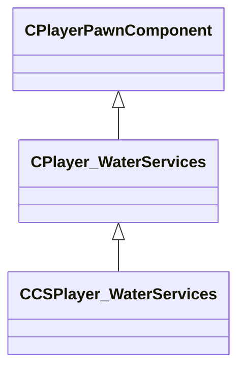

[Schemas](../../schemas.md) / [client](../client.md) / CCSPlayer_WaterServices

# CCSPlayer_WaterServices

> Source: **Build 25000182** · 2026-08-28 · `windows-x86_64` · schema `0.10.0`

**Kind:** class · **Size:** 112 bytes (`0x70`) · **Align:** n/a (unspecified) · **Module:** client

**Twin:** [CCSPlayer_WaterServices (server)](../server/CCSPlayer_WaterServices.md)

**Inherits from:** [CPlayer_WaterServices](../client/CPlayer_WaterServices.md)

**Relationships:**

## Memory layout

5 fields (3 declared here, 2 inherited). Offsets are absolute from the object base.

| Offset | Field | Type | From | Annotations |
|--------|-------|------|------|-------------|
| `0x8` | `__m_pChainEntity` | [CNetworkVarChainer](../entity2/CNetworkVarChainer.md) | [CPlayerPawnComponent](../server/CPlayerPawnComponent.md) | `MNotSaved` |
| `0x30` | `m_pComponentGraphController` | [CAnimGraphControllerPtr](../server/CAnimGraphControllerPtr.md) | [CPlayerPawnComponent](../server/CPlayerPawnComponent.md) |  |
| `0x48` | `m_flWaterJumpTime` | float32 |  |  |
| `0x4c` | `m_vecWaterJumpVel` | Vector |  |  |
| `0x58` | `m_flSwimSoundTime` | float32 |  |  |
