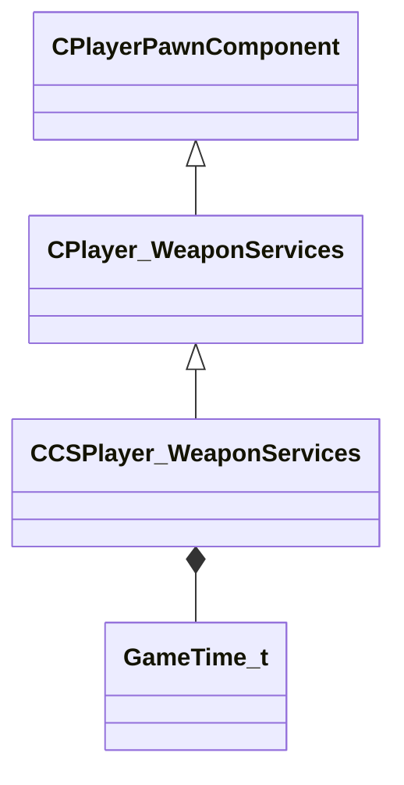

[Schemas](../../schemas.md) / [client](../client.md) / CCSPlayer_WeaponServices

# CCSPlayer_WeaponServices

> Source: **Build 25000182** · 2026-08-28 · `windows-x86_64` · schema `0.10.0`

Component attached to CCSPlayerPawn that manages the active weapon and weapon-switch timing for a CS2 player.

**Kind:** class · **Size:** 5584 bytes (`0x15d0`) · **Align:** n/a (unspecified) · **Module:** client

**Twin:** [CCSPlayer_WeaponServices (server)](../server/CCSPlayer_WeaponServices.md)

**Inherits from:** [CPlayer_WeaponServices](../client/CPlayer_WeaponServices.md)

**Relationships:**

## Memory layout

11 fields (5 declared here, 6 inherited). Offsets are absolute from the object base.

| Offset | Field | Type | From | Annotations |
|--------|-------|------|------|-------------|
| `0x8` | `__m_pChainEntity` | [CNetworkVarChainer](../entity2/CNetworkVarChainer.md) | [CPlayerPawnComponent](../server/CPlayerPawnComponent.md) | `MNotSaved` |
| `0x30` | `m_pComponentGraphController` | [CAnimGraphControllerPtr](../server/CAnimGraphControllerPtr.md) | [CPlayerPawnComponent](../server/CPlayerPawnComponent.md) |  |
| `0x48` | `m_hMyWeapons` | C_NetworkUtlVectorBase< CHandle< [C_BasePlayerWeapon](../client/C_BasePlayerWeapon.md) > > | [CPlayer_WeaponServices](../client/CPlayer_WeaponServices.md) |  |
| `0x60` | `m_hActiveWeapon` | CHandle< [C_BasePlayerWeapon](../client/C_BasePlayerWeapon.md) > | [CPlayer_WeaponServices](../client/CPlayer_WeaponServices.md) |  |
| `0x64` | `m_hLastWeapon` | CHandle< [C_BasePlayerWeapon](../client/C_BasePlayerWeapon.md) > | [CPlayer_WeaponServices](../client/CPlayer_WeaponServices.md) |  |
| `0x68` | `m_iAmmo` | uint16[32] | [CPlayer_WeaponServices](../client/CPlayer_WeaponServices.md) |  |
| `0xd0` | `m_flNextAttack` | [GameTime_t](../entity2/GameTime_t.md) |  | GameTime before which no weapon switch is permitted (e.g. after throwing a grenade). *Only sent to the owning player (LocalPlayerExclusive).* |
| `0xd4` | `m_nOldTotalShootPositionHistoryCount` | uint32 |  |  |
| `0x370` | `m_nOldTotalInputHistoryCount` | uint32 |  |  |
| `0x1588` | `m_networkAnimTiming` | C_NetworkUtlVectorBase< uint8 > |  | Byte array encoding animation transition timing for the active weapon, used to synchronise viewmodel animations across client and server. |
| `0x15a0` | `m_bBlockInspectUntilNextGraphUpdate` | bool |  | True when the inspect animation is suppressed until the animation graph ticks again (prevents stutter). |
