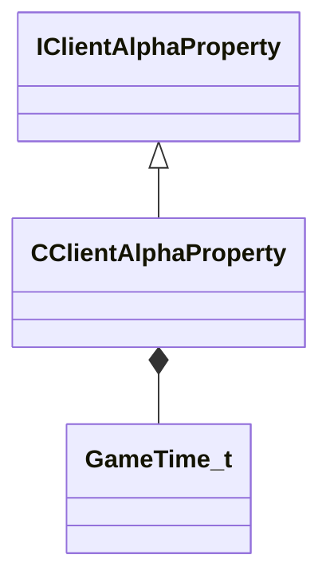

[Schemas](../../schemas.md) / [client](../client.md) / CClientAlphaProperty

# CClientAlphaProperty

**Kind:** class · **Size:** 48 bytes (`0x30`) · **Align:** 16 · **Module:** client

**Inherits from:** [IClientAlphaProperty](../client/IClientAlphaProperty.md)

**Relationships:**

## Memory layout

11 fields (11 declared here, 0 inherited). Offsets are absolute from the object base.

| Offset | Field | Type | From | Annotations |
|--------|-------|------|------|-------------|
| `0x0` | `m_bAlphaOverride` | bitfield:1 |  |  |
| `0x0` | `m_bShadowAlphaOverride` | bitfield:1 |  |  |
| `0x0` | `m_nDesyncOffset` | bitfield:14 |  |  |
| `0x0` | `m_nRenderFX` | bitfield:5 |  |  |
| `0x0` | `m_nRenderMode` | bitfield:3 |  |  |
| `0x10` | `m_nDistFadeStart` | uint16 |  |  |
| `0x12` | `m_nDistFadeEnd` | uint16 |  |  |
| `0x17` | `m_nAlpha` | uint8 |  |  |
| `0x18` | `m_flFadeScale` | float32 |  |  |
| `0x1c` | `m_flRenderFxStartTime` | [GameTime_t](../entity2/GameTime_t.md) |  |  |
| `0x20` | `m_flRenderFxDuration` | float32 |  |  |

KV3 class defaults

<pre>{
	&quot;_class&quot;: &quot;CClientAlphaProperty&quot;,
	&quot;m_nDistFadeStart&quot;: 0,
	&quot;m_nDistFadeEnd&quot;: 0,
	&quot;m_nDesyncOffset&quot;: 0,
	&quot;m_bAlphaOverride&quot;: 0,
	&quot;m_bShadowAlphaOverride&quot;: 0,
	&quot;m_nRenderMode&quot;: 0,
	&quot;m_nRenderFX&quot;: 0,
	&quot;m_nAlpha&quot;: 255,
	&quot;m_flFadeScale&quot;: 0.000000,
	&quot;m_flRenderFxStartTime&quot;: null,
	&quot;m_flRenderFxDuration&quot;: 0.000000
}</pre>

