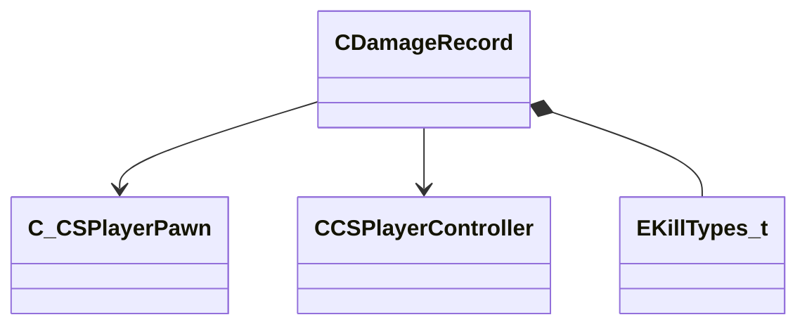

[Schemas](../../schemas.md) / [client](../client.md) / CDamageRecord

# CDamageRecord

**Kind:** class · **Size:** 120 bytes (`0x78`) · **Align:** 255 · **Module:** client

**Relationships:**

## Memory layout

15 fields (15 declared here, 0 inherited). Offsets are absolute from the object base.

| Offset | Field | Type | From | Annotations |
|--------|-------|------|------|-------------|
| `0x30` | `m_PlayerDamager` | CHandle< [C_CSPlayerPawn](../client/C_CSPlayerPawn.md) > |  |  |
| `0x34` | `m_PlayerRecipient` | CHandle< [C_CSPlayerPawn](../client/C_CSPlayerPawn.md) > |  |  |
| `0x38` | `m_hPlayerControllerDamager` | CHandle< [CCSPlayerController](../client/CCSPlayerController.md) > |  |  |
| `0x3c` | `m_hPlayerControllerRecipient` | CHandle< [CCSPlayerController](../client/CCSPlayerController.md) > |  |  |
| `0x40` | `m_szPlayerDamagerName` | CUtlString |  |  |
| `0x48` | `m_szPlayerRecipientName` | CUtlString |  |  |
| `0x50` | `m_DamagerXuid` | uint64 |  |  |
| `0x58` | `m_RecipientXuid` | uint64 |  |  |
| `0x60` | `m_flBulletsDamage` | float32 |  |  |
| `0x64` | `m_flDamage` | float32 |  |  |
| `0x68` | `m_flActualHealthRemoved` | float32 |  |  |
| `0x6c` | `m_iNumHits` | int32 |  |  |
| `0x70` | `m_iLastBulletUpdate` | int32 |  |  |
| `0x74` | `m_bIsOtherEnemy` | bool |  |  |
| `0x75` | `m_killType` | [EKillTypes_t](../!GlobalTypes/EKillTypes_t.md) |  |  |
