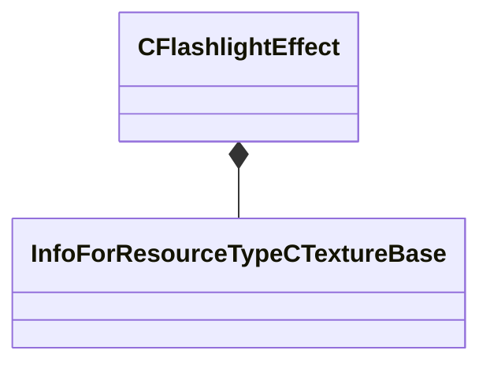

[Schemas](../../schemas.md) / [client](../client.md) / CFlashlightEffect

# CFlashlightEffect

**Kind:** class · **Size:** 736 bytes (`0x2e0`) · **Align:** 255 · **Module:** client

**Relationships:**

## Memory layout

13 fields (13 declared here, 0 inherited). Offsets are absolute from the object base.

| Offset | Field | Type | From | Annotations |
|--------|-------|------|------|-------------|
| `0x10` | `m_bIsOn` | bool |  |  |
| `0x20` | `m_bMuzzleFlashEnabled` | bool |  |  |
| `0x24` | `m_flMuzzleFlashBrightness` | float32 |  |  |
| `0x30` | `m_quatMuzzleFlashOrientation` | Quaternion |  |  |
| `0x40` | `m_vecMuzzleFlashOrigin` | VectorWS |  |  |
| `0x4c` | `m_flFov` | float32 |  |  |
| `0x50` | `m_flFarZ` | float32 |  |  |
| `0x54` | `m_flLinearAtten` | float32 |  |  |
| `0x58` | `m_bCastsShadows` | bool |  |  |
| `0x5c` | `m_flCurrentPullBackDist` | float32 |  |  |
| `0x60` | `m_FlashlightTexture` | CStrongHandle< [InfoForResourceTypeCTextureBase](../resourcesystem/InfoForResourceTypeCTextureBase.md) > |  |  |
| `0x68` | `m_MuzzleFlashTexture` | CStrongHandle< [InfoForResourceTypeCTextureBase](../resourcesystem/InfoForResourceTypeCTextureBase.md) > |  |  |
| `0x70` | `m_textureName` | char[64] |  |  |
