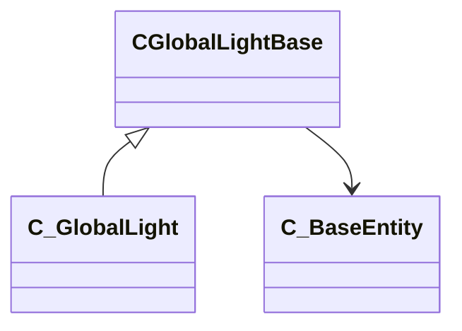

[Schemas](../../schemas.md) / [client](../client.md) / CGlobalLightBase

# CGlobalLightBase

**Kind:** class · **Size:** 1216 bytes (`0x4c0`) · **Align:** 255 · **Module:** client

**Derived by:** [C_GlobalLight](../client/C_GlobalLight.md)

**Relationships:**

## Memory layout

43 fields (43 declared here, 0 inherited). Offsets are absolute from the object base.

| Offset | Field | Type | From | Annotations |
|--------|-------|------|------|-------------|
| `0x10` | `m_bSpotLight` | bool |  |  |
| `0x14` | `m_SpotLightOrigin` | VectorWS |  |  |
| `0x20` | `m_SpotLightAngles` | QAngle |  |  |
| `0x2c` | `m_ShadowDirection` | Vector |  |  |
| `0x38` | `m_AmbientDirection` | Vector |  |  |
| `0x44` | `m_SpecularDirection` | Vector |  |  |
| `0x50` | `m_InspectorSpecularDirection` | Vector |  |  |
| `0x5c` | `m_flSpecularPower` | float32 |  |  |
| `0x60` | `m_flSpecularIndependence` | float32 |  |  |
| `0x64` | `m_SpecularColor` | Color |  |  |
| `0x68` | `m_bStartDisabled` | bool |  |  |
| `0x69` | `m_bEnabled` | bool |  |  |
| `0x6a` | `m_LightColor` | Color |  |  |
| `0x6e` | `m_AmbientColor1` | Color |  |  |
| `0x72` | `m_AmbientColor2` | Color |  |  |
| `0x76` | `m_AmbientColor3` | Color |  |  |
| `0x7c` | `m_flSunDistance` | float32 |  |  |
| `0x80` | `m_flFOV` | float32 |  |  |
| `0x84` | `m_flNearZ` | float32 |  |  |
| `0x88` | `m_flFarZ` | float32 |  |  |
| `0x8c` | `m_bEnableShadows` | bool |  |  |
| `0x8d` | `m_bOldEnableShadows` | bool |  |  |
| `0x8e` | `m_bBackgroundClearNotRequired` | bool |  |  |
| `0x90` | `m_flCloudScale` | float32 |  |  |
| `0x94` | `m_flCloud1Speed` | float32 |  |  |
| `0x98` | `m_flCloud1Direction` | float32 |  |  |
| `0x9c` | `m_flCloud2Speed` | float32 |  |  |
| `0xa0` | `m_flCloud2Direction` | float32 |  |  |
| `0xb0` | `m_flAmbientScale1` | float32 |  |  |
| `0xb4` | `m_flAmbientScale2` | float32 |  |  |
| `0xb8` | `m_flGroundScale` | float32 |  |  |
| `0xbc` | `m_flLightScale` | float32 |  |  |
| `0xc0` | `m_flFoWDarkness` | float32 |  |  |
| `0xc4` | `m_bEnableSeparateSkyboxFog` | bool |  |  |
| `0xc8` | `m_vFowColor` | Vector |  |  |
| `0xd4` | `m_ViewOrigin` | VectorWS |  |  |
| `0xe0` | `m_ViewAngles` | QAngle |  |  |
| `0xec` | `m_flViewFoV` | float32 |  |  |
| `0xf0` | `m_WorldPoints` | VectorWS[8] |  |  |
| `0x4a8` | `m_vFogOffsetLayer0` | Vector2D |  |  |
| `0x4b0` | `m_vFogOffsetLayer1` | Vector2D |  |  |
| `0x4b8` | `m_hEnvWind` | CHandle< [C_BaseEntity](../client/C_BaseEntity.md) > |  |  |
| `0x4bc` | `m_hEnvSky` | CHandle< [C_BaseEntity](../client/C_BaseEntity.md) > |  |  |
