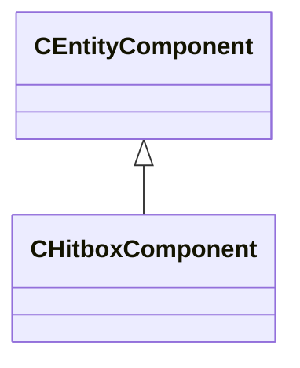

[Schemas](../../schemas.md) / [client](../client.md) / CHitboxComponent

# CHitboxComponent

> Source: **Build 25000182** · 2026-08-28 · `windows-x86_64` · schema `0.10.0`

**Kind:** class · **Size:** 24 bytes (`0x18`) · **Align:** 8 · **Module:** client

**Twin:** [CHitboxComponent (server)](../server/CHitboxComponent.md)

**Inherits from:** [CEntityComponent](../entity2/CEntityComponent.md)

**Relationships:**

## Memory layout

1 field (1 declared here, 0 inherited). Offsets are absolute from the object base.

| Offset | Field | Type | From | Annotations |
|--------|-------|------|------|-------------|
| `0x14` | `m_flBoundsExpandRadius` | float32 |  |  |

KV3 class defaults

<pre>{
	&quot;_class&quot;: &quot;CHitboxComponent&quot;,
	&quot;m_flBoundsExpandRadius&quot;: 0.000000
}</pre>

