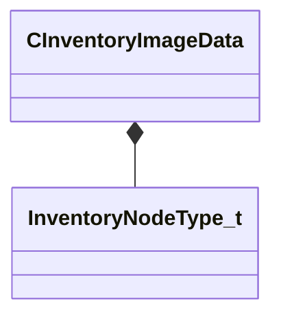

[Schemas](../../schemas.md) / [client](../client.md) / CInventoryImageData

# CInventoryImageData

> Source: **Build 25000182** · 2026-08-28 · `windows-x86_64` · schema `0.10.0`

**Kind:** class · **Size:** 248 bytes (`0xf8`) · **Align:** 8 · **Module:** client

**Metadata:** `MVDataHideNodeClass`, `MVDataOutlinerDetailExpr name`, `MVDataOutlinerLeafColorFn`, `MVDataOutlinerLeafDetailFn`, `MVDataOutlinerLeafNameFn`, `MVDataOverlayType 1`, `MVDataPostSaveFixupFn`, `MVDataPreLoadFixupFn`, `MVDataPreviewWidget csgo_inv_image_preview`, `MVDataRoot`, `MVDataVirtualNodeFactoryFn`

**Relationships:**

## Memory layout

3 fields (3 declared here, 0 inherited). Offsets are absolute from the object base.

| Offset | Field | Type | From | Annotations |
|--------|-------|------|------|-------------|
| `0x0` | `m_nNodeType` | [InventoryNodeType_t](../client/InventoryNodeType_t.md) |  | `MPropertySuppressField` |
| `0x8` | `name` | CUtlString |  | `MPropertyFriendlyName Item Name` `MPropertyReadOnly` `MPropertyReadonlyExpr 1` `MPropertySuppressExpr name == ""` |
| `0x10` | `inventory_image_data` | inv_image_data_t |  | `MPropertyAutoExpandSelf` `MPropertyFriendlyName Inventory Image Data` |

KV3 class defaults

<pre>{
	&quot;m_nNodeType&quot;: &quot;NODE_TYPE_INVALID&quot;,
	&quot;name&quot;: &quot;&quot;,
	&quot;inventory_image_data&quot;:
	{
		&quot;map&quot;:
		{
			&quot;map_name&quot;: &quot;ui/icon_generation_basic_nuke_bombsitea&quot;,
			&quot;map_rotation&quot;: 0.000000
		},
		&quot;item&quot;:
		{
			&quot;position&quot;:
			[
				0.000000,
				0.000000,
				0.000000
			],
			&quot;angle&quot;:
			[
				0.000000,
				0.000000,
				0.000000
			],
			&quot;pose_sequence&quot;: &quot;&quot;
		},
		&quot;camera&quot;:
		{
			&quot;angle&quot;:
			[
				0.000000,
				0.000000,
				0.000000
			],
			&quot;fov&quot;: 45.000000,
			&quot;znear&quot;: 4.000000,
			&quot;zfar&quot;: 1000.000000,
			&quot;target&quot;:
			[
				0.000000,
				0.000000,
				0.000000
			],
			&quot;target_nudge&quot;:
			[
				0.000000,
				0.000000,
				0.000000
			],
			&quot;orbit_distance&quot;: 0.000000
		},
		&quot;lightsun&quot;:
		{
			&quot;color&quot;:
			[
				0.000000,
				0.000000,
				0.000000
			],
			&quot;angle&quot;:
			[
				0.000000,
				0.000000,
				0.000000
			],
			&quot;brightness&quot;: 1.000000
		},
		&quot;lightfill&quot;:
		{
			&quot;color&quot;:
			[
				0.000000,
				0.000000,
				0.000000
			],
			&quot;angle&quot;:
			[
				0.000000,
				0.000000,
				0.000000
			],
			&quot;brightness&quot;: 1.000000
		},
		&quot;light0&quot;:
		{
			&quot;color&quot;:
			[
				0.000000,
				0.000000,
				0.000000
			],
			&quot;angle&quot;:
			[
				0.000000,
				0.000000,
				0.000000
			],
			&quot;brightness&quot;: 0.000000,
			&quot;orbit_distance&quot;: 1.000000
		},
		&quot;light1&quot;:
		{
			&quot;color&quot;:
			[
				0.000000,
				0.000000,
				0.000000
			],
			&quot;angle&quot;:
			[
				0.000000,
				0.000000,
				0.000000
			],
			&quot;brightness&quot;: 0.000000,
			&quot;orbit_distance&quot;: 1.000000
		},
		&quot;clearcolor&quot;:
		{
			&quot;color&quot;:
			[
				0.200000,
				0.200000,
				0.200000
			]
		}
	}
}</pre>

