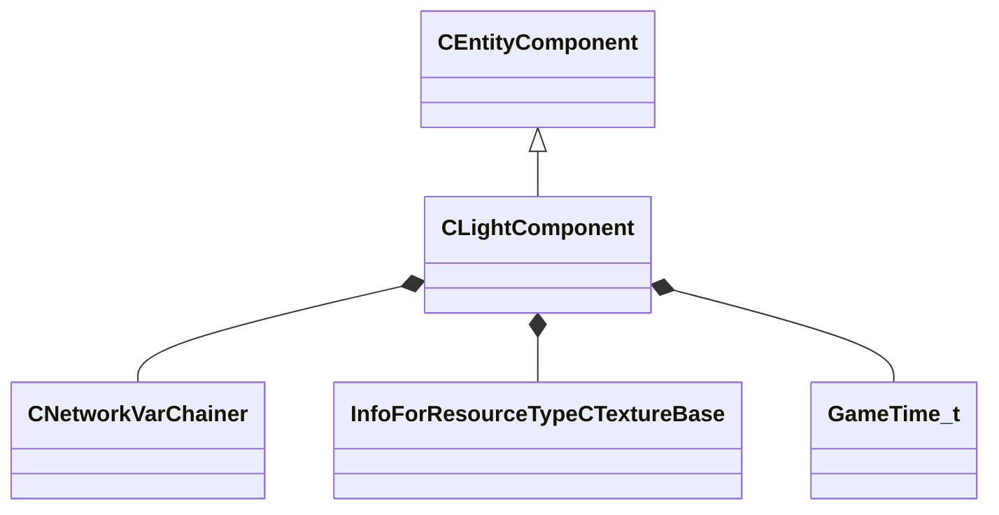

[Schemas](../../schemas.md) / [client](../client.md) / CLightComponent

# CLightComponent

**Kind:** class · **Size:** 496 bytes (`0x1f0`) · **Align:** 255 · **Module:** client

**Inherits from:** [CEntityComponent](../entity2/CEntityComponent.md)

**Relationships:**

## Memory layout

70 fields (70 declared here, 0 inherited). Offsets are absolute from the object base.

| Offset | Field | Type | From | Annotations |
|--------|-------|------|------|-------------|
| `0x38` | `__m_pChainEntity` | [CNetworkVarChainer](../entity2/CNetworkVarChainer.md) |  | `MNotSaved` |
| `0x75` | `m_Color` | Color |  |  |
| `0x79` | `m_SecondaryColor` | Color |  |  |
| `0x80` | `m_flBrightness` | float32 |  |  |
| `0x84` | `m_flBrightnessScale` | float32 |  |  |
| `0x88` | `m_flBrightnessMult` | float32 |  |  |
| `0x8c` | `m_flRange` | float32 |  |  |
| `0x90` | `m_flFalloff` | float32 |  |  |
| `0x94` | `m_flAttenuation0` | float32 |  |  |
| `0x98` | `m_flAttenuation1` | float32 |  |  |
| `0x9c` | `m_flAttenuation2` | float32 |  |  |
| `0xa0` | `m_flTheta` | float32 |  |  |
| `0xa4` | `m_flPhi` | float32 |  |  |
| `0xa8` | `m_hLightCookie` | CStrongHandle< [InfoForResourceTypeCTextureBase](../resourcesystem/InfoForResourceTypeCTextureBase.md) > |  |  |
| `0xb0` | `m_nCascades` | int32 |  |  |
| `0xb4` | `m_nCastShadows` | int32 |  |  |
| `0xb8` | `m_nShadowWidth` | int32 |  |  |
| `0xbc` | `m_nShadowHeight` | int32 |  |  |
| `0xc0` | `m_bRenderDiffuse` | bool |  |  |
| `0xc4` | `m_nRenderSpecular` | int32 |  |  |
| `0xc8` | `m_bRenderTransmissive` | bool |  |  |
| `0xcc` | `m_flOrthoLightWidth` | float32 |  |  |
| `0xd0` | `m_flOrthoLightHeight` | float32 |  |  |
| `0xd4` | `m_nStyle` | int32 |  |  |
| `0xd8` | `m_Pattern` | CUtlString |  |  |
| `0xe0` | `m_nCascadeRenderStaticObjects` | int32 |  |  |
| `0xe4` | `m_flShadowCascadeCrossFade` | float32 |  |  |
| `0xe8` | `m_flShadowCascadeDistanceFade` | float32 |  |  |
| `0xec` | `m_flShadowCascadeDistance0` | float32 |  |  |
| `0xf0` | `m_flShadowCascadeDistance1` | float32 |  |  |
| `0xf4` | `m_flShadowCascadeDistance2` | float32 |  |  |
| `0xf8` | `m_flShadowCascadeDistance3` | float32 |  |  |
| `0xfc` | `m_nShadowCascadeResolution0` | int32 |  |  |
| `0x100` | `m_nShadowCascadeResolution1` | int32 |  |  |
| `0x104` | `m_nShadowCascadeResolution2` | int32 |  |  |
| `0x108` | `m_nShadowCascadeResolution3` | int32 |  |  |
| `0x10c` | `m_bUsesBakedShadowing` | bool |  |  |
| `0x110` | `m_nShadowPriority` | int32 |  |  |
| `0x114` | `m_nBakedShadowIndex` | int32 |  |  |
| `0x118` | `m_nLightPathUniqueId` | int32 |  |  |
| `0x11c` | `m_nLightMapUniqueId` | int32 |  |  |
| `0x120` | `m_bRenderToCubemaps` | bool |  |  |
| `0x121` | `m_bAllowSSTGeneration` | bool |  |  |
| `0x124` | `m_nDirectLight` | int32 |  |  |
| `0x128` | `m_nBounceLight` | int32 |  |  |
| `0x12c` | `m_flBounceScale` | float32 |  |  |
| `0x130` | `m_flFadeMinDist` | float32 |  |  |
| `0x134` | `m_flFadeMaxDist` | float32 |  |  |
| `0x138` | `m_flShadowFadeMinDist` | float32 |  |  |
| `0x13c` | `m_flShadowFadeMaxDist` | float32 |  |  |
| `0x140` | `m_bEnabled` | bool |  |  |
| `0x141` | `m_bFlicker` | bool |  |  |
| `0x142` | `m_bPrecomputedFieldsValid` | bool |  |  |
| `0x144` | `m_vPrecomputedBoundsMins` | Vector |  |  |
| `0x150` | `m_vPrecomputedBoundsMaxs` | Vector |  |  |
| `0x15c` | `m_vPrecomputedOBBOrigin` | Vector |  |  |
| `0x168` | `m_vPrecomputedOBBAngles` | QAngle |  |  |
| `0x174` | `m_vPrecomputedOBBExtent` | Vector |  |  |
| `0x180` | `m_flPrecomputedMaxRange` | float32 |  |  |
| `0x184` | `m_nFogLightingMode` | int32 |  |  |
| `0x188` | `m_flFogContributionStength` | float32 |  |  |
| `0x18c` | `m_flNearClipPlane` | float32 |  |  |
| `0x190` | `m_SkyColor` | Color |  |  |
| `0x194` | `m_flSkyIntensity` | float32 |  |  |
| `0x198` | `m_SkyAmbientBounce` | Color |  |  |
| `0x19c` | `m_bUseSecondaryColor` | bool |  |  |
| `0x19d` | `m_bMixedShadows` | bool |  | `MNotSaved` |
| `0x1a0` | `m_flLightStyleStartTime` | [GameTime_t](../entity2/GameTime_t.md) |  |  |
| `0x1a4` | `m_flCapsuleLength` | float32 |  |  |
| `0x1a8` | `m_flMinRoughness` | float32 |  |  |

KV3 class defaults

<pre>{
	&quot;_class&quot;: &quot;CLightComponent&quot;,
	&quot;m_Color&quot;:
	[
		0,
		0,
		0,
		0
	],
	&quot;m_SecondaryColor&quot;:
	[
		0,
		0,
		0,
		0
	],
	&quot;m_flBrightness&quot;: 0.000000,
	&quot;m_flBrightnessScale&quot;: 1.000000,
	&quot;m_flBrightnessMult&quot;: 1.000000,
	&quot;m_flRange&quot;: 0.000000,
	&quot;m_flFalloff&quot;: 0.000000,
	&quot;m_flAttenuation0&quot;: 0.000000,
	&quot;m_flAttenuation1&quot;: 0.000000,
	&quot;m_flAttenuation2&quot;: 0.000000,
	&quot;m_flTheta&quot;: 0.000000,
	&quot;m_flPhi&quot;: 0.000000,
	&quot;m_hLightCookie&quot;: &quot;&quot;,
	&quot;m_nCascades&quot;: 0,
	&quot;m_nCastShadows&quot;: 0,
	&quot;m_nShadowWidth&quot;: 0,
	&quot;m_nShadowHeight&quot;: 0,
	&quot;m_bRenderDiffuse&quot;: true,
	&quot;m_nRenderSpecular&quot;: 1,
	&quot;m_bRenderTransmissive&quot;: true,
	&quot;m_flOrthoLightWidth&quot;: 0.000000,
	&quot;m_flOrthoLightHeight&quot;: 0.000000,
	&quot;m_nStyle&quot;: 0,
	&quot;m_Pattern&quot;: &quot;&quot;,
	&quot;m_nCascadeRenderStaticObjects&quot;: -1,
	&quot;m_flShadowCascadeCrossFade&quot;: 0.000000,
	&quot;m_flShadowCascadeDistanceFade&quot;: 0.000000,
	&quot;m_flShadowCascadeDistance0&quot;: 0.000000,
	&quot;m_flShadowCascadeDistance1&quot;: 0.000000,
	&quot;m_flShadowCascadeDistance2&quot;: 0.000000,
	&quot;m_flShadowCascadeDistance3&quot;: 0.000000,
	&quot;m_nShadowCascadeResolution0&quot;: 0,
	&quot;m_nShadowCascadeResolution1&quot;: 0,
	&quot;m_nShadowCascadeResolution2&quot;: 0,
	&quot;m_nShadowCascadeResolution3&quot;: 0,
	&quot;m_bUsesBakedShadowing&quot;: false,
	&quot;m_nShadowPriority&quot;: -1,
	&quot;m_nBakedShadowIndex&quot;: -1,
	&quot;m_nLightPathUniqueId&quot;: 0,
	&quot;m_nLightMapUniqueId&quot;: 0,
	&quot;m_bRenderToCubemaps&quot;: true,
	&quot;m_bAllowSSTGeneration&quot;: true,
	&quot;m_nDirectLight&quot;: 0,
	&quot;m_nBounceLight&quot;: 0,
	&quot;m_flBounceScale&quot;: 0.000000,
	&quot;m_flFadeMinDist&quot;: 0.000000,
	&quot;m_flFadeMaxDist&quot;: 0.000000,
	&quot;m_flShadowFadeMinDist&quot;: 0.000000,
	&quot;m_flShadowFadeMaxDist&quot;: 0.000000,
	&quot;m_bEnabled&quot;: false,
	&quot;m_bFlicker&quot;: false,
	&quot;m_bPrecomputedFieldsValid&quot;: false,
	&quot;m_vPrecomputedBoundsMins&quot;:
	[
		0.000000,
		0.000000,
		0.000000
	],
	&quot;m_vPrecomputedBoundsMaxs&quot;:
	[
		0.000000,
		0.000000,
		0.000000
	],
	&quot;m_vPrecomputedOBBOrigin&quot;:
	[
		0.000000,
		0.000000,
		0.000000
	],
	&quot;m_vPrecomputedOBBAngles&quot;:
	[
		0.000000,
		0.000000,
		0.000000
	],
	&quot;m_vPrecomputedOBBExtent&quot;:
	[
		0.000000,
		0.000000,
		0.000000
	],
	&quot;m_flPrecomputedMaxRange&quot;: 0.000000,
	&quot;m_nFogLightingMode&quot;: 0,
	&quot;m_flFogContributionStength&quot;: 1.000000,
	&quot;m_flNearClipPlane&quot;: 1.000000,
	&quot;m_SkyColor&quot;:
	[
		0,
		0,
		0,
		0
	],
	&quot;m_flSkyIntensity&quot;: 0.000000,
	&quot;m_SkyAmbientBounce&quot;:
	[
		0,
		0,
		0,
		0
	],
	&quot;m_bUseSecondaryColor&quot;: false,
	&quot;m_flLightStyleStartTime&quot;: null,
	&quot;m_flCapsuleLength&quot;: 0.000000,
	&quot;m_flMinRoughness&quot;: 0.000000
}</pre>

