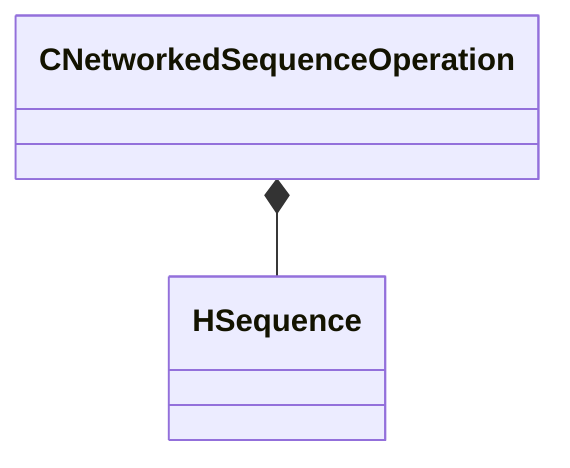

[Schemas](../../schemas.md) / [client](../client.md) / CNetworkedSequenceOperation

# CNetworkedSequenceOperation

**Kind:** class · **Size:** 40 bytes (`0x28`) · **Align:** 8 · **Module:** client

**Relationships:**

## Memory layout

8 fields (8 declared here, 0 inherited). Offsets are absolute from the object base.

| Offset | Field | Type | From | Annotations |
|--------|-------|------|------|-------------|
| `0x8` | `m_hSequence` | [HSequence](../animationsystem/HSequence.md) |  |  |
| `0xc` | `m_flPrevCycle` | float32 |  |  |
| `0x10` | `m_flCycle` | float32 |  |  |
| `0x14` | `m_flWeight` | CNetworkedQuantizedFloat |  |  |
| `0x1c` | `m_bSequenceChangeNetworked` | bool |  |  |
| `0x1d` | `m_bDiscontinuity` | bool |  |  |
| `0x20` | `m_flPrevCycleFromDiscontinuity` | float32 |  |  |
| `0x24` | `m_flPrevCycleForAnimEventDetection` | float32 |  |  |

KV3 class defaults

<pre>{
	&quot;_class&quot;: &quot;CNetworkedSequenceOperation&quot;,
	&quot;m_hSequence&quot;: -1,
	&quot;m_flPrevCycle&quot;: 0.000000,
	&quot;m_flCycle&quot;: 0.000000,
	&quot;m_flWeight&quot;: 1.000000,
	&quot;m_bSequenceChangeNetworked&quot;: false,
	&quot;m_bDiscontinuity&quot;: false,
	&quot;m_flPrevCycleFromDiscontinuity&quot;: 0.000000,
	&quot;m_flPrevCycleForAnimEventDetection&quot;: 0.000000
}</pre>

