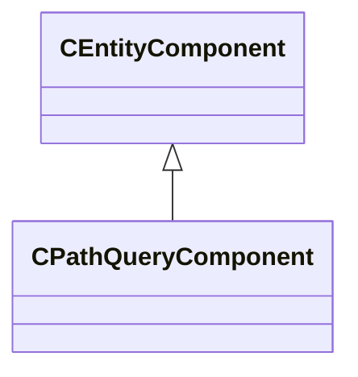

[Schemas](../../schemas.md) / [client](../client.md) / CPathQueryComponent

# CPathQueryComponent

> Source: **Build 25000182** · 2026-08-28 · `windows-x86_64` · schema `0.10.0`

**Kind:** class · **Size:** 160 bytes (`0xa0`) · **Align:** n/a (unspecified) · **Module:** client

**Twin:** [CPathQueryComponent (server)](../server/CPathQueryComponent.md)

**Inherits from:** [CEntityComponent](../entity2/CEntityComponent.md), [CPathQueryUtil](../server/CPathQueryUtil.md)

**Relationships:**

## Memory layout

No schema-visible fields (160 bytes of opaque storage).

**Also inherits (secondary base classes):** [CPathQueryUtil](../server/CPathQueryUtil.md) — additional-base fields sit at a shifted offset the schema does not record; see each base's own page for its layout.
