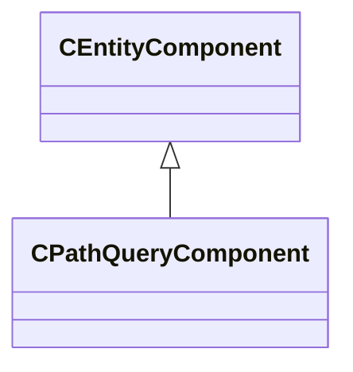

[Schemas](../../schemas.md) / [client](../client.md) / CPathQueryComponent

# CPathQueryComponent

**Kind:** class · **Size:** 160 bytes (`0xa0`) · **Align:** 255 · **Module:** client

**Inherits from:** [CEntityComponent](../entity2/CEntityComponent.md), [CPathQueryUtil](../server/CPathQueryUtil.md)

**Relationships:**

**Also inherits (secondary base classes):** [CPathQueryUtil](../server/CPathQueryUtil.md) — additional-base fields sit at a shifted offset the schema does not record; see each base's own page for its layout.
