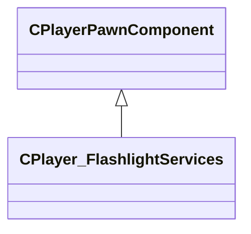

[Schemas](../../schemas.md) / [client](../client.md) / CPlayer_FlashlightServices

# CPlayer_FlashlightServices

> Source: **Build 25000182** · 2026-08-28 · `windows-x86_64` · schema `0.10.0`

**Kind:** class · **Size:** 72 bytes (`0x48`) · **Align:** n/a (unspecified) · **Module:** client

**Twin:** [CPlayer_FlashlightServices (server)](../server/CPlayer_FlashlightServices.md)

**Inherits from:** [CPlayerPawnComponent](../server/CPlayerPawnComponent.md)

**Relationships:**

## Memory layout

2 fields (0 declared here, 2 inherited). Offsets are absolute from the object base.

| Offset | Field | Type | From | Annotations |
|--------|-------|------|------|-------------|
| `0x8` | `__m_pChainEntity` | [CNetworkVarChainer](../entity2/CNetworkVarChainer.md) | [CPlayerPawnComponent](../server/CPlayerPawnComponent.md) | `MNotSaved` |
| `0x30` | `m_pComponentGraphController` | [CAnimGraphControllerPtr](../server/CAnimGraphControllerPtr.md) | [CPlayerPawnComponent](../server/CPlayerPawnComponent.md) |  |
