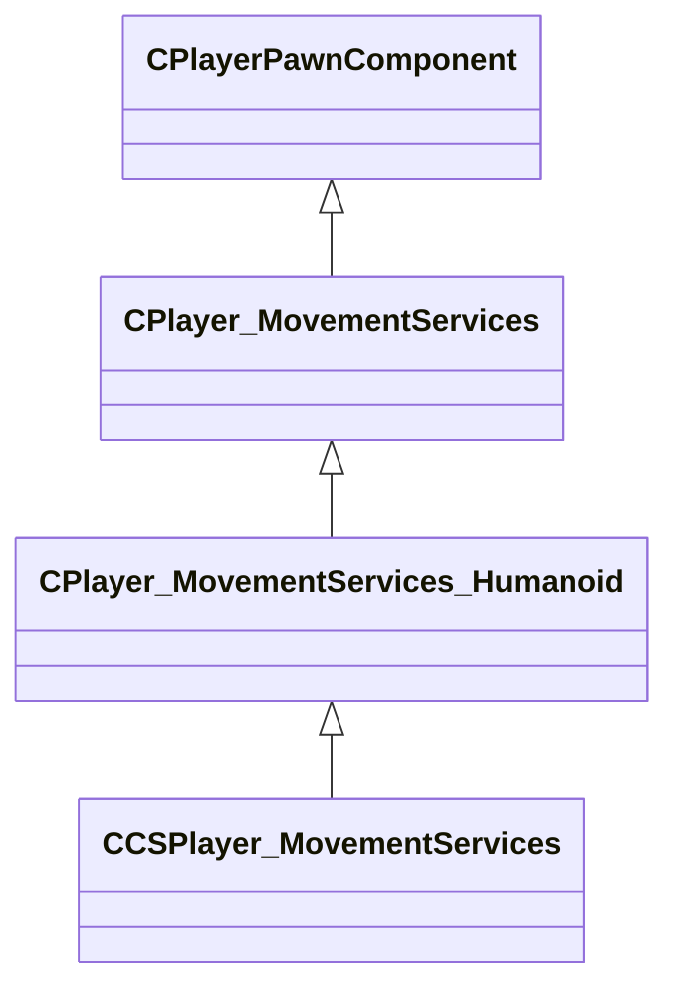

[Schemas](../../schemas.md) / [client](../client.md) / CPlayer_MovementServices_Humanoid

# CPlayer_MovementServices_Humanoid

> Source: **Build 25000182** · 2026-08-28 · `windows-x86_64` · schema `0.10.0`

**Kind:** class · **Size:** 648 bytes (`0x288`) · **Align:** n/a (unspecified) · **Module:** client

**Twin:** [CPlayer_MovementServices_Humanoid (server)](../server/CPlayer_MovementServices_Humanoid.md)

**Inherits from:** [CPlayer_MovementServices](../client/CPlayer_MovementServices.md)

**Derived by:** [CCSPlayer_MovementServices](../client/CCSPlayer_MovementServices.md)

**Relationships:**

## Memory layout

26 fields (6 declared here, 20 inherited). Offsets are absolute from the object base.

| Offset | Field | Type | From | Annotations |
|--------|-------|------|------|-------------|
| `0x8` | `__m_pChainEntity` | [CNetworkVarChainer](../entity2/CNetworkVarChainer.md) | [CPlayerPawnComponent](../server/CPlayerPawnComponent.md) | `MNotSaved` |
| `0x30` | `m_pComponentGraphController` | [CAnimGraphControllerPtr](../server/CAnimGraphControllerPtr.md) | [CPlayerPawnComponent](../server/CPlayerPawnComponent.md) |  |
| `0x48` | `m_nImpulse` | int32 | [CPlayer_MovementServices](../client/CPlayer_MovementServices.md) | Pending impulse command number (e.g. `impulse 100` flashlight). |
| `0x50` | `m_nButtons` | [CInButtonState](../server/CInButtonState.md) | [CPlayer_MovementServices](../client/CPlayer_MovementServices.md) | Bitmask of currently-pressed input buttons (IN_ATTACK, IN_JUMP, IN_DUCK, …). `MNotSaved` |
| `0x70` | `m_nQueuedButtonDownMask` | uint64 | [CPlayer_MovementServices](../client/CPlayer_MovementServices.md) |  |
| `0x78` | `m_nQueuedButtonChangeMask` | uint64 | [CPlayer_MovementServices](../client/CPlayer_MovementServices.md) |  |
| `0x80` | `m_nButtonDoublePressed` | uint64 | [CPlayer_MovementServices](../client/CPlayer_MovementServices.md) |  |
| `0x88` | `m_pButtonPressedCmdNumber` | uint32[64] | [CPlayer_MovementServices](../client/CPlayer_MovementServices.md) | `MNotSaved` |
| `0x188` | `m_nLastCommandNumberProcessed` | uint32 | [CPlayer_MovementServices](../client/CPlayer_MovementServices.md) | `MNotSaved` |
| `0x190` | `m_nToggleButtonDownMask` | uint64 | [CPlayer_MovementServices](../client/CPlayer_MovementServices.md) |  |
| `0x1a0` | `m_flCmdForwardMove` | float32 | [CPlayer_MovementServices](../client/CPlayer_MovementServices.md) |  |
| `0x1a4` | `m_flCmdLeftMove` | float32 | [CPlayer_MovementServices](../client/CPlayer_MovementServices.md) |  |
| `0x1a8` | `m_flCmdUpMove` | float32 | [CPlayer_MovementServices](../client/CPlayer_MovementServices.md) |  |
| `0x1ac` | `m_flMaxspeed` | float32 | [CPlayer_MovementServices](../client/CPlayer_MovementServices.md) | Current maximum ground movement speed (units/second). |
| `0x1b0` | `m_arrForceSubtickMoveWhen` | float32[4] | [CPlayer_MovementServices](../client/CPlayer_MovementServices.md) |  |
| `0x1c0` | `m_flForwardMove` | float32 | [CPlayer_MovementServices](../client/CPlayer_MovementServices.md) | Decoded forward/back movement axis for the current user command. |
| `0x1c4` | `m_flLeftMove` | float32 | [CPlayer_MovementServices](../client/CPlayer_MovementServices.md) | Decoded strafe (left/right) movement axis for the current user command. |
| `0x1c8` | `m_flUpMove` | float32 | [CPlayer_MovementServices](../client/CPlayer_MovementServices.md) | Decoded vertical movement axis (swim / ladder) for the current user command. |
| `0x1cc` | `m_vecLastMovementImpulses` | Vector | [CPlayer_MovementServices](../client/CPlayer_MovementServices.md) |  |
| `0x240` | `m_vecOldViewAngles` | QAngle | [CPlayer_MovementServices](../client/CPlayer_MovementServices.md) |  |
| `0x258` | `m_flStepSoundTime` | float32 |  |  |
| `0x25c` | `m_flFallVelocity` | float32 |  |  |
| `0x260` | `m_groundNormal` | Vector |  | `MNotSaved` |
| `0x26c` | `m_flSurfaceFriction` | float32 |  |  |
| `0x270` | `m_surfaceProps` | CUtlStringToken |  | `MNotSaved` |
| `0x280` | `m_nStepside` | int32 |  |  |
