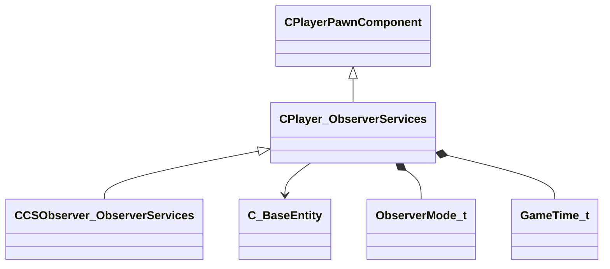

[Schemas](../../schemas.md) / [client](../client.md) / CPlayer_ObserverServices

# CPlayer_ObserverServices

**Kind:** class · **Size:** 96 bytes (`0x60`) · **Align:** 255 · **Module:** client

**Inherits from:** [CPlayerPawnComponent](../server/CPlayerPawnComponent.md)

**Derived by:** [CCSObserver_ObserverServices](../client/CCSObserver_ObserverServices.md)

**Relationships:**

## Memory layout

8 fields (6 declared here, 2 inherited). Offsets are absolute from the object base.

| Offset | Field | Type | From | Annotations |
|--------|-------|------|------|-------------|
| `0x8` | `__m_pChainEntity` | [CNetworkVarChainer](../entity2/CNetworkVarChainer.md) | [CPlayerPawnComponent](../server/CPlayerPawnComponent.md) | `MNotSaved` |
| `0x30` | `m_pComponentGraphController` | [CAnimGraphControllerPtr](../server/CAnimGraphControllerPtr.md) | [CPlayerPawnComponent](../server/CPlayerPawnComponent.md) |  |
| `0x48` | `m_iObserverMode` | uint8 |  |  |
| `0x4c` | `m_hObserverTarget` | CHandle< [C_BaseEntity](../client/C_BaseEntity.md) > |  |  |
| `0x50` | `m_iObserverLastMode` | [ObserverMode_t](../!GlobalTypes/ObserverMode_t.md) |  |  |
| `0x54` | `m_bForcedObserverMode` | bool |  |  |
| `0x58` | `m_flObserverChaseDistance` | float32 |  | `MNotSaved` |
| `0x5c` | `m_flObserverChaseDistanceCalcTime` | [GameTime_t](../entity2/GameTime_t.md) |  | `MNotSaved` |
