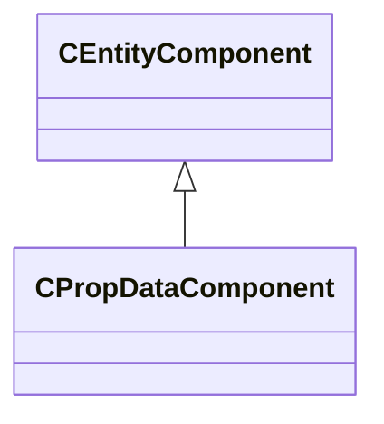

[Schemas](../../schemas.md) / [client](../client.md) / CPropDataComponent

# CPropDataComponent

> Source: **Build 25000182** · 2026-08-28 · `windows-x86_64` · schema `0.10.0`

**Kind:** class · **Size:** 64 bytes (`0x40`) · **Align:** 8 · **Module:** client

**Twin:** [CPropDataComponent (server)](../server/CPropDataComponent.md)

**Inherits from:** [CEntityComponent](../entity2/CEntityComponent.md)

**Relationships:**

## Memory layout

10 fields (10 declared here, 0 inherited). Offsets are absolute from the object base.

| Offset | Field | Type | From | Annotations |
|--------|-------|------|------|-------------|
| `0x10` | `m_flDmgModBullet` | float32 |  |  |
| `0x14` | `m_flDmgModClub` | float32 |  |  |
| `0x18` | `m_flDmgModExplosive` | float32 |  |  |
| `0x1c` | `m_flDmgModFire` | float32 |  |  |
| `0x20` | `m_iszPhysicsDamageTableName` | CUtlSymbolLarge |  |  |
| `0x28` | `m_iszBasePropData` | CUtlSymbolLarge |  |  |
| `0x30` | `m_nInteractions` | int32 |  |  |
| `0x34` | `m_bSpawnMotionDisabled` | bool |  |  |
| `0x38` | `m_nDisableTakePhysicsDamageSpawnFlag` | int32 |  |  |
| `0x3c` | `m_nMotionDisabledSpawnFlag` | int32 |  |  |

KV3 class defaults

<pre>{
	&quot;_class&quot;: &quot;CPropDataComponent&quot;,
	&quot;m_flDmgModBullet&quot;: 1.000000,
	&quot;m_flDmgModClub&quot;: 1.000000,
	&quot;m_flDmgModExplosive&quot;: 1.000000,
	&quot;m_flDmgModFire&quot;: 1.000000,
	&quot;m_iszPhysicsDamageTableName&quot;: &quot;&quot;,
	&quot;m_iszBasePropData&quot;: &quot;&quot;,
	&quot;m_nInteractions&quot;: 0,
	&quot;m_bSpawnMotionDisabled&quot;: false,
	&quot;m_nDisableTakePhysicsDamageSpawnFlag&quot;: 0,
	&quot;m_nMotionDisabledSpawnFlag&quot;: 0
}</pre>

