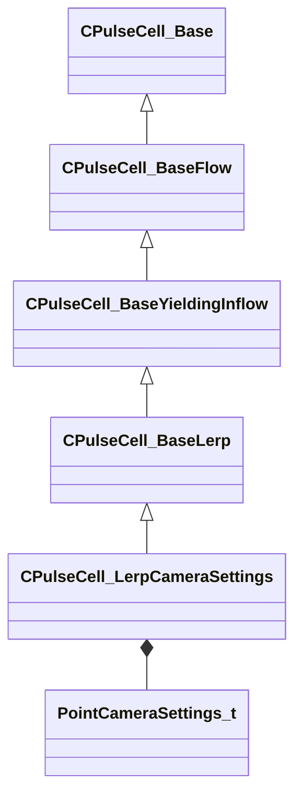

[Schemas](../../schemas.md) / [client](../client.md) / CPulseCell_LerpCameraSettings

# CPulseCell_LerpCameraSettings

> Source: **Build 25000182** · 2026-08-28 · `windows-x86_64` · schema `0.10.0`

**Kind:** class · **Size:** 328 bytes (`0x148`) · **Align:** 8 · **Module:** client

**Twin:** [CPulseCell_LerpCameraSettings (server)](../server/CPulseCell_LerpCameraSettings.md)

**Inherits from:** [CPulseCell_BaseLerp](../pulse_runtime_lib/CPulseCell_BaseLerp.md)

**Relationships:**

## Memory layout

7 fields (3 declared here, 4 inherited). Offsets are absolute from the object base.

| Offset | Field | Type | From | Annotations |
|--------|-------|------|------|-------------|
| `0x8` | `m_nEditorNodeID` | [PulseDocNodeID_t](../pulse_runtime_lib/PulseDocNodeID_t.md) | [CPulseCell_Base](../pulse_runtime_lib/CPulseCell_Base.md) | `MFgdFromSchemaCompletelySkipField` |
| `0x48` | `m_BaseFlow_OnAfterCancel` | [CPulse_ResumePoint](../pulse_runtime_lib/CPulse_ResumePoint.md) | [CPulseCell_BaseYieldingInflow](../pulse_runtime_lib/CPulseCell_BaseYieldingInflow.md) | `MPulseFGDSkipField` |
| `0x90` | `m_BaseFlow_WhileActive` | [CPulse_ResumePoint](../pulse_runtime_lib/CPulse_ResumePoint.md) | [CPulseCell_BaseYieldingInflow](../pulse_runtime_lib/CPulseCell_BaseYieldingInflow.md) | `MPulseFGDSkipField` |
| `0xd8` | `m_WakeResume` | [CPulse_ResumePoint](../pulse_runtime_lib/CPulse_ResumePoint.md) | [CPulseCell_BaseLerp](../pulse_runtime_lib/CPulseCell_BaseLerp.md) |  |
| `0x120` | `m_flSeconds` | float32 |  |  |
| `0x124` | `m_Start` | [PointCameraSettings_t](../server/PointCameraSettings_t.md) |  |  |
| `0x134` | `m_End` | [PointCameraSettings_t](../server/PointCameraSettings_t.md) |  |  |

KV3 class defaults

<pre>{
	&quot;_class&quot;: &quot;CPulseCell_LerpCameraSettings&quot;,
	&quot;m_nEditorNodeID&quot;: -1,
	&quot;m_BaseFlow_OnAfterCancel&quot;:
	{
		&quot;m_SourceOutflowName&quot;: &quot;&quot;,
		&quot;m_nDestChunk&quot;: -1,
		&quot;m_nInstruction&quot;: -1
	},
	&quot;m_BaseFlow_WhileActive&quot;:
	{
		&quot;m_SourceOutflowName&quot;: &quot;&quot;,
		&quot;m_nDestChunk&quot;: -1,
		&quot;m_nInstruction&quot;: -1
	},
	&quot;m_WakeResume&quot;:
	{
		&quot;m_SourceOutflowName&quot;: &quot;&quot;,
		&quot;m_nDestChunk&quot;: -1,
		&quot;m_nInstruction&quot;: -1
	},
	&quot;m_flSeconds&quot;: 4.000000,
	&quot;m_Start&quot;:
	{
		&quot;m_flNearBlurryDistance&quot;: -1.000000,
		&quot;m_flNearCrispDistance&quot;: -1.000000,
		&quot;m_flFarCrispDistance&quot;: -1.000000,
		&quot;m_flFarBlurryDistance&quot;: -1.000000
	},
	&quot;m_End&quot;:
	{
		&quot;m_flNearBlurryDistance&quot;: -1.000000,
		&quot;m_flNearCrispDistance&quot;: -1.000000,
		&quot;m_flFarCrispDistance&quot;: -1.000000,
		&quot;m_flFarBlurryDistance&quot;: -1.000000
	}
}</pre>

