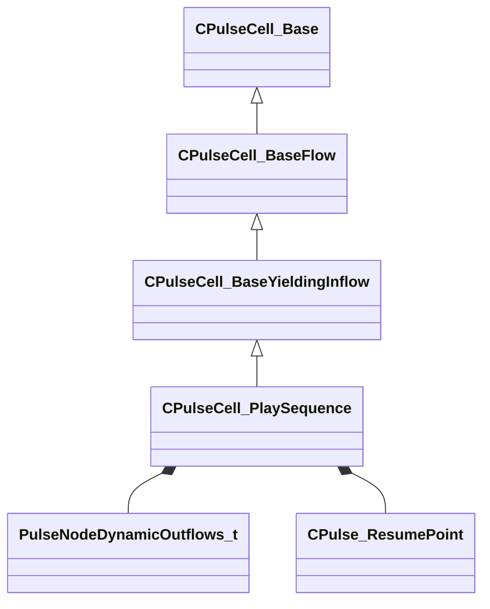

[Schemas](../../schemas.md) / [client](../client.md) / CPulseCell_PlaySequence

# CPulseCell_PlaySequence

> Source: **Build 25000182** · 2026-08-28 · `windows-x86_64` · schema `0.10.0`

**Kind:** class · **Size:** 320 bytes (`0x140`) · **Align:** 8 · **Module:** client

**Twin:** [CPulseCell_PlaySequence (server)](../server/CPulseCell_PlaySequence.md)

**Inherits from:** [CPulseCell_BaseYieldingInflow](../pulse_runtime_lib/CPulseCell_BaseYieldingInflow.md)

**Metadata:** `MPropertyDescription Play the specified animation sequence on a NON-ANIMGRAPH entity, and wait for it to complete.`, `MPropertyFriendlyName Play Sequence`

**Relationships:**

## Memory layout

6 fields (3 declared here, 3 inherited). Offsets are absolute from the object base.

| Offset | Field | Type | From | Annotations |
|--------|-------|------|------|-------------|
| `0x8` | `m_nEditorNodeID` | [PulseDocNodeID_t](../pulse_runtime_lib/PulseDocNodeID_t.md) | [CPulseCell_Base](../pulse_runtime_lib/CPulseCell_Base.md) | `MFgdFromSchemaCompletelySkipField` |
| `0x48` | `m_BaseFlow_OnAfterCancel` | [CPulse_ResumePoint](../pulse_runtime_lib/CPulse_ResumePoint.md) | [CPulseCell_BaseYieldingInflow](../pulse_runtime_lib/CPulseCell_BaseYieldingInflow.md) | `MPulseFGDSkipField` |
| `0x90` | `m_BaseFlow_WhileActive` | [CPulse_ResumePoint](../pulse_runtime_lib/CPulse_ResumePoint.md) | [CPulseCell_BaseYieldingInflow](../pulse_runtime_lib/CPulseCell_BaseYieldingInflow.md) | `MPulseFGDSkipField` |
| `0xd8` | `m_SequenceName` | CUtlString |  | `MPropertyAttributeSuggestionName pulse_model_sequence_name` |
| `0xe0` | `m_PulseAnimEvents` | [PulseNodeDynamicOutflows_t](../pulse_runtime_lib/PulseNodeDynamicOutflows_t.md) |  |  |
| `0xf8` | `m_OnFinished` | [CPulse_ResumePoint](../pulse_runtime_lib/CPulse_ResumePoint.md) |  |  |

KV3 class defaults

<pre>{
	&quot;_class&quot;: &quot;CPulseCell_PlaySequence&quot;,
	&quot;m_nEditorNodeID&quot;: -1,
	&quot;m_BaseFlow_OnAfterCancel&quot;:
	{
		&quot;m_SourceOutflowName&quot;: &quot;&quot;,
		&quot;m_nDestChunk&quot;: -1,
		&quot;m_nInstruction&quot;: -1
	},
	&quot;m_BaseFlow_WhileActive&quot;:
	{
		&quot;m_SourceOutflowName&quot;: &quot;&quot;,
		&quot;m_nDestChunk&quot;: -1,
		&quot;m_nInstruction&quot;: -1
	},
	&quot;m_SequenceName&quot;: &quot;&quot;,
	&quot;m_PulseAnimEvents&quot;:
	{
		&quot;m_Outflows&quot;:
		[
		]
	},
	&quot;m_OnFinished&quot;:
	{
		&quot;m_SourceOutflowName&quot;: &quot;&quot;,
		&quot;m_nDestChunk&quot;: -1,
		&quot;m_nInstruction&quot;: -1
	}
}</pre>

