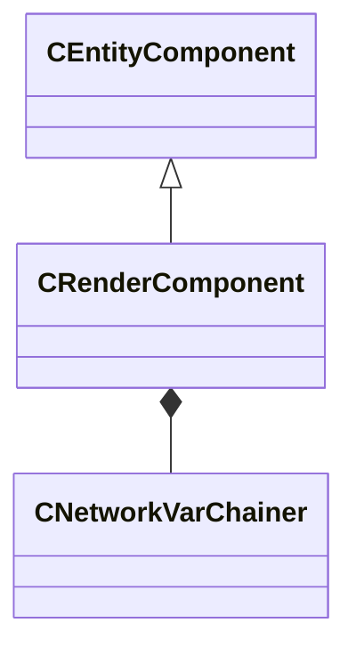

[Schemas](../../schemas.md) / [client](../client.md) / CRenderComponent

# CRenderComponent

> Source: **Build 25000182** · 2026-08-28 · `windows-x86_64` · schema `0.10.0`

**Kind:** class · **Size:** 208 bytes (`0xd0`) · **Align:** 8 · **Module:** client

**Twin:** [CRenderComponent (server)](../server/CRenderComponent.md)

**Inherits from:** [CEntityComponent](../entity2/CEntityComponent.md)

**Relationships:**

## Memory layout

5 fields (5 declared here, 0 inherited). Offsets are absolute from the object base.

| Offset | Field | Type | From | Annotations |
|--------|-------|------|------|-------------|
| `0x10` | `__m_pChainEntity` | [CNetworkVarChainer](../entity2/CNetworkVarChainer.md) |  | `MNotSaved` |
| `0x50` | `m_bIsRenderingWithViewModels` | bool |  | `MNotSaved` |
| `0x54` | `m_nSplitscreenFlags` | uint32 |  | `MNotSaved` |
| `0x58` | `m_bEnableRendering` | bool |  | `MNotSaved` |
| `0xa8` | `m_bInterpolationReadyToDraw` | bool |  | `MNotSaved` |

KV3 class defaults

<pre>{
	&quot;_class&quot;: &quot;CRenderComponent&quot;
}</pre>

