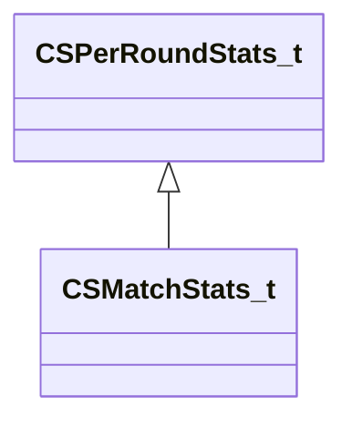

[Schemas](../../schemas.md) / [client](../client.md) / CSMatchStats_t

# CSMatchStats_t

**Kind:** class · **Size:** 128 bytes (`0x80`) · **Align:** 255 · **Module:** client

**Inherits from:** [CSPerRoundStats_t](../client/CSPerRoundStats_t.md)

**Relationships:**

## Memory layout

18 fields (5 declared here, 13 inherited). Offsets are absolute from the object base.

| Offset | Field | Type | From | Annotations |
|--------|-------|------|------|-------------|
| `0x30` | `m_iKills` | int32 | [CSPerRoundStats_t](../client/CSPerRoundStats_t.md) |  |
| `0x34` | `m_iDeaths` | int32 | [CSPerRoundStats_t](../client/CSPerRoundStats_t.md) |  |
| `0x38` | `m_iAssists` | int32 | [CSPerRoundStats_t](../client/CSPerRoundStats_t.md) |  |
| `0x3c` | `m_iDamage` | int32 | [CSPerRoundStats_t](../client/CSPerRoundStats_t.md) |  |
| `0x40` | `m_iEquipmentValue` | int32 | [CSPerRoundStats_t](../client/CSPerRoundStats_t.md) |  |
| `0x44` | `m_iMoneySaved` | int32 | [CSPerRoundStats_t](../client/CSPerRoundStats_t.md) |  |
| `0x48` | `m_iKillReward` | int32 | [CSPerRoundStats_t](../client/CSPerRoundStats_t.md) |  |
| `0x4c` | `m_iLiveTime` | int32 | [CSPerRoundStats_t](../client/CSPerRoundStats_t.md) |  |
| `0x50` | `m_iHeadShotKills` | int32 | [CSPerRoundStats_t](../client/CSPerRoundStats_t.md) |  |
| `0x54` | `m_iObjective` | int32 | [CSPerRoundStats_t](../client/CSPerRoundStats_t.md) |  |
| `0x58` | `m_iCashEarned` | int32 | [CSPerRoundStats_t](../client/CSPerRoundStats_t.md) |  |
| `0x5c` | `m_iUtilityDamage` | int32 | [CSPerRoundStats_t](../client/CSPerRoundStats_t.md) |  |
| `0x60` | `m_iEnemiesFlashed` | int32 | [CSPerRoundStats_t](../client/CSPerRoundStats_t.md) |  |
| `0x68` | `m_iEnemy5Ks` | int32 |  |  |
| `0x6c` | `m_iEnemy4Ks` | int32 |  |  |
| `0x70` | `m_iEnemy3Ks` | int32 |  |  |
| `0x74` | `m_iEnemyKnifeKills` | int32 |  |  |
| `0x78` | `m_iEnemyTaserKills` | int32 |  |  |
