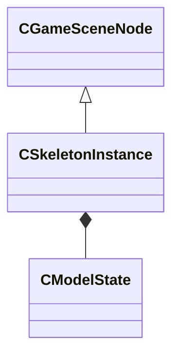

[Schemas](../../schemas.md) / [client](../client.md) / CSkeletonInstance

# CSkeletonInstance

> Source: **Build 25000182** · 2026-08-28 · `windows-x86_64` · schema `0.10.0`

**Kind:** class · **Size:** 1168 bytes (`0x490`) · **Align:** 16 · **Module:** client

**Twin:** [CSkeletonInstance (server)](../server/CSkeletonInstance.md)

**Inherits from:** [CGameSceneNode](../client/CGameSceneNode.md)

**Relationships:**

## Memory layout

41 fields (7 declared here, 34 inherited). Offsets are absolute from the object base.

| Offset | Field | Type | From | Annotations |
|--------|-------|------|------|-------------|
| `0x0` bit 0 | `m_bBoneMergeFlex` | bitfield:1 | [CGameSceneNode](../client/CGameSceneNode.md) | `MNotSaved` |
| `0x0` bit 1 | `m_bDirtyBoneMergeBoneToRoot` | bitfield:1 | [CGameSceneNode](../client/CGameSceneNode.md) | `MNotSaved` |
| `0x0` bit 2 | `m_bDirtyBoneMergeInfo` | bitfield:1 | [CGameSceneNode](../client/CGameSceneNode.md) | `MNotSaved` |
| `0x0` bit 3 | `m_bDirtyHierarchy` | bitfield:1 | [CGameSceneNode](../client/CGameSceneNode.md) | `MNotSaved` |
| `0x0` bit 4 | `m_bNetworkedAnglesChanged` | bitfield:1 | [CGameSceneNode](../client/CGameSceneNode.md) | `MNotSaved` |
| `0x0` bit 5 | `m_bNetworkedPositionChanged` | bitfield:1 | [CGameSceneNode](../client/CGameSceneNode.md) | `MNotSaved` |
| `0x0` bit 6 | `m_bNetworkedScaleChanged` | bitfield:1 | [CGameSceneNode](../client/CGameSceneNode.md) | `MNotSaved` |
| `0x0` bit 7 | `m_bWillBeCallingPostDataUpdate` | bitfield:1 | [CGameSceneNode](../client/CGameSceneNode.md) | `MNotSaved` |
| `0x0` bits 8..9 | `m_nLatchAbsOrigin` | bitfield:2 | [CGameSceneNode](../client/CGameSceneNode.md) | `MNotSaved` |
| `0x10` | `m_nodeToWorld` | CTransformWS | [CGameSceneNode](../client/CGameSceneNode.md) | `MNotSaved` |
| `0x30` | `m_pOwner` | [CEntityInstance](../entity2/CEntityInstance.md)* | [CGameSceneNode](../client/CGameSceneNode.md) | `MNotSaved` |
| `0x38` | `m_pParent` | [CGameSceneNode](../client/CGameSceneNode.md)* | [CGameSceneNode](../client/CGameSceneNode.md) | `MNotSaved` |
| `0x40` | `m_pChild` | [CGameSceneNode](../client/CGameSceneNode.md)* | [CGameSceneNode](../client/CGameSceneNode.md) | `MNotSaved` |
| `0x48` | `m_pNextSibling` | [CGameSceneNode](../client/CGameSceneNode.md)* | [CGameSceneNode](../client/CGameSceneNode.md) | `MNotSaved` |
| `0x70` | `m_hParent` | [CGameSceneNodeHandle](../client/CGameSceneNodeHandle.md) | [CGameSceneNode](../client/CGameSceneNode.md) |  |
| `0x80` | `m_vecOrigin` | [CNetworkOriginCellCoordQuantizedVector](../server/CNetworkOriginCellCoordQuantizedVector.md) | [CGameSceneNode](../client/CGameSceneNode.md) |  |
| `0xb8` | `m_angRotation` | QAngle | [CGameSceneNode](../client/CGameSceneNode.md) |  |
| `0xc4` | `m_flScale` | float32 | [CGameSceneNode](../client/CGameSceneNode.md) |  |
| `0xc8` | `m_vecAbsOrigin` | VectorWS | [CGameSceneNode](../client/CGameSceneNode.md) |  |
| `0xd4` | `m_angAbsRotation` | QAngle | [CGameSceneNode](../client/CGameSceneNode.md) |  |
| `0xe0` | `m_flAbsScale` | float32 | [CGameSceneNode](../client/CGameSceneNode.md) |  |
| `0xe4` | `m_vecWrappedLocalOrigin` | Vector | [CGameSceneNode](../client/CGameSceneNode.md) | `MNotSaved` |
| `0xf0` | `m_angWrappedLocalRotation` | QAngle | [CGameSceneNode](../client/CGameSceneNode.md) | `MNotSaved` |
| `0xfc` | `m_flWrappedScale` | float32 | [CGameSceneNode](../client/CGameSceneNode.md) | `MNotSaved` |
| `0x100` | `m_nParentAttachmentOrBone` | int16 | [CGameSceneNode](../client/CGameSceneNode.md) | `MNotSaved` |
| `0x102` | `m_bDebugAbsOriginChanges` | bool | [CGameSceneNode](../client/CGameSceneNode.md) | `MNotSaved` |
| `0x103` | `m_bDormant` | bool | [CGameSceneNode](../client/CGameSceneNode.md) |  |
| `0x104` | `m_bForceParentToBeNetworked` | bool | [CGameSceneNode](../client/CGameSceneNode.md) |  |
| `0x107` | `m_nHierarchicalDepth` | uint8 | [CGameSceneNode](../client/CGameSceneNode.md) | `MNotSaved` |
| `0x108` | `m_nHierarchyType` | uint8 | [CGameSceneNode](../client/CGameSceneNode.md) | `MNotSaved` |
| `0x109` | `m_nDoNotSetAnimTimeInInvalidatePhysicsCount` | uint8 | [CGameSceneNode](../client/CGameSceneNode.md) | `MNotSaved` |
| `0x10c` | `m_name` | CUtlStringToken | [CGameSceneNode](../client/CGameSceneNode.md) |  |
| `0x120` | `m_hierarchyAttachName` | CUtlStringToken | [CGameSceneNode](../client/CGameSceneNode.md) |  |
| `0x124` | `m_flClientLocalScale` | float32 | [CGameSceneNode](../client/CGameSceneNode.md) |  |
| `0x140` | `m_modelState` | [CModelState](../client/CModelState.md) |  |  |
| `0x3f0` | `m_bUseParentRenderBounds` | bool |  | `MNotSaved` |
| `0x3f1` | `m_bDisableSolidCollisionsForHierarchy` | bool |  |  |
| `0x3f2` | `m_bDirtyMotionType` | bool |  | `MNotSaved` |
| `0x3f3` | `m_bIsGeneratingLatchedParentSpaceState` | bool |  | `MNotSaved` |
| `0x3f8` | `m_materialGroup` | CUtlStringToken |  |  |
| `0x3fc` | `m_nHitboxSet` | uint8 |  |  |
