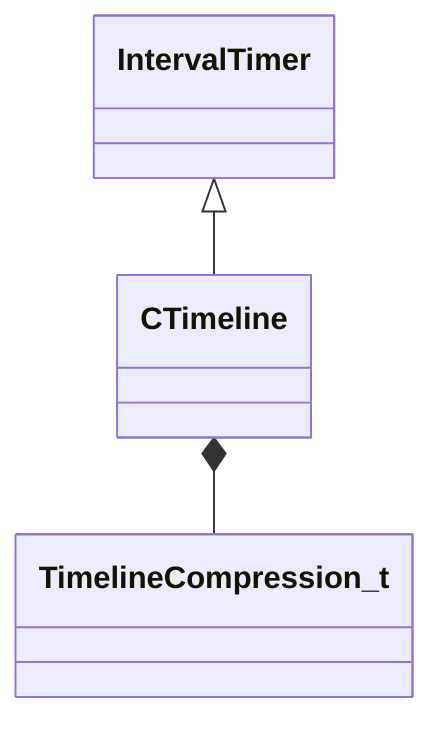

[Schemas](../../schemas.md) / [client](../client.md) / CTimeline

# CTimeline

**Kind:** class · **Size:** 552 bytes (`0x228`) · **Align:** 8 · **Module:** client

**Inherits from:** [IntervalTimer](../client/IntervalTimer.md)

**Relationships:**

## Memory layout

9 fields (7 declared here, 2 inherited). Offsets are absolute from the object base.

| Offset | Field | Type | From | Annotations |
|--------|-------|------|------|-------------|
| `0x8` | `m_timestamp` | [GameTime_t](../entity2/GameTime_t.md) | [IntervalTimer](../client/IntervalTimer.md) |  |
| `0xc` | `m_nWorldGroupId` | WorldGroupId_t | [IntervalTimer](../client/IntervalTimer.md) |  |
| `0x10` | `m_flValues` | float32[64] |  |  |
| `0x110` | `m_nValueCounts` | int32[64] |  |  |
| `0x210` | `m_nBucketCount` | int32 |  |  |
| `0x214` | `m_flInterval` | float32 |  |  |
| `0x218` | `m_flFinalValue` | float32 |  |  |
| `0x21c` | `m_nCompressionType` | [TimelineCompression_t](../!GlobalTypes/TimelineCompression_t.md) |  |  |
| `0x220` | `m_bStopped` | bool |  |  |

KV3 class defaults

<pre>null</pre>

