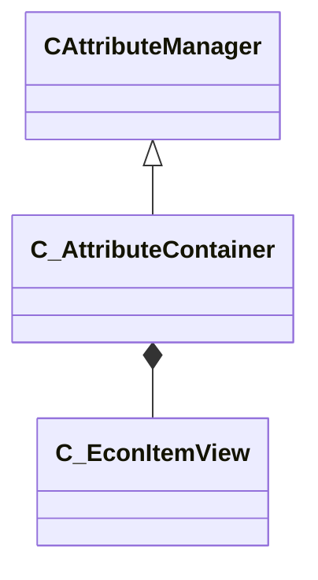

[Schemas](../../schemas.md) / [client](../client.md) / C_AttributeContainer

# C_AttributeContainer

> Source: **Build 25000182** · 2026-08-28 · `windows-x86_64` · schema `0.10.0`

**Kind:** class · **Size:** 1232 bytes (`0x4d0`) · **Align:** n/a (unspecified) · **Module:** client

**Inherits from:** [CAttributeManager](../client/CAttributeManager.md)

**Relationships:**

## Memory layout

9 fields (3 declared here, 6 inherited). Offsets are absolute from the object base.

| Offset | Field | Type | From | Annotations |
|--------|-------|------|------|-------------|
| `0x8` | `m_Providers` | CUtlVector< CHandle< [C_BaseEntity](../client/C_BaseEntity.md) > > | [CAttributeManager](../client/CAttributeManager.md) |  |
| `0x20` | `m_iReapplyProvisionParity` | int32 | [CAttributeManager](../client/CAttributeManager.md) |  |
| `0x24` | `m_hOuter` | CHandle< [C_BaseEntity](../client/C_BaseEntity.md) > | [CAttributeManager](../client/CAttributeManager.md) |  |
| `0x28` | `m_bPreventLoopback` | bool | [CAttributeManager](../client/CAttributeManager.md) |  |
| `0x2c` | `m_ProviderType` | attributeprovidertypes_t | [CAttributeManager](../client/CAttributeManager.md) |  |
| `0x30` | `m_CachedResults` | CUtlVector< [CAttributeManager::cached_attribute_float_t](../client/CAttributeManager.cached_attribute_float_t.md) > | [CAttributeManager](../client/CAttributeManager.md) |  |
| `0x50` | `m_Item` | [C_EconItemView](../client/C_EconItemView.md) |  |  |
| `0x4c0` | `m_iExternalItemProviderRegisteredToken` | int32 |  |  |
| `0x4c8` | `m_ullRegisteredAsItemID` | uint64 |  |  |
