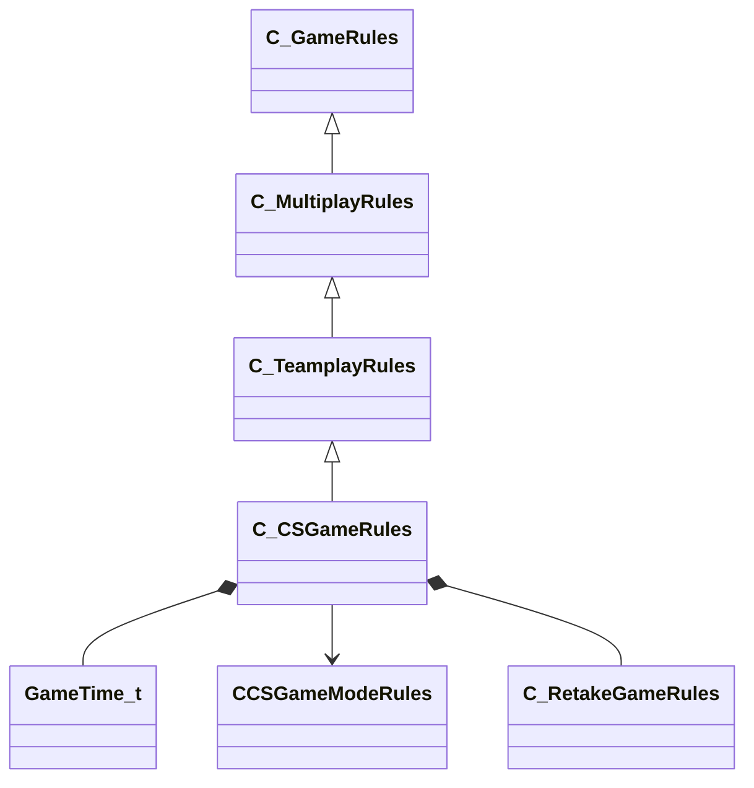

[Schemas](../../schemas.md) / [client](../client.md) / C_CSGameRules

# C_CSGameRules

> Source: **Build 25000182** · 2026-08-28 · `windows-x86_64` · schema `0.10.0`

**Kind:** class · **Size:** 20320 bytes (`0x4f60`) · **Align:** n/a (unspecified) · **Module:** client

**Inherits from:** [C_TeamplayRules](../client/C_TeamplayRules.md)

**Relationships:**

## Memory layout

102 fields (98 declared here, 4 inherited). Offsets are absolute from the object base.

| Offset | Field | Type | From | Annotations |
|--------|-------|------|------|-------------|
| `0x8` | `__m_pChainEntity` | [CNetworkVarChainer](../entity2/CNetworkVarChainer.md) | [C_GameRules](../client/C_GameRules.md) | `MNotSaved` |
| `0x30` | `m_nTotalPausedTicks` | int32 | [C_GameRules](../client/C_GameRules.md) |  |
| `0x34` | `m_nPauseStartTick` | int32 | [C_GameRules](../client/C_GameRules.md) |  |
| `0x38` | `m_bGamePaused` | bool | [C_GameRules](../client/C_GameRules.md) |  |
| `0x40` | `m_bFreezePeriod` | bool |  |  |
| `0x41` | `m_bWarmupPeriod` | bool |  |  |
| `0x44` | `m_fWarmupPeriodEnd` | [GameTime_t](../entity2/GameTime_t.md) |  |  |
| `0x48` | `m_fWarmupPeriodStart` | [GameTime_t](../entity2/GameTime_t.md) |  |  |
| `0x4c` | `m_bTerroristTimeOutActive` | bool |  |  |
| `0x4d` | `m_bCTTimeOutActive` | bool |  |  |
| `0x50` | `m_flTerroristTimeOutRemaining` | float32 |  |  |
| `0x54` | `m_flCTTimeOutRemaining` | float32 |  |  |
| `0x58` | `m_nTerroristTimeOuts` | int32 |  |  |
| `0x5c` | `m_nCTTimeOuts` | int32 |  |  |
| `0x60` | `m_bTechnicalTimeOut` | bool |  |  |
| `0x61` | `m_bMatchWaitingForResume` | bool |  |  |
| `0x64` | `m_iFreezeTime` | int32 |  |  |
| `0x68` | `m_iRoundTime` | int32 |  |  |
| `0x6c` | `m_fMatchStartTime` | float32 |  |  |
| `0x70` | `m_fRoundStartTime` | [GameTime_t](../entity2/GameTime_t.md) |  |  |
| `0x74` | `m_flRestartRoundTime` | [GameTime_t](../entity2/GameTime_t.md) |  |  |
| `0x78` | `m_bGameRestart` | bool |  |  |
| `0x7c` | `m_flGameStartTime` | float32 |  |  |
| `0x80` | `m_timeUntilNextPhaseStarts` | float32 |  |  |
| `0x84` | `m_gamePhase` | int32 |  |  |
| `0x88` | `m_totalRoundsPlayed` | int32 |  |  |
| `0x8c` | `m_nRoundsPlayedThisPhase` | int32 |  |  |
| `0x90` | `m_nOvertimePlaying` | int32 |  |  |
| `0x94` | `m_iHostagesRemaining` | int32 |  |  |
| `0x98` | `m_bAnyHostageReached` | bool |  |  |
| `0x99` | `m_bMapHasBombTarget` | bool |  |  |
| `0x9a` | `m_bMapHasRescueZone` | bool |  |  |
| `0x9b` | `m_bMapHasBuyZone` | bool |  |  |
| `0x9c` | `m_bIsQueuedMatchmaking` | bool |  |  |
| `0xa0` | `m_nQueuedMatchmakingMode` | int32 |  |  |
| `0xa4` | `m_bIsValveDS` | bool |  |  |
| `0xa5` | `m_bLogoMap` | bool |  |  |
| `0xa6` | `m_bPlayAllStepSoundsOnServer` | bool |  |  |
| `0xa8` | `m_iSpectatorSlotCount` | int32 |  |  |
| `0xac` | `m_MatchDevice` | int32 |  |  |
| `0xb0` | `m_bHasMatchStarted` | bool |  |  |
| `0xb4` | `m_nNextMapInMapgroup` | int32 |  |  |
| `0xb8` | `m_szTournamentEventName` | char[512] |  |  |
| `0x2b8` | `m_szTournamentEventStage` | char[512] |  |  |
| `0x4b8` | `m_szMatchStatTxt` | char[512] |  |  |
| `0x6b8` | `m_szTournamentPredictionsTxt` | char[512] |  |  |
| `0x8b8` | `m_nTournamentPredictionsPct` | int32 |  |  |
| `0x8bc` | `m_flCMMItemDropRevealStartTime` | [GameTime_t](../entity2/GameTime_t.md) |  |  |
| `0x8c0` | `m_flCMMItemDropRevealEndTime` | [GameTime_t](../entity2/GameTime_t.md) |  |  |
| `0x8c4` | `m_bIsDroppingItems` | bool |  |  |
| `0x8c5` | `m_bIsQuestEligible` | bool |  |  |
| `0x8c6` | `m_bIsHltvActive` | bool |  |  |
| `0x8c7` | `m_bBombPlanted` | bool |  |  |
| `0x8c8` | `m_arrProhibitedItemIndices` | uint16[100] |  |  |
| `0x990` | `m_arrTournamentActiveCasterAccounts` | uint32[4] |  |  |
| `0x9a0` | `m_numBestOfMaps` | int32 |  |  |
| `0x9a4` | `m_nHalloweenMaskListSeed` | int32 |  |  |
| `0x9a8` | `m_bBombDropped` | bool |  |  |
| `0x9ac` | `m_iRoundWinStatus` | int32 |  |  |
| `0x9b0` | `m_eRoundWinReason` | int32 |  |  |
| `0x9b4` | `m_bTCantBuy` | bool |  |  |
| `0x9b5` | `m_bCTCantBuy` | bool |  |  |
| `0x9b8` | `m_iMatchStats_RoundResults` | int32[30] |  |  |
| `0xa30` | `m_iMatchStats_PlayersAlive_CT` | int32[30] |  |  |
| `0xaa8` | `m_iMatchStats_PlayersAlive_T` | int32[30] |  |  |
| `0xb20` | `m_TeamRespawnWaveTimes` | float32[32] |  |  |
| `0xba0` | `m_flNextRespawnWave` | [GameTime_t](../entity2/GameTime_t.md)[32] |  |  |
| `0xc20` | `m_vMinimapMins` | VectorWS |  |  |
| `0xc2c` | `m_vMinimapMaxs` | VectorWS |  |  |
| `0xc38` | `m_MinimapVerticalSectionHeights` | float32[8] |  |  |
| `0xc58` | `m_ullLocalMatchID` | uint64 |  |  |
| `0xc60` | `m_nEndMatchMapGroupVoteTypes` | int32[10] |  |  |
| `0xc88` | `m_nEndMatchMapGroupVoteOptions` | int32[10] |  |  |
| `0xcb0` | `m_nEndMatchMapVoteWinner` | int32 |  |  |
| `0xcb4` | `m_iNumConsecutiveCTLoses` | int32 |  |  |
| `0xcb8` | `m_iNumConsecutiveTerroristLoses` | int32 |  |  |
| `0xd78` | `m_nMatchAbortedEarlyReason` | int32 |  |  |
| `0xd7c` | `m_bHasTriggeredRoundStartMusic` | bool |  |  |
| `0xd7d` | `m_bSwitchingTeamsAtRoundReset` | bool |  |  |
| `0xd98` | `m_pGameModeRules` | [CCSGameModeRules](../client/CCSGameModeRules.md)* |  |  |
| `0xda0` | `m_RetakeRules` | [C_RetakeGameRules](../client/C_RetakeGameRules.md) |  |  |
| `0xef8` | `m_nMatchEndCount` | uint8 |  |  |
| `0xefc` | `m_nTTeamIntroVariant` | int32 |  |  |
| `0xf00` | `m_nCTTeamIntroVariant` | int32 |  |  |
| `0xf04` | `m_bTeamIntroPeriod` | bool |  |  |
| `0xf08` | `m_iRoundEndWinnerTeam` | int32 |  |  |
| `0xf0c` | `m_eRoundEndReason` | int32 |  |  |
| `0xf10` | `m_bRoundEndShowTimerDefend` | bool |  |  |
| `0xf14` | `m_iRoundEndTimerTime` | int32 |  |  |
| `0xf18` | `m_sRoundEndFunFactToken` | CUtlString |  |  |
| `0xf20` | `m_iRoundEndFunFactPlayerSlot` | CPlayerSlot |  |  |
| `0xf24` | `m_iRoundEndFunFactData1` | int32 |  |  |
| `0xf28` | `m_iRoundEndFunFactData2` | int32 |  |  |
| `0xf2c` | `m_iRoundEndFunFactData3` | int32 |  |  |
| `0xf30` | `m_sRoundEndMessage` | CUtlString |  |  |
| `0xf38` | `m_iRoundEndPlayerCount` | int32 |  |  |
| `0xf3c` | `m_bRoundEndNoMusic` | bool |  |  |
| `0xf40` | `m_iRoundEndLegacy` | int32 |  |  |
| `0xf44` | `m_nRoundEndCount` | uint8 |  |  |
| `0xf48` | `m_iRoundStartRoundNumber` | int32 |  |  |
| `0xf4c` | `m_nRoundStartCount` | uint8 |  |  |
| `0x4f58` | `m_flLastPerfSampleTime` | float64 |  |  |
