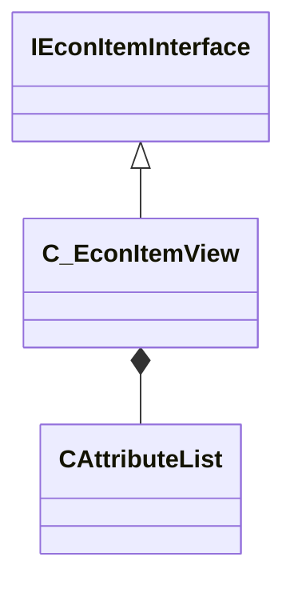

[Schemas](../../schemas.md) / [client](../client.md) / C_EconItemView

# C_EconItemView

> Source: **Build 25000182** · 2026-08-28 · `windows-x86_64` · schema `0.10.0`

**Kind:** class · **Size:** 1136 bytes (`0x470`) · **Align:** n/a (unspecified) · **Module:** client

**Inherits from:** [IEconItemInterface](../server/IEconItemInterface.md)

**Relationships:**

## Memory layout

29 fields (29 declared here, 0 inherited). Offsets are absolute from the object base.

| Offset | Field | Type | From | Annotations |
|--------|-------|------|------|-------------|
| `0x60` | `m_bInventoryImageRgbaRequested` | bool |  |  |
| `0x61` | `m_bInventoryImageTriedCache` | bool |  |  |
| `0x80` | `m_nInventoryImageRgbaWidth` | int32 |  |  |
| `0x84` | `m_nInventoryImageRgbaHeight` | int32 |  |  |
| `0x88` | `m_szCurrentLoadCachedFileName` | char[260] |  |  |
| `0x1b8` | `m_bRestoreCustomMaterialAfterPrecache` | bool |  |  |
| `0x1ba` | `m_iItemDefinitionIndex` | uint16 |  |  |
| `0x1bc` | `m_iEntityQuality` | int32 |  |  |
| `0x1c0` | `m_iEntityLevel` | uint32 |  |  |
| `0x1c8` | `m_iItemID` | uint64 |  |  |
| `0x1d0` | `m_iItemIDHigh` | uint32 |  |  |
| `0x1d4` | `m_iItemIDLow` | uint32 |  |  |
| `0x1d8` | `m_iAccountID` | uint32 |  |  |
| `0x1dc` | `m_iInventoryPosition` | uint32 |  |  |
| `0x1e8` | `m_bInitialized` | bool |  |  |
| `0x1e9` | `m_bDisallowSOC` | bool |  |  |
| `0x1ea` | `m_bIsStoreItem` | bool |  |  |
| `0x1eb` | `m_bIsTradeItem` | bool |  |  |
| `0x1ec` | `m_iEntityQuantity` | int32 |  |  |
| `0x1f0` | `m_iRarityOverride` | int32 |  |  |
| `0x1f4` | `m_iQualityOverride` | int32 |  |  |
| `0x1f8` | `m_iOriginOverride` | int32 |  |  |
| `0x1fc` | `m_ubStyleOverride` | uint8 |  |  |
| `0x1fd` | `m_unClientFlags` | uint8 |  |  |
| `0x208` | `m_AttributeList` | [CAttributeList](../client/CAttributeList.md) |  |  |
| `0x280` | `m_NetworkedDynamicAttributes` | [CAttributeList](../client/CAttributeList.md) |  |  |
| `0x2f8` | `m_szCustomName` | char[161] |  |  |
| `0x399` | `m_szCustomNameOverride` | char[161] |  |  |
| `0x468` | `m_bInitializedTags` | bool |  |  |
