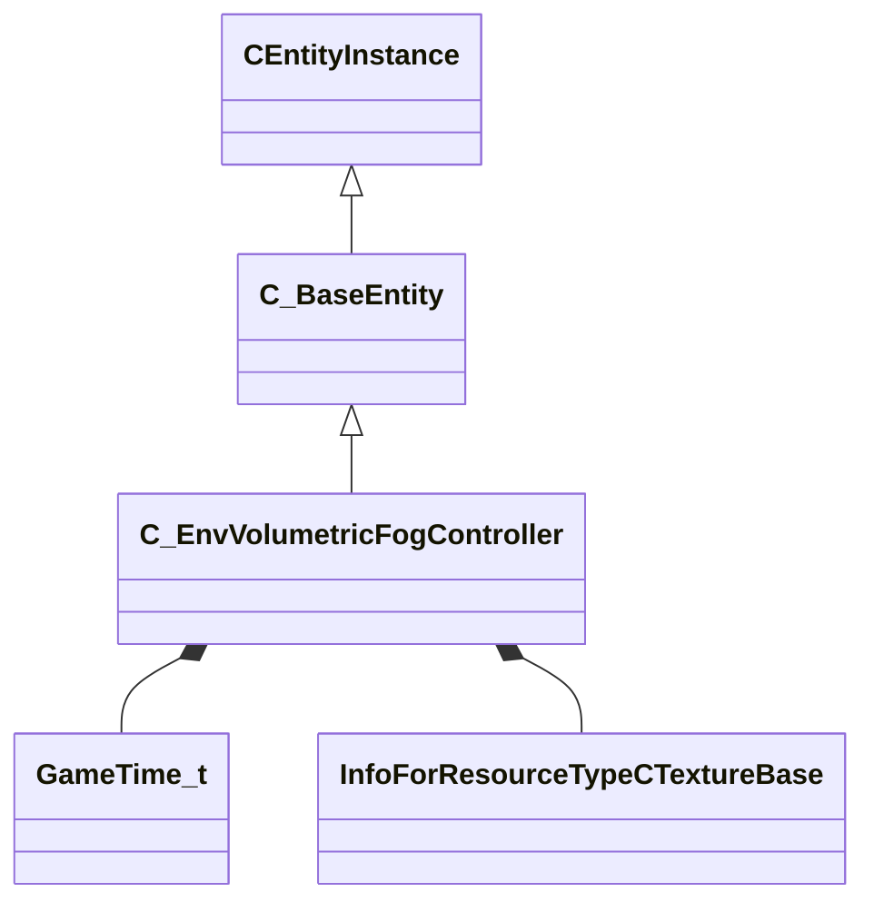

[Schemas](../../schemas.md) / [client](../client.md) / C_EnvVolumetricFogController

# C_EnvVolumetricFogController

**Kind:** class · **Size:** 1712 bytes (`0x6b0`) · **Align:** 8 · **Module:** client

**Inherits from:** [C_BaseEntity](../client/C_BaseEntity.md)

**Metadata:** `MEntityAllowsPortraitWorldSpawn`

**Relationships:**

## Memory layout

121 fields (36 declared here, 85 inherited). Offsets are absolute from the object base.

| Offset | Field | Type | From | Annotations |
|--------|-------|------|------|-------------|
| `0x8` | `m_iszPrivateVScripts` | CUtlSymbolLarge | [CEntityInstance](../entity2/CEntityInstance.md) |  |
| `0x10` | `m_pEntity` | [CEntityIdentity](../entity2/CEntityIdentity.md)* | [CEntityInstance](../entity2/CEntityInstance.md) |  |
| `0x28` | `m_CScriptComponent` | [CScriptComponent](../entity2/CScriptComponent.md)* | [CEntityInstance](../entity2/CEntityInstance.md) |  |
| `0x30` | `m_CBodyComponent` | [CBodyComponent](../client/CBodyComponent.md)* | [C_BaseEntity](../client/C_BaseEntity.md) |  |
| `0x38` | `m_NetworkTransmitComponent` | [CNetworkTransmitComponent](../server/CNetworkTransmitComponent.md) | [C_BaseEntity](../client/C_BaseEntity.md) | `MNotSaved` |
| `0x328` | `m_nLastThinkTick` | [GameTick_t](../entity2/GameTick_t.md) | [C_BaseEntity](../client/C_BaseEntity.md) | `MNotSaved` |
| `0x330` | `m_pGameSceneNode` | [CGameSceneNode](../client/CGameSceneNode.md)* | [C_BaseEntity](../client/C_BaseEntity.md) | `MNotSaved` |
| `0x338` | `m_pRenderComponent` | [CRenderComponent](../client/CRenderComponent.md)* | [C_BaseEntity](../client/C_BaseEntity.md) | `MNotSaved` |
| `0x340` | `m_pCollision` | [CCollisionProperty](../client/CCollisionProperty.md)* | [C_BaseEntity](../client/C_BaseEntity.md) | `MNotSaved` |
| `0x348` | `m_iMaxHealth` | int32 | [C_BaseEntity](../client/C_BaseEntity.md) | `MNotSaved` |
| `0x34c` | `m_iHealth` | int32 | [C_BaseEntity](../client/C_BaseEntity.md) |  |
| `0x350` | `m_flDamageAccumulator` | float32 | [C_BaseEntity](../client/C_BaseEntity.md) | `MNotSaved` |
| `0x354` | `m_lifeState` | uint8 | [C_BaseEntity](../client/C_BaseEntity.md) | `MNotSaved` |
| `0x355` | `m_bTakesDamage` | bool | [C_BaseEntity](../client/C_BaseEntity.md) | `MNotSaved` |
| `0x358` | `m_nTakeDamageFlags` | [TakeDamageFlags_t](../!GlobalTypes/TakeDamageFlags_t.md) | [C_BaseEntity](../client/C_BaseEntity.md) | `MNotSaved` |
| `0x360` | `m_nPlatformType` | [EntityPlatformTypes_t](../!GlobalTypes/EntityPlatformTypes_t.md) | [C_BaseEntity](../client/C_BaseEntity.md) |  |
| `0x361` | `m_ubInterpolationFrame` | uint8 | [C_BaseEntity](../client/C_BaseEntity.md) | `MNotSaved` |
| `0x364` | `m_hSceneObjectController` | CHandle< [C_BaseEntity](../client/C_BaseEntity.md) > | [C_BaseEntity](../client/C_BaseEntity.md) |  |
| `0x368` | `m_nNoInterpolationTick` | int32 | [C_BaseEntity](../client/C_BaseEntity.md) | `MNotSaved` |
| `0x36c` | `m_nVisibilityNoInterpolationTick` | int32 | [C_BaseEntity](../client/C_BaseEntity.md) | `MNotSaved` |
| `0x370` | `m_flProxyRandomValue` | float32 | [C_BaseEntity](../client/C_BaseEntity.md) | `MNotSaved` |
| `0x374` | `m_iEFlags` | int32 | [C_BaseEntity](../client/C_BaseEntity.md) | `MNotSaved` |
| `0x378` | `m_nWaterType` | uint8 | [C_BaseEntity](../client/C_BaseEntity.md) | `MNotSaved` |
| `0x379` | `m_bInterpolateEvenWithNoModel` | bool | [C_BaseEntity](../client/C_BaseEntity.md) | `MNotSaved` |
| `0x37a` | `m_bPredictionEligible` | bool | [C_BaseEntity](../client/C_BaseEntity.md) | `MNotSaved` |
| `0x37b` | `m_bApplyLayerMatchIDToModel` | bool | [C_BaseEntity](../client/C_BaseEntity.md) | `MNotSaved` |
| `0x37c` | `m_tokLayerMatchID` | CUtlStringToken | [C_BaseEntity](../client/C_BaseEntity.md) | `MNotSaved` |
| `0x380` | `m_nSubclassID` | CUtlStringToken | [C_BaseEntity](../client/C_BaseEntity.md) |  |
| `0x390` | `m_nSimulationTick` | int32 | [C_BaseEntity](../client/C_BaseEntity.md) | `MNotSaved` |
| `0x394` | `m_iCurrentThinkContext` | int32 | [C_BaseEntity](../client/C_BaseEntity.md) | `MNotSaved` |
| `0x398` | `m_aThinkFunctions` | CUtlVector< thinkfunc_t > | [C_BaseEntity](../client/C_BaseEntity.md) | `MNotSaved` |
| `0x3b0` | `m_bDisabledContextThinks` | bool | [C_BaseEntity](../client/C_BaseEntity.md) |  |
| `0x3b4` | `m_flAnimTime` | float32 | [C_BaseEntity](../client/C_BaseEntity.md) | `MNotSaved` |
| `0x3b8` | `m_flSimulationTime` | float32 | [C_BaseEntity](../client/C_BaseEntity.md) | `MNotSaved` |
| `0x3bc` | `m_nSceneObjectOverrideFlags` | uint8 | [C_BaseEntity](../client/C_BaseEntity.md) |  |
| `0x3bd` | `m_bHasSuccessfullyInterpolated` | bool | [C_BaseEntity](../client/C_BaseEntity.md) | `MNotSaved` |
| `0x3be` | `m_bHasAddedVarsToInterpolation` | bool | [C_BaseEntity](../client/C_BaseEntity.md) | `MNotSaved` |
| `0x3bf` | `m_bRenderEvenWhenNotSuccessfullyInterpolated` | bool | [C_BaseEntity](../client/C_BaseEntity.md) | `MNotSaved` |
| `0x3c0` | `m_nInterpolationLatchDirtyFlags` | int32[2] | [C_BaseEntity](../client/C_BaseEntity.md) | `MNotSaved` |
| `0x3c8` | `m_ListEntry` | uint16[11] | [C_BaseEntity](../client/C_BaseEntity.md) | `MNotSaved` |
| `0x3e0` | `m_flCreateTime` | [GameTime_t](../entity2/GameTime_t.md) | [C_BaseEntity](../client/C_BaseEntity.md) | `MNotSaved` |
| `0x3e4` | `m_EntClientFlags` | uint16 | [C_BaseEntity](../client/C_BaseEntity.md) | `MNotSaved` |
| `0x3e6` | `m_bClientSideRagdoll` | bool | [C_BaseEntity](../client/C_BaseEntity.md) | `MNotSaved` |
| `0x3e7` | `m_iTeamNum` | uint8 | [C_BaseEntity](../client/C_BaseEntity.md) | `MNotSaved` |
| `0x3e8` | `m_spawnflags` | uint32 | [C_BaseEntity](../client/C_BaseEntity.md) |  |
| `0x3ec` | `m_nNextThinkTick` | [GameTick_t](../entity2/GameTick_t.md) | [C_BaseEntity](../client/C_BaseEntity.md) | `MNotSaved` |
| `0x3f4` | `m_fFlags` | uint32 | [C_BaseEntity](../client/C_BaseEntity.md) | `MSaveBehavior` |
| `0x3f8` | `m_vecAbsVelocity` | Vector | [C_BaseEntity](../client/C_BaseEntity.md) | `MNotSaved` |
| `0x404` | `m_vecServerVelocity` | [CNetworkVelocityVector](../server/CNetworkVelocityVector.md) | [C_BaseEntity](../client/C_BaseEntity.md) | `MNotSaved` |
| `0x430` | `m_vecVelocity` | [CNetworkVelocityVector](../server/CNetworkVelocityVector.md) | [C_BaseEntity](../client/C_BaseEntity.md) |  |
| `0x510` | `m_vecBaseVelocity` | Vector | [C_BaseEntity](../client/C_BaseEntity.md) | `MNotSaved` |
| `0x51c` | `m_hEffectEntity` | CHandle< [C_BaseEntity](../client/C_BaseEntity.md) > | [C_BaseEntity](../client/C_BaseEntity.md) | `MNotSaved` |
| `0x520` | `m_hOwnerEntity` | CHandle< [C_BaseEntity](../client/C_BaseEntity.md) > | [C_BaseEntity](../client/C_BaseEntity.md) |  |
| `0x524` | `m_MoveCollide` | [MoveCollide_t](../!GlobalTypes/MoveCollide_t.md) | [C_BaseEntity](../client/C_BaseEntity.md) | `MNotSaved` |
| `0x525` | `m_MoveType` | [MoveType_t](../!GlobalTypes/MoveType_t.md) | [C_BaseEntity](../client/C_BaseEntity.md) |  |
| `0x526` | `m_nActualMoveType` | [MoveType_t](../!GlobalTypes/MoveType_t.md) | [C_BaseEntity](../client/C_BaseEntity.md) |  |
| `0x528` | `m_flWaterLevel` | float32 | [C_BaseEntity](../client/C_BaseEntity.md) | `MNotSaved` |
| `0x52c` | `m_fEffects` | uint32 | [C_BaseEntity](../client/C_BaseEntity.md) | `MNotSaved` |
| `0x530` | `m_hGroundEntity` | CHandle< [C_BaseEntity](../client/C_BaseEntity.md) > | [C_BaseEntity](../client/C_BaseEntity.md) | `MNotSaved` |
| `0x534` | `m_nGroundBodyIndex` | int32 | [C_BaseEntity](../client/C_BaseEntity.md) | `MNotSaved` |
| `0x538` | `m_flFriction` | float32 | [C_BaseEntity](../client/C_BaseEntity.md) | `MNotSaved` |
| `0x53c` | `m_flElasticity` | float32 | [C_BaseEntity](../client/C_BaseEntity.md) | `MNotSaved` |
| `0x540` | `m_flGravityScale` | float32 | [C_BaseEntity](../client/C_BaseEntity.md) | `MNotSaved` |
| `0x544` | `m_flTimeScale` | float32 | [C_BaseEntity](../client/C_BaseEntity.md) | `MNotSaved` |
| `0x548` | `m_bAnimatedEveryTick` | bool | [C_BaseEntity](../client/C_BaseEntity.md) | `MNotSaved` |
| `0x549` | `m_bGravityDisabled` | bool | [C_BaseEntity](../client/C_BaseEntity.md) |  |
| `0x54c` | `m_flNavIgnoreUntilTime` | [GameTime_t](../entity2/GameTime_t.md) | [C_BaseEntity](../client/C_BaseEntity.md) | `MNotSaved` |
| `0x550` | `m_hThink` | uint16 | [C_BaseEntity](../client/C_BaseEntity.md) | `MNotSaved` |
| `0x560` | `m_fBBoxVisFlags` | uint8 | [C_BaseEntity](../client/C_BaseEntity.md) | `MNotSaved` |
| `0x564` | `m_flActualGravityScale` | float32 | [C_BaseEntity](../client/C_BaseEntity.md) |  |
| `0x568` | `m_bGravityActuallyDisabled` | bool | [C_BaseEntity](../client/C_BaseEntity.md) |  |
| `0x569` | `m_bPredictable` | bool | [C_BaseEntity](../client/C_BaseEntity.md) | `MNotSaved` |
| `0x56a` | `m_bRenderWithViewModels` | bool | [C_BaseEntity](../client/C_BaseEntity.md) |  |
| `0x56c` | `m_nFirstPredictableCommand` | int32 | [C_BaseEntity](../client/C_BaseEntity.md) | `MNotSaved` |
| `0x570` | `m_nLastPredictableCommand` | int32 | [C_BaseEntity](../client/C_BaseEntity.md) | `MNotSaved` |
| `0x574` | `m_hOldMoveParent` | CHandle< [C_BaseEntity](../client/C_BaseEntity.md) > | [C_BaseEntity](../client/C_BaseEntity.md) | `MNotSaved` |
| `0x578` | `m_Particles` | [CParticleProperty](../particleslib/CParticleProperty.md) | [C_BaseEntity](../client/C_BaseEntity.md) | `MNotSaved` |
| `0x5a8` | `m_vecAngVelocity` | QAngle | [C_BaseEntity](../client/C_BaseEntity.md) |  |
| `0x5b4` | `m_DataChangeEventRef` | int32 | [C_BaseEntity](../client/C_BaseEntity.md) | `MNotSaved` |
| `0x5b8` | `m_dependencies` | CUtlVector< CEntityHandle > | [C_BaseEntity](../client/C_BaseEntity.md) | `MNotSaved` |
| `0x5d0` | `m_nCreationTick` | int32 | [C_BaseEntity](../client/C_BaseEntity.md) | `MNotSaved` |
| `0x5e1` | `m_bAnimTimeChanged` | bool | [C_BaseEntity](../client/C_BaseEntity.md) | `MNotSaved` |
| `0x5e2` | `m_bSimulationTimeChanged` | bool | [C_BaseEntity](../client/C_BaseEntity.md) | `MNotSaved` |
| `0x5f0` | `m_sUniqueHammerID` | CUtlString | [C_BaseEntity](../client/C_BaseEntity.md) | `MNotSaved` |
| `0x5f8` | `m_nBloodType` | [BloodType](../!GlobalTypes/BloodType.md) | [C_BaseEntity](../client/C_BaseEntity.md) |  |
| `0x600` | `m_flScattering` | float32 |  |  |
| `0x604` | `m_TintColor` | Color |  |  |
| `0x608` | `m_flAnisotropy` | float32 |  |  |
| `0x60c` | `m_flFadeSpeed` | float32 |  |  |
| `0x610` | `m_flDrawDistance` | float32 |  |  |
| `0x614` | `m_flFadeInStart` | float32 |  |  |
| `0x618` | `m_flFadeInEnd` | float32 |  |  |
| `0x61c` | `m_flIndirectStrength` | float32 |  |  |
| `0x620` | `m_nVolumeDepth` | int32 |  |  |
| `0x624` | `m_fFirstVolumeSliceThickness` | float32 |  |  |
| `0x628` | `m_nIndirectTextureDimX` | int32 |  |  |
| `0x62c` | `m_nIndirectTextureDimY` | int32 |  |  |
| `0x630` | `m_nIndirectTextureDimZ` | int32 |  |  |
| `0x634` | `m_vBoxMins` | Vector |  |  |
| `0x640` | `m_vBoxMaxs` | Vector |  |  |
| `0x64c` | `m_bActive` | bool |  |  |
| `0x650` | `m_flStartAnisoTime` | [GameTime_t](../entity2/GameTime_t.md) |  |  |
| `0x654` | `m_flStartScatterTime` | [GameTime_t](../entity2/GameTime_t.md) |  |  |
| `0x658` | `m_flStartDrawDistanceTime` | [GameTime_t](../entity2/GameTime_t.md) |  |  |
| `0x65c` | `m_flStartAnisotropy` | float32 |  |  |
| `0x660` | `m_flStartScattering` | float32 |  |  |
| `0x664` | `m_flStartDrawDistance` | float32 |  |  |
| `0x668` | `m_flDefaultAnisotropy` | float32 |  |  |
| `0x66c` | `m_flDefaultScattering` | float32 |  |  |
| `0x670` | `m_flDefaultDrawDistance` | float32 |  |  |
| `0x674` | `m_bStartDisabled` | bool |  |  |
| `0x675` | `m_bEnableIndirect` | bool |  |  |
| `0x676` | `m_bIsMaster` | bool |  |  |
| `0x678` | `m_hFogIndirectTexture` | CStrongHandle< [InfoForResourceTypeCTextureBase](../resourcesystem/InfoForResourceTypeCTextureBase.md) > |  |  |
| `0x680` | `m_nForceRefreshCount` | int32 |  |  |
| `0x684` | `m_fNoiseSpeed` | float32 |  |  |
| `0x688` | `m_fNoiseStrength` | float32 |  |  |
| `0x68c` | `m_vNoiseScale` | Vector |  |  |
| `0x698` | `m_fWindSpeed` | float32 |  |  |
| `0x69c` | `m_vWindDirection` | Vector |  |  |
| `0x6a8` | `m_bFirstTime` | bool |  |  |
