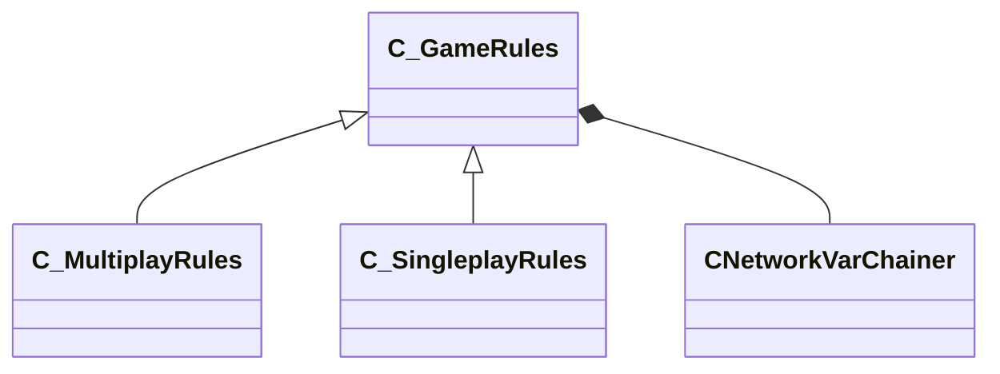

[Schemas](../../schemas.md) / [client](../client.md) / C_GameRules

# C_GameRules

> Source: **Build 25000182** · 2026-08-28 · `windows-x86_64` · schema `0.10.0`

**Kind:** class · **Size:** 64 bytes (`0x40`) · **Align:** n/a (unspecified) · **Module:** client

**Derived by:** [C_MultiplayRules](../client/C_MultiplayRules.md), [C_SingleplayRules](../client/C_SingleplayRules.md)

**Relationships:**

## Memory layout

4 fields (4 declared here, 0 inherited). Offsets are absolute from the object base.

| Offset | Field | Type | From | Annotations |
|--------|-------|------|------|-------------|
| `0x8` | `__m_pChainEntity` | [CNetworkVarChainer](../entity2/CNetworkVarChainer.md) |  | `MNotSaved` |
| `0x30` | `m_nTotalPausedTicks` | int32 |  |  |
| `0x34` | `m_nPauseStartTick` | int32 |  |  |
| `0x38` | `m_bGamePaused` | bool |  |  |
