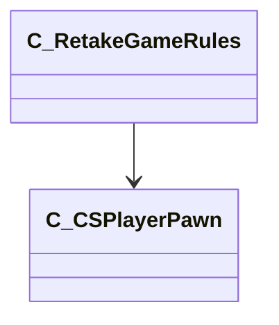

[Schemas](../../schemas.md) / [client](../client.md) / C_RetakeGameRules

# C_RetakeGameRules

**Kind:** class · **Size:** 344 bytes (`0x158`) · **Align:** 255 · **Module:** client

**Relationships:**

## Memory layout

6 fields (6 declared here, 0 inherited). Offsets are absolute from the object base.

| Offset | Field | Type | From | Annotations |
|--------|-------|------|------|-------------|
| `0x138` | `m_nMatchSeed` | int32 |  |  |
| `0x13c` | `m_bBlockersPresent` | bool |  |  |
| `0x13d` | `m_bRoundInProgress` | bool |  |  |
| `0x140` | `m_iFirstSecondHalfRound` | int32 |  |  |
| `0x144` | `m_iBombSite` | int32 |  |  |
| `0x148` | `m_hBombPlanter` | CHandle< [C_CSPlayerPawn](../client/C_CSPlayerPawn.md) > |  |  |
