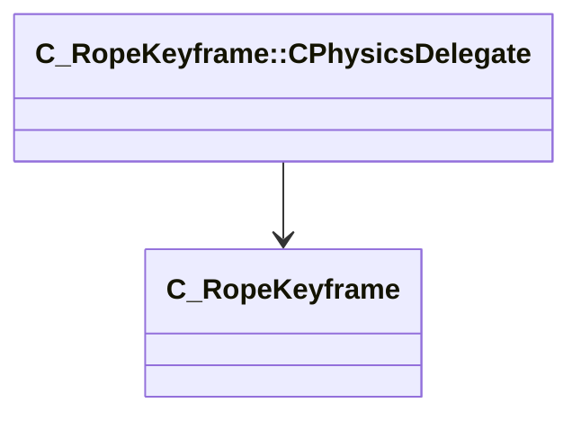

[Schemas](../../schemas.md) / [client](../client.md) / C_RopeKeyframe::CPhysicsDelegate

# C_RopeKeyframe::CPhysicsDelegate

> Source: **Build 25175329** · 2026-09-07 · `windows-x86_64` · schema `0.10.0`

**Kind:** class · **Size:** 16 bytes (`0x10`) · **Align:** n/a (unspecified) · **Module:** client

**Relationships:**

## Memory layout

1 field (1 declared here, 0 inherited). Offsets are absolute from the object base.

| Offset | Field | Type | From | Annotations |
|--------|-------|------|------|-------------|
| `0x8` | `m_pKeyframe` | [C_RopeKeyframe](../client/C_RopeKeyframe.md)* |  |  |
