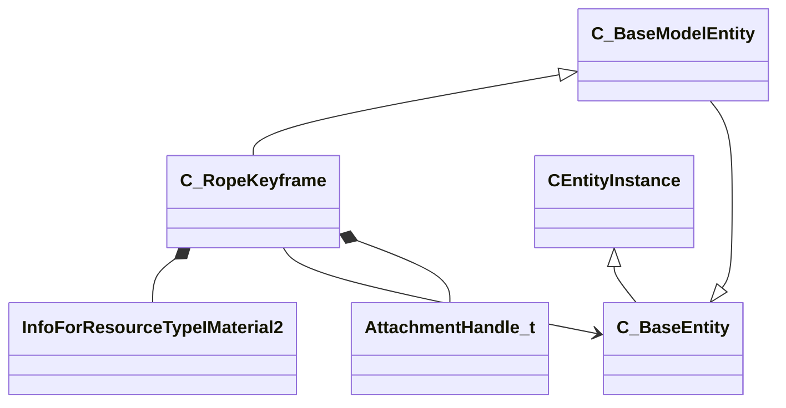

[Schemas](../../schemas.md) / [client](../client.md) / C_RopeKeyframe

# C_RopeKeyframe

**Kind:** class · **Size:** 4896 bytes (`0x1320`) · **Align:** 8 · **Module:** client

**Inherits from:** [C_BaseModelEntity](../client/C_BaseModelEntity.md)

**Relationships:**

## Memory layout

169 fields (40 declared here, 129 inherited). Offsets are absolute from the object base.

| Offset | Field | Type | From | Annotations |
|--------|-------|------|------|-------------|
| `0x0` | `m_bEndPointAttachmentAnglesDirty` | bitfield:1 |  | `MNotSaved` |
| `0x0` | `m_bEndPointAttachmentPositionsDirty` | bitfield:1 |  | `MNotSaved` |
| `0x0` | `m_bNewDataThisFrame` | bitfield:1 |  | `MNotSaved` |
| `0x0` | `m_bPhysicsInitted` | bitfield:1 |  | `MNotSaved` |
| `0x8` | `m_iszPrivateVScripts` | CUtlSymbolLarge | [CEntityInstance](../entity2/CEntityInstance.md) |  |
| `0x10` | `m_pEntity` | [CEntityIdentity](../entity2/CEntityIdentity.md)* | [CEntityInstance](../entity2/CEntityInstance.md) |  |
| `0x28` | `m_CScriptComponent` | [CScriptComponent](../entity2/CScriptComponent.md)* | [CEntityInstance](../entity2/CEntityInstance.md) |  |
| `0x30` | `m_CBodyComponent` | [CBodyComponent](../client/CBodyComponent.md)* | [C_BaseEntity](../client/C_BaseEntity.md) |  |
| `0x38` | `m_NetworkTransmitComponent` | [CNetworkTransmitComponent](../server/CNetworkTransmitComponent.md) | [C_BaseEntity](../client/C_BaseEntity.md) | `MNotSaved` |
| `0x328` | `m_nLastThinkTick` | [GameTick_t](../entity2/GameTick_t.md) | [C_BaseEntity](../client/C_BaseEntity.md) | `MNotSaved` |
| `0x330` | `m_pGameSceneNode` | [CGameSceneNode](../client/CGameSceneNode.md)* | [C_BaseEntity](../client/C_BaseEntity.md) | `MNotSaved` |
| `0x338` | `m_pRenderComponent` | [CRenderComponent](../client/CRenderComponent.md)* | [C_BaseEntity](../client/C_BaseEntity.md) | `MNotSaved` |
| `0x340` | `m_pCollision` | [CCollisionProperty](../client/CCollisionProperty.md)* | [C_BaseEntity](../client/C_BaseEntity.md) | `MNotSaved` |
| `0x348` | `m_iMaxHealth` | int32 | [C_BaseEntity](../client/C_BaseEntity.md) | `MNotSaved` |
| `0x34c` | `m_iHealth` | int32 | [C_BaseEntity](../client/C_BaseEntity.md) |  |
| `0x350` | `m_flDamageAccumulator` | float32 | [C_BaseEntity](../client/C_BaseEntity.md) | `MNotSaved` |
| `0x354` | `m_lifeState` | uint8 | [C_BaseEntity](../client/C_BaseEntity.md) | `MNotSaved` |
| `0x355` | `m_bTakesDamage` | bool | [C_BaseEntity](../client/C_BaseEntity.md) | `MNotSaved` |
| `0x358` | `m_nTakeDamageFlags` | [TakeDamageFlags_t](../!GlobalTypes/TakeDamageFlags_t.md) | [C_BaseEntity](../client/C_BaseEntity.md) | `MNotSaved` |
| `0x360` | `m_nPlatformType` | [EntityPlatformTypes_t](../!GlobalTypes/EntityPlatformTypes_t.md) | [C_BaseEntity](../client/C_BaseEntity.md) |  |
| `0x361` | `m_ubInterpolationFrame` | uint8 | [C_BaseEntity](../client/C_BaseEntity.md) | `MNotSaved` |
| `0x364` | `m_hSceneObjectController` | CHandle< [C_BaseEntity](../client/C_BaseEntity.md) > | [C_BaseEntity](../client/C_BaseEntity.md) |  |
| `0x368` | `m_nNoInterpolationTick` | int32 | [C_BaseEntity](../client/C_BaseEntity.md) | `MNotSaved` |
| `0x36c` | `m_nVisibilityNoInterpolationTick` | int32 | [C_BaseEntity](../client/C_BaseEntity.md) | `MNotSaved` |
| `0x370` | `m_flProxyRandomValue` | float32 | [C_BaseEntity](../client/C_BaseEntity.md) | `MNotSaved` |
| `0x374` | `m_iEFlags` | int32 | [C_BaseEntity](../client/C_BaseEntity.md) | `MNotSaved` |
| `0x378` | `m_nWaterType` | uint8 | [C_BaseEntity](../client/C_BaseEntity.md) | `MNotSaved` |
| `0x379` | `m_bInterpolateEvenWithNoModel` | bool | [C_BaseEntity](../client/C_BaseEntity.md) | `MNotSaved` |
| `0x37a` | `m_bPredictionEligible` | bool | [C_BaseEntity](../client/C_BaseEntity.md) | `MNotSaved` |
| `0x37b` | `m_bApplyLayerMatchIDToModel` | bool | [C_BaseEntity](../client/C_BaseEntity.md) | `MNotSaved` |
| `0x37c` | `m_tokLayerMatchID` | CUtlStringToken | [C_BaseEntity](../client/C_BaseEntity.md) | `MNotSaved` |
| `0x380` | `m_nSubclassID` | CUtlStringToken | [C_BaseEntity](../client/C_BaseEntity.md) |  |
| `0x390` | `m_nSimulationTick` | int32 | [C_BaseEntity](../client/C_BaseEntity.md) | `MNotSaved` |
| `0x394` | `m_iCurrentThinkContext` | int32 | [C_BaseEntity](../client/C_BaseEntity.md) | `MNotSaved` |
| `0x398` | `m_aThinkFunctions` | CUtlVector< thinkfunc_t > | [C_BaseEntity](../client/C_BaseEntity.md) | `MNotSaved` |
| `0x3b0` | `m_bDisabledContextThinks` | bool | [C_BaseEntity](../client/C_BaseEntity.md) |  |
| `0x3b4` | `m_flAnimTime` | float32 | [C_BaseEntity](../client/C_BaseEntity.md) | `MNotSaved` |
| `0x3b8` | `m_flSimulationTime` | float32 | [C_BaseEntity](../client/C_BaseEntity.md) | `MNotSaved` |
| `0x3bc` | `m_nSceneObjectOverrideFlags` | uint8 | [C_BaseEntity](../client/C_BaseEntity.md) |  |
| `0x3bd` | `m_bHasSuccessfullyInterpolated` | bool | [C_BaseEntity](../client/C_BaseEntity.md) | `MNotSaved` |
| `0x3be` | `m_bHasAddedVarsToInterpolation` | bool | [C_BaseEntity](../client/C_BaseEntity.md) | `MNotSaved` |
| `0x3bf` | `m_bRenderEvenWhenNotSuccessfullyInterpolated` | bool | [C_BaseEntity](../client/C_BaseEntity.md) | `MNotSaved` |
| `0x3c0` | `m_nInterpolationLatchDirtyFlags` | int32[2] | [C_BaseEntity](../client/C_BaseEntity.md) | `MNotSaved` |
| `0x3c8` | `m_ListEntry` | uint16[11] | [C_BaseEntity](../client/C_BaseEntity.md) | `MNotSaved` |
| `0x3e0` | `m_flCreateTime` | [GameTime_t](../entity2/GameTime_t.md) | [C_BaseEntity](../client/C_BaseEntity.md) | `MNotSaved` |
| `0x3e4` | `m_EntClientFlags` | uint16 | [C_BaseEntity](../client/C_BaseEntity.md) | `MNotSaved` |
| `0x3e6` | `m_bClientSideRagdoll` | bool | [C_BaseEntity](../client/C_BaseEntity.md) | `MNotSaved` |
| `0x3e7` | `m_iTeamNum` | uint8 | [C_BaseEntity](../client/C_BaseEntity.md) | `MNotSaved` |
| `0x3e8` | `m_spawnflags` | uint32 | [C_BaseEntity](../client/C_BaseEntity.md) |  |
| `0x3ec` | `m_nNextThinkTick` | [GameTick_t](../entity2/GameTick_t.md) | [C_BaseEntity](../client/C_BaseEntity.md) | `MNotSaved` |
| `0x3f4` | `m_fFlags` | uint32 | [C_BaseEntity](../client/C_BaseEntity.md) | `MSaveBehavior` |
| `0x3f8` | `m_vecAbsVelocity` | Vector | [C_BaseEntity](../client/C_BaseEntity.md) | `MNotSaved` |
| `0x404` | `m_vecServerVelocity` | [CNetworkVelocityVector](../server/CNetworkVelocityVector.md) | [C_BaseEntity](../client/C_BaseEntity.md) | `MNotSaved` |
| `0x430` | `m_vecVelocity` | [CNetworkVelocityVector](../server/CNetworkVelocityVector.md) | [C_BaseEntity](../client/C_BaseEntity.md) |  |
| `0x510` | `m_vecBaseVelocity` | Vector | [C_BaseEntity](../client/C_BaseEntity.md) | `MNotSaved` |
| `0x51c` | `m_hEffectEntity` | CHandle< [C_BaseEntity](../client/C_BaseEntity.md) > | [C_BaseEntity](../client/C_BaseEntity.md) | `MNotSaved` |
| `0x520` | `m_hOwnerEntity` | CHandle< [C_BaseEntity](../client/C_BaseEntity.md) > | [C_BaseEntity](../client/C_BaseEntity.md) |  |
| `0x524` | `m_MoveCollide` | [MoveCollide_t](../!GlobalTypes/MoveCollide_t.md) | [C_BaseEntity](../client/C_BaseEntity.md) | `MNotSaved` |
| `0x525` | `m_MoveType` | [MoveType_t](../!GlobalTypes/MoveType_t.md) | [C_BaseEntity](../client/C_BaseEntity.md) |  |
| `0x526` | `m_nActualMoveType` | [MoveType_t](../!GlobalTypes/MoveType_t.md) | [C_BaseEntity](../client/C_BaseEntity.md) |  |
| `0x528` | `m_flWaterLevel` | float32 | [C_BaseEntity](../client/C_BaseEntity.md) | `MNotSaved` |
| `0x52c` | `m_fEffects` | uint32 | [C_BaseEntity](../client/C_BaseEntity.md) | `MNotSaved` |
| `0x530` | `m_hGroundEntity` | CHandle< [C_BaseEntity](../client/C_BaseEntity.md) > | [C_BaseEntity](../client/C_BaseEntity.md) | `MNotSaved` |
| `0x534` | `m_nGroundBodyIndex` | int32 | [C_BaseEntity](../client/C_BaseEntity.md) | `MNotSaved` |
| `0x538` | `m_flFriction` | float32 | [C_BaseEntity](../client/C_BaseEntity.md) | `MNotSaved` |
| `0x53c` | `m_flElasticity` | float32 | [C_BaseEntity](../client/C_BaseEntity.md) | `MNotSaved` |
| `0x540` | `m_flGravityScale` | float32 | [C_BaseEntity](../client/C_BaseEntity.md) | `MNotSaved` |
| `0x544` | `m_flTimeScale` | float32 | [C_BaseEntity](../client/C_BaseEntity.md) | `MNotSaved` |
| `0x548` | `m_bAnimatedEveryTick` | bool | [C_BaseEntity](../client/C_BaseEntity.md) | `MNotSaved` |
| `0x549` | `m_bGravityDisabled` | bool | [C_BaseEntity](../client/C_BaseEntity.md) |  |
| `0x54c` | `m_flNavIgnoreUntilTime` | [GameTime_t](../entity2/GameTime_t.md) | [C_BaseEntity](../client/C_BaseEntity.md) | `MNotSaved` |
| `0x550` | `m_hThink` | uint16 | [C_BaseEntity](../client/C_BaseEntity.md) | `MNotSaved` |
| `0x560` | `m_fBBoxVisFlags` | uint8 | [C_BaseEntity](../client/C_BaseEntity.md) | `MNotSaved` |
| `0x564` | `m_flActualGravityScale` | float32 | [C_BaseEntity](../client/C_BaseEntity.md) |  |
| `0x568` | `m_bGravityActuallyDisabled` | bool | [C_BaseEntity](../client/C_BaseEntity.md) |  |
| `0x569` | `m_bPredictable` | bool | [C_BaseEntity](../client/C_BaseEntity.md) | `MNotSaved` |
| `0x56a` | `m_bRenderWithViewModels` | bool | [C_BaseEntity](../client/C_BaseEntity.md) |  |
| `0x56c` | `m_nFirstPredictableCommand` | int32 | [C_BaseEntity](../client/C_BaseEntity.md) | `MNotSaved` |
| `0x570` | `m_nLastPredictableCommand` | int32 | [C_BaseEntity](../client/C_BaseEntity.md) | `MNotSaved` |
| `0x574` | `m_hOldMoveParent` | CHandle< [C_BaseEntity](../client/C_BaseEntity.md) > | [C_BaseEntity](../client/C_BaseEntity.md) | `MNotSaved` |
| `0x578` | `m_Particles` | [CParticleProperty](../particleslib/CParticleProperty.md) | [C_BaseEntity](../client/C_BaseEntity.md) | `MNotSaved` |
| `0x5a8` | `m_vecAngVelocity` | QAngle | [C_BaseEntity](../client/C_BaseEntity.md) |  |
| `0x5b4` | `m_DataChangeEventRef` | int32 | [C_BaseEntity](../client/C_BaseEntity.md) | `MNotSaved` |
| `0x5b8` | `m_dependencies` | CUtlVector< CEntityHandle > | [C_BaseEntity](../client/C_BaseEntity.md) | `MNotSaved` |
| `0x5d0` | `m_nCreationTick` | int32 | [C_BaseEntity](../client/C_BaseEntity.md) | `MNotSaved` |
| `0x5e1` | `m_bAnimTimeChanged` | bool | [C_BaseEntity](../client/C_BaseEntity.md) | `MNotSaved` |
| `0x5e2` | `m_bSimulationTimeChanged` | bool | [C_BaseEntity](../client/C_BaseEntity.md) | `MNotSaved` |
| `0x5f0` | `m_sUniqueHammerID` | CUtlString | [C_BaseEntity](../client/C_BaseEntity.md) | `MNotSaved` |
| `0x5f8` | `m_nBloodType` | [BloodType](../!GlobalTypes/BloodType.md) | [C_BaseEntity](../client/C_BaseEntity.md) |  |
| `0xaf0` | `m_CRenderComponent` | [CRenderComponent](../client/CRenderComponent.md)* | [C_BaseModelEntity](../client/C_BaseModelEntity.md) | `MNotSaved` |
| `0xaf8` | `m_CHitboxComponent` | [CHitboxComponent](../client/CHitboxComponent.md) | [C_BaseModelEntity](../client/C_BaseModelEntity.md) |  |
| `0xb10` | `m_pChoreoComponent` | [CChoreoComponent](../client/CChoreoComponent.md)* | [C_BaseModelEntity](../client/C_BaseModelEntity.md) |  |
| `0xb18` | `m_nDestructiblePartInitialStateDestructed0` | [HitGroup_t](../!GlobalTypes/HitGroup_t.md) | [C_BaseModelEntity](../client/C_BaseModelEntity.md) |  |
| `0xb1c` | `m_nDestructiblePartInitialStateDestructed1` | [HitGroup_t](../!GlobalTypes/HitGroup_t.md) | [C_BaseModelEntity](../client/C_BaseModelEntity.md) |  |
| `0xb20` | `m_nDestructiblePartInitialStateDestructed2` | [HitGroup_t](../!GlobalTypes/HitGroup_t.md) | [C_BaseModelEntity](../client/C_BaseModelEntity.md) |  |
| `0xb24` | `m_nDestructiblePartInitialStateDestructed3` | [HitGroup_t](../!GlobalTypes/HitGroup_t.md) | [C_BaseModelEntity](../client/C_BaseModelEntity.md) |  |
| `0xb28` | `m_nDestructiblePartInitialStateDestructed4` | [HitGroup_t](../!GlobalTypes/HitGroup_t.md) | [C_BaseModelEntity](../client/C_BaseModelEntity.md) |  |
| `0xb2c` | `m_nDestructiblePartInitialStateDestructed0_PartIndex` | int32 | [C_BaseModelEntity](../client/C_BaseModelEntity.md) |  |
| `0xb30` | `m_nDestructiblePartInitialStateDestructed1_PartIndex` | int32 | [C_BaseModelEntity](../client/C_BaseModelEntity.md) |  |
| `0xb34` | `m_nDestructiblePartInitialStateDestructed2_PartIndex` | int32 | [C_BaseModelEntity](../client/C_BaseModelEntity.md) |  |
| `0xb38` | `m_nDestructiblePartInitialStateDestructed3_PartIndex` | int32 | [C_BaseModelEntity](../client/C_BaseModelEntity.md) |  |
| `0xb3c` | `m_nDestructiblePartInitialStateDestructed4_PartIndex` | int32 | [C_BaseModelEntity](../client/C_BaseModelEntity.md) |  |
| `0xb40` | `m_bDestructiblePartInitialStateDestructed0_GenerateBreakpieces` | bool | [C_BaseModelEntity](../client/C_BaseModelEntity.md) |  |
| `0xb41` | `m_bDestructiblePartInitialStateDestructed1_GenerateBreakpieces` | bool | [C_BaseModelEntity](../client/C_BaseModelEntity.md) |  |
| `0xb42` | `m_bDestructiblePartInitialStateDestructed2_GenerateBreakpieces` | bool | [C_BaseModelEntity](../client/C_BaseModelEntity.md) |  |
| `0xb43` | `m_bDestructiblePartInitialStateDestructed3_GenerateBreakpieces` | bool | [C_BaseModelEntity](../client/C_BaseModelEntity.md) |  |
| `0xb44` | `m_bDestructiblePartInitialStateDestructed4_GenerateBreakpieces` | bool | [C_BaseModelEntity](../client/C_BaseModelEntity.md) |  |
| `0xb48` | `m_pDestructiblePartsSystemComponent` | [CDestructiblePartsComponent](../client/CDestructiblePartsComponent.md)* | [C_BaseModelEntity](../client/C_BaseModelEntity.md) |  |
| `0xc70` | `m_bInitModelEffects` | bool | [C_BaseModelEntity](../client/C_BaseModelEntity.md) | `MNotSaved` |
| `0xc71` | `m_bDoingModelEffects` | bool | [C_BaseModelEntity](../client/C_BaseModelEntity.md) | `MNotSaved` |
| `0xc74` | `m_iOldHealth` | int32 | [C_BaseModelEntity](../client/C_BaseModelEntity.md) | `MNotSaved` |
| `0xc78` | `m_nRenderMode` | [RenderMode_t](../!GlobalTypes/RenderMode_t.md) | [C_BaseModelEntity](../client/C_BaseModelEntity.md) |  |
| `0xc79` | `m_nRenderFX` | [RenderFx_t](../!GlobalTypes/RenderFx_t.md) | [C_BaseModelEntity](../client/C_BaseModelEntity.md) |  |
| `0xc7a` | `m_bAllowFadeInView` | bool | [C_BaseModelEntity](../client/C_BaseModelEntity.md) |  |
| `0xc98` | `m_clrRender` | Color | [C_BaseModelEntity](../client/C_BaseModelEntity.md) |  |
| `0xca0` | `m_vecRenderAttributes` | C_UtlVectorEmbeddedNetworkVar< [EntityRenderAttribute_t](../client/EntityRenderAttribute_t.md) > | [C_BaseModelEntity](../client/C_BaseModelEntity.md) |  |
| `0xd20` | `m_bRenderToCubemaps` | bool | [C_BaseModelEntity](../client/C_BaseModelEntity.md) |  |
| `0xd21` | `m_bNoInterpolate` | bool | [C_BaseModelEntity](../client/C_BaseModelEntity.md) |  |
| `0xd28` | `m_Collision` | [CCollisionProperty](../client/CCollisionProperty.md) | [C_BaseModelEntity](../client/C_BaseModelEntity.md) |  |
| `0xde0` | `m_Glow` | [CGlowProperty](../client/CGlowProperty.md) | [C_BaseModelEntity](../client/C_BaseModelEntity.md) |  |
| `0xe38` | `m_flGlowBackfaceMult` | float32 | [C_BaseModelEntity](../client/C_BaseModelEntity.md) |  |
| `0xe3c` | `m_fadeMinDist` | float32 | [C_BaseModelEntity](../client/C_BaseModelEntity.md) |  |
| `0xe40` | `m_fadeMaxDist` | float32 | [C_BaseModelEntity](../client/C_BaseModelEntity.md) |  |
| `0xe44` | `m_flFadeScale` | float32 | [C_BaseModelEntity](../client/C_BaseModelEntity.md) |  |
| `0xe48` | `m_flShadowStrength` | float32 | [C_BaseModelEntity](../client/C_BaseModelEntity.md) |  |
| `0xe4c` | `m_nObjectCulling` | uint8 | [C_BaseModelEntity](../client/C_BaseModelEntity.md) |  |
| `0xe4d` | `m_nRequiredDecalRtEncoding` | [DecalRtEncoding_t](../!GlobalTypes/DecalRtEncoding_t.md) | [C_BaseModelEntity](../client/C_BaseModelEntity.md) |  |
| `0xe50` | `m_bodyGroupChoices` | CUtlOrderedMap< CGlobalSymbol, int32 > | [C_BaseModelEntity](../client/C_BaseModelEntity.md) |  |
| `0xe78` | `m_vecViewOffset` | [CNetworkViewOffsetVector](../server/CNetworkViewOffsetVector.md) | [C_BaseModelEntity](../client/C_BaseModelEntity.md) |  |
| `0xf58` | `m_pClientAlphaProperty` | [CClientAlphaProperty](../client/CClientAlphaProperty.md)* | [C_BaseModelEntity](../client/C_BaseModelEntity.md) | `MNotSaved` |
| `0xf60` | `m_ClientOverrideTint` | Color | [C_BaseModelEntity](../client/C_BaseModelEntity.md) | `MNotSaved` |
| `0xf64` | `m_bUseClientOverrideTint` | bool | [C_BaseModelEntity](../client/C_BaseModelEntity.md) | `MNotSaved` |
| `0xfa0` | `m_bvDisabledHitGroups` | uint32[1] | [C_BaseModelEntity](../client/C_BaseModelEntity.md) | `MKV3TransferSaveOpsForField GetHitgroupDisableListSaveRestoreOps` |
| `0xfb8` | `m_LinksTouchingSomething` | CBitVec< 10 > |  | `MNotSaved` |
| `0xfbc` | `m_nLinksTouchingSomething` | int32 |  | `MNotSaved` |
| `0xfc0` | `m_bApplyWind` | bool |  | `MNotSaved` |
| `0xfc4` | `m_fPrevLockedPoints` | int32 |  | `MNotSaved` |
| `0xfc8` | `m_iForcePointMoveCounter` | int32 |  | `MNotSaved` |
| `0xfcc` | `m_bPrevEndPointPos` | bool[2] |  | `MNotSaved` |
| `0xfd0` | `m_vPrevEndPointPos` | VectorWS[2] |  | `MNotSaved` |
| `0xfe8` | `m_flCurScroll` | float32 |  | `MNotSaved` |
| `0xfec` | `m_flScrollSpeed` | float32 |  | `MNotSaved` |
| `0xff0` | `m_RopeFlags` | uint16 |  | `MNotSaved` |
| `0xff8` | `m_iRopeMaterialModelIndex` | CStrongHandle< [InfoForResourceTypeIMaterial2](../resourcesystem/InfoForResourceTypeIMaterial2.md) > |  | `MNotSaved` |
| `0x1270` | `m_nSegments` | uint8 |  | `MNotSaved` |
| `0x1274` | `m_hStartPoint` | CHandle< [C_BaseEntity](../client/C_BaseEntity.md) > |  | `MNotSaved` |
| `0x1278` | `m_hEndPoint` | CHandle< [C_BaseEntity](../client/C_BaseEntity.md) > |  | `MNotSaved` |
| `0x127c` | `m_iStartAttachment` | [AttachmentHandle_t](../modellib/AttachmentHandle_t.md) |  | `MNotSaved` |
| `0x127d` | `m_iEndAttachment` | [AttachmentHandle_t](../modellib/AttachmentHandle_t.md) |  | `MNotSaved` |
| `0x127e` | `m_Subdiv` | uint8 |  | `MNotSaved` |
| `0x1280` | `m_RopeLength` | int16 |  | `MNotSaved` |
| `0x1282` | `m_Slack` | int16 |  | `MNotSaved` |
| `0x1284` | `m_TextureScale` | float32 |  | `MNotSaved` |
| `0x1288` | `m_fLockedPoints` | uint8 |  | `MNotSaved` |
| `0x1289` | `m_nChangeCount` | uint8 |  | `MNotSaved` |
| `0x128c` | `m_Width` | float32 |  | `MNotSaved` |
| `0x1290` | `m_PhysicsDelegate` | [C_RopeKeyframe](../client/C_RopeKeyframe.md)::CPhysicsDelegate |  | `MNotSaved` |
| `0x12a0` | `m_hMaterial` | CStrongHandle< [InfoForResourceTypeIMaterial2](../resourcesystem/InfoForResourceTypeIMaterial2.md) > |  | `MNotSaved` |
| `0x12a8` | `m_TextureHeight` | int32 |  | `MNotSaved` |
| `0x12ac` | `m_vecImpulse` | Vector |  | `MNotSaved` |
| `0x12b8` | `m_vecPreviousImpulse` | Vector |  | `MNotSaved` |
| `0x12c4` | `m_flCurrentGustTimer` | float32 |  | `MNotSaved` |
| `0x12c8` | `m_flCurrentGustLifetime` | float32 |  | `MNotSaved` |
| `0x12cc` | `m_flTimeToNextGust` | float32 |  | `MNotSaved` |
| `0x12d0` | `m_vWindDir` | Vector |  | `MNotSaved` |
| `0x12dc` | `m_vColorMod` | Vector |  | `MNotSaved` |
| `0x12e8` | `m_vCachedEndPointAttachmentPos` | VectorWS[2] |  | `MNotSaved` |
| `0x1300` | `m_vCachedEndPointAttachmentAngle` | QAngle[2] |  | `MNotSaved` |
| `0x1318` | `m_bConstrainBetweenEndpoints` | bool |  | `MNotSaved` |
