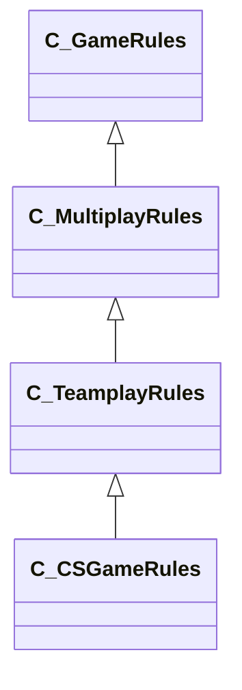

[Schemas](../../schemas.md) / [client](../client.md) / C_TeamplayRules

# C_TeamplayRules

**Kind:** class · **Size:** 64 bytes (`0x40`) · **Align:** 255 · **Module:** client

**Inherits from:** [C_MultiplayRules](../client/C_MultiplayRules.md)

**Derived by:** [C_CSGameRules](../client/C_CSGameRules.md)

**Relationships:**

## Memory layout

4 fields (0 declared here, 4 inherited). Offsets are absolute from the object base.

| Offset | Field | Type | From | Annotations |
|--------|-------|------|------|-------------|
| `0x8` | `__m_pChainEntity` | [CNetworkVarChainer](../entity2/CNetworkVarChainer.md) | [C_GameRules](../client/C_GameRules.md) | `MNotSaved` |
| `0x30` | `m_nTotalPausedTicks` | int32 | [C_GameRules](../client/C_GameRules.md) |  |
| `0x34` | `m_nPauseStartTick` | int32 | [C_GameRules](../client/C_GameRules.md) |  |
| `0x38` | `m_bGamePaused` | bool | [C_GameRules](../client/C_GameRules.md) |  |
