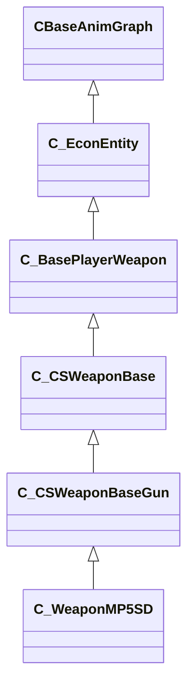

[Schemas](../../schemas.md) / [client](../client.md) / C_WeaponMP5SD

# C_WeaponMP5SD

**Kind:** class · **Size:** 7440 bytes (`0x1d10`) · **Align:** 16 · **Module:** client

**Inherits from:** [C_CSWeaponBaseGun](../client/C_CSWeaponBaseGun.md)

**Relationships:**

## Memory layout

234 fields (0 declared here, 234 inherited). Offsets are absolute from the object base.

| Offset | Field | Type | From | Annotations |
|--------|-------|------|------|-------------|
| `0x8` | `m_iszPrivateVScripts` | CUtlSymbolLarge | [CEntityInstance](../entity2/CEntityInstance.md) |  |
| `0x10` | `m_pEntity` | [CEntityIdentity](../entity2/CEntityIdentity.md)* | [CEntityInstance](../entity2/CEntityInstance.md) |  |
| `0x28` | `m_CScriptComponent` | [CScriptComponent](../entity2/CScriptComponent.md)* | [CEntityInstance](../entity2/CEntityInstance.md) |  |
| `0x30` | `m_CBodyComponent` | [CBodyComponent](../client/CBodyComponent.md)* | [C_BaseEntity](../client/C_BaseEntity.md) |  |
| `0x38` | `m_NetworkTransmitComponent` | [CNetworkTransmitComponent](../server/CNetworkTransmitComponent.md) | [C_BaseEntity](../client/C_BaseEntity.md) | `MNotSaved` |
| `0x328` | `m_nLastThinkTick` | [GameTick_t](../entity2/GameTick_t.md) | [C_BaseEntity](../client/C_BaseEntity.md) | `MNotSaved` |
| `0x330` | `m_pGameSceneNode` | [CGameSceneNode](../client/CGameSceneNode.md)* | [C_BaseEntity](../client/C_BaseEntity.md) | `MNotSaved` |
| `0x338` | `m_pRenderComponent` | [CRenderComponent](../client/CRenderComponent.md)* | [C_BaseEntity](../client/C_BaseEntity.md) | `MNotSaved` |
| `0x340` | `m_pCollision` | [CCollisionProperty](../client/CCollisionProperty.md)* | [C_BaseEntity](../client/C_BaseEntity.md) | `MNotSaved` |
| `0x348` | `m_iMaxHealth` | int32 | [C_BaseEntity](../client/C_BaseEntity.md) | `MNotSaved` |
| `0x34c` | `m_iHealth` | int32 | [C_BaseEntity](../client/C_BaseEntity.md) |  |
| `0x350` | `m_flDamageAccumulator` | float32 | [C_BaseEntity](../client/C_BaseEntity.md) | `MNotSaved` |
| `0x354` | `m_lifeState` | uint8 | [C_BaseEntity](../client/C_BaseEntity.md) | `MNotSaved` |
| `0x355` | `m_bTakesDamage` | bool | [C_BaseEntity](../client/C_BaseEntity.md) | `MNotSaved` |
| `0x358` | `m_nTakeDamageFlags` | [TakeDamageFlags_t](../server/TakeDamageFlags_t.md) | [C_BaseEntity](../client/C_BaseEntity.md) | `MNotSaved` |
| `0x360` | `m_nPlatformType` | [EntityPlatformTypes_t](../server/EntityPlatformTypes_t.md) | [C_BaseEntity](../client/C_BaseEntity.md) |  |
| `0x361` | `m_ubInterpolationFrame` | uint8 | [C_BaseEntity](../client/C_BaseEntity.md) | `MNotSaved` |
| `0x364` | `m_hSceneObjectController` | CHandle< [C_BaseEntity](../client/C_BaseEntity.md) > | [C_BaseEntity](../client/C_BaseEntity.md) |  |
| `0x368` | `m_nNoInterpolationTick` | int32 | [C_BaseEntity](../client/C_BaseEntity.md) | `MNotSaved` |
| `0x36c` | `m_nVisibilityNoInterpolationTick` | int32 | [C_BaseEntity](../client/C_BaseEntity.md) | `MNotSaved` |
| `0x370` | `m_flProxyRandomValue` | float32 | [C_BaseEntity](../client/C_BaseEntity.md) | `MNotSaved` |
| `0x374` | `m_iEFlags` | int32 | [C_BaseEntity](../client/C_BaseEntity.md) | `MNotSaved` |
| `0x378` | `m_nWaterType` | uint8 | [C_BaseEntity](../client/C_BaseEntity.md) | `MNotSaved` |
| `0x379` | `m_bInterpolateEvenWithNoModel` | bool | [C_BaseEntity](../client/C_BaseEntity.md) | `MNotSaved` |
| `0x37a` | `m_bPredictionEligible` | bool | [C_BaseEntity](../client/C_BaseEntity.md) | `MNotSaved` |
| `0x37b` | `m_bApplyLayerMatchIDToModel` | bool | [C_BaseEntity](../client/C_BaseEntity.md) | `MNotSaved` |
| `0x37c` | `m_tokLayerMatchID` | CUtlStringToken | [C_BaseEntity](../client/C_BaseEntity.md) | `MNotSaved` |
| `0x380` | `m_nSubclassID` | CUtlStringToken | [C_BaseEntity](../client/C_BaseEntity.md) |  |
| `0x390` | `m_nSimulationTick` | int32 | [C_BaseEntity](../client/C_BaseEntity.md) | `MNotSaved` |
| `0x394` | `m_iCurrentThinkContext` | int32 | [C_BaseEntity](../client/C_BaseEntity.md) | `MNotSaved` |
| `0x398` | `m_aThinkFunctions` | CUtlVector< thinkfunc_t > | [C_BaseEntity](../client/C_BaseEntity.md) | `MNotSaved` |
| `0x3b0` | `m_bDisabledContextThinks` | bool | [C_BaseEntity](../client/C_BaseEntity.md) |  |
| `0x3b4` | `m_flAnimTime` | float32 | [C_BaseEntity](../client/C_BaseEntity.md) | `MNotSaved` |
| `0x3b8` | `m_flSimulationTime` | float32 | [C_BaseEntity](../client/C_BaseEntity.md) | `MNotSaved` |
| `0x3bc` | `m_nSceneObjectOverrideFlags` | uint8 | [C_BaseEntity](../client/C_BaseEntity.md) |  |
| `0x3bd` | `m_bHasSuccessfullyInterpolated` | bool | [C_BaseEntity](../client/C_BaseEntity.md) | `MNotSaved` |
| `0x3be` | `m_bHasAddedVarsToInterpolation` | bool | [C_BaseEntity](../client/C_BaseEntity.md) | `MNotSaved` |
| `0x3bf` | `m_bRenderEvenWhenNotSuccessfullyInterpolated` | bool | [C_BaseEntity](../client/C_BaseEntity.md) | `MNotSaved` |
| `0x3c0` | `m_nInterpolationLatchDirtyFlags` | int32[2] | [C_BaseEntity](../client/C_BaseEntity.md) | `MNotSaved` |
| `0x3c8` | `m_ListEntry` | uint16[11] | [C_BaseEntity](../client/C_BaseEntity.md) | `MNotSaved` |
| `0x3e0` | `m_flCreateTime` | [GameTime_t](../entity2/GameTime_t.md) | [C_BaseEntity](../client/C_BaseEntity.md) | `MNotSaved` |
| `0x3e4` | `m_EntClientFlags` | uint16 | [C_BaseEntity](../client/C_BaseEntity.md) | `MNotSaved` |
| `0x3e6` | `m_bClientSideRagdoll` | bool | [C_BaseEntity](../client/C_BaseEntity.md) | `MNotSaved` |
| `0x3e7` | `m_iTeamNum` | uint8 | [C_BaseEntity](../client/C_BaseEntity.md) | `MNotSaved` |
| `0x3e8` | `m_spawnflags` | uint32 | [C_BaseEntity](../client/C_BaseEntity.md) |  |
| `0x3ec` | `m_nNextThinkTick` | [GameTick_t](../entity2/GameTick_t.md) | [C_BaseEntity](../client/C_BaseEntity.md) | `MNotSaved` |
| `0x3f4` | `m_fFlags` | uint32 | [C_BaseEntity](../client/C_BaseEntity.md) | `MSaveBehavior` |
| `0x3f8` | `m_vecAbsVelocity` | Vector | [C_BaseEntity](../client/C_BaseEntity.md) | `MNotSaved` |
| `0x404` | `m_vecServerVelocity` | [CNetworkVelocityVector](../server/CNetworkVelocityVector.md) | [C_BaseEntity](../client/C_BaseEntity.md) | `MNotSaved` |
| `0x430` | `m_vecVelocity` | [CNetworkVelocityVector](../server/CNetworkVelocityVector.md) | [C_BaseEntity](../client/C_BaseEntity.md) |  |
| `0x510` | `m_vecBaseVelocity` | Vector | [C_BaseEntity](../client/C_BaseEntity.md) | `MNotSaved` |
| `0x51c` | `m_hEffectEntity` | CHandle< [C_BaseEntity](../client/C_BaseEntity.md) > | [C_BaseEntity](../client/C_BaseEntity.md) | `MNotSaved` |
| `0x520` | `m_hOwnerEntity` | CHandle< [C_BaseEntity](../client/C_BaseEntity.md) > | [C_BaseEntity](../client/C_BaseEntity.md) |  |
| `0x524` | `m_MoveCollide` | [MoveCollide_t](../server/MoveCollide_t.md) | [C_BaseEntity](../client/C_BaseEntity.md) | `MNotSaved` |
| `0x525` | `m_MoveType` | [MoveType_t](../server/MoveType_t.md) | [C_BaseEntity](../client/C_BaseEntity.md) |  |
| `0x526` | `m_nActualMoveType` | [MoveType_t](../server/MoveType_t.md) | [C_BaseEntity](../client/C_BaseEntity.md) |  |
| `0x528` | `m_flWaterLevel` | float32 | [C_BaseEntity](../client/C_BaseEntity.md) | `MNotSaved` |
| `0x52c` | `m_fEffects` | uint32 | [C_BaseEntity](../client/C_BaseEntity.md) | `MNotSaved` |
| `0x530` | `m_hGroundEntity` | CHandle< [C_BaseEntity](../client/C_BaseEntity.md) > | [C_BaseEntity](../client/C_BaseEntity.md) | `MNotSaved` |
| `0x534` | `m_nGroundBodyIndex` | int32 | [C_BaseEntity](../client/C_BaseEntity.md) | `MNotSaved` |
| `0x538` | `m_flFriction` | float32 | [C_BaseEntity](../client/C_BaseEntity.md) | `MNotSaved` |
| `0x53c` | `m_flElasticity` | float32 | [C_BaseEntity](../client/C_BaseEntity.md) | `MNotSaved` |
| `0x540` | `m_flGravityScale` | float32 | [C_BaseEntity](../client/C_BaseEntity.md) | `MNotSaved` |
| `0x544` | `m_flTimeScale` | float32 | [C_BaseEntity](../client/C_BaseEntity.md) | `MNotSaved` |
| `0x548` | `m_bAnimatedEveryTick` | bool | [C_BaseEntity](../client/C_BaseEntity.md) | `MNotSaved` |
| `0x549` | `m_bGravityDisabled` | bool | [C_BaseEntity](../client/C_BaseEntity.md) |  |
| `0x54c` | `m_flNavIgnoreUntilTime` | [GameTime_t](../entity2/GameTime_t.md) | [C_BaseEntity](../client/C_BaseEntity.md) | `MNotSaved` |
| `0x550` | `m_hThink` | uint16 | [C_BaseEntity](../client/C_BaseEntity.md) | `MNotSaved` |
| `0x560` | `m_fBBoxVisFlags` | uint8 | [C_BaseEntity](../client/C_BaseEntity.md) | `MNotSaved` |
| `0x564` | `m_flActualGravityScale` | float32 | [C_BaseEntity](../client/C_BaseEntity.md) |  |
| `0x568` | `m_bGravityActuallyDisabled` | bool | [C_BaseEntity](../client/C_BaseEntity.md) |  |
| `0x569` | `m_bPredictable` | bool | [C_BaseEntity](../client/C_BaseEntity.md) | `MNotSaved` |
| `0x56a` | `m_bRenderWithViewModels` | bool | [C_BaseEntity](../client/C_BaseEntity.md) |  |
| `0x56c` | `m_nFirstPredictableCommand` | int32 | [C_BaseEntity](../client/C_BaseEntity.md) | `MNotSaved` |
| `0x570` | `m_nLastPredictableCommand` | int32 | [C_BaseEntity](../client/C_BaseEntity.md) | `MNotSaved` |
| `0x574` | `m_hOldMoveParent` | CHandle< [C_BaseEntity](../client/C_BaseEntity.md) > | [C_BaseEntity](../client/C_BaseEntity.md) | `MNotSaved` |
| `0x578` | `m_Particles` | [CParticleProperty](../particleslib/CParticleProperty.md) | [C_BaseEntity](../client/C_BaseEntity.md) | `MNotSaved` |
| `0x5a8` | `m_vecAngVelocity` | QAngle | [C_BaseEntity](../client/C_BaseEntity.md) |  |
| `0x5b4` | `m_DataChangeEventRef` | int32 | [C_BaseEntity](../client/C_BaseEntity.md) | `MNotSaved` |
| `0x5b8` | `m_dependencies` | CUtlVector< CEntityHandle > | [C_BaseEntity](../client/C_BaseEntity.md) | `MNotSaved` |
| `0x5d0` | `m_nCreationTick` | int32 | [C_BaseEntity](../client/C_BaseEntity.md) | `MNotSaved` |
| `0x5e1` | `m_bAnimTimeChanged` | bool | [C_BaseEntity](../client/C_BaseEntity.md) | `MNotSaved` |
| `0x5e2` | `m_bSimulationTimeChanged` | bool | [C_BaseEntity](../client/C_BaseEntity.md) | `MNotSaved` |
| `0x5f0` | `m_sUniqueHammerID` | CUtlString | [C_BaseEntity](../client/C_BaseEntity.md) | `MNotSaved` |
| `0x5f8` | `m_nBloodType` | [BloodType](../server/BloodType.md) | [C_BaseEntity](../client/C_BaseEntity.md) |  |
| `0xaf0` | `m_CRenderComponent` | [CRenderComponent](../client/CRenderComponent.md)* | [C_BaseModelEntity](../client/C_BaseModelEntity.md) | `MNotSaved` |
| `0xaf8` | `m_CHitboxComponent` | [CHitboxComponent](../client/CHitboxComponent.md) | [C_BaseModelEntity](../client/C_BaseModelEntity.md) |  |
| `0xb10` | `m_pChoreoComponent` | [CChoreoComponent](../client/CChoreoComponent.md)* | [C_BaseModelEntity](../client/C_BaseModelEntity.md) |  |
| `0xb18` | `m_nDestructiblePartInitialStateDestructed0` | [HitGroup_t](../server/HitGroup_t.md) | [C_BaseModelEntity](../client/C_BaseModelEntity.md) |  |
| `0xb1c` | `m_nDestructiblePartInitialStateDestructed1` | [HitGroup_t](../server/HitGroup_t.md) | [C_BaseModelEntity](../client/C_BaseModelEntity.md) |  |
| `0xb20` | `m_nDestructiblePartInitialStateDestructed2` | [HitGroup_t](../server/HitGroup_t.md) | [C_BaseModelEntity](../client/C_BaseModelEntity.md) |  |
| `0xb24` | `m_nDestructiblePartInitialStateDestructed3` | [HitGroup_t](../server/HitGroup_t.md) | [C_BaseModelEntity](../client/C_BaseModelEntity.md) |  |
| `0xb28` | `m_nDestructiblePartInitialStateDestructed4` | [HitGroup_t](../server/HitGroup_t.md) | [C_BaseModelEntity](../client/C_BaseModelEntity.md) |  |
| `0xb2c` | `m_nDestructiblePartInitialStateDestructed0_PartIndex` | int32 | [C_BaseModelEntity](../client/C_BaseModelEntity.md) |  |
| `0xb30` | `m_nDestructiblePartInitialStateDestructed1_PartIndex` | int32 | [C_BaseModelEntity](../client/C_BaseModelEntity.md) |  |
| `0xb34` | `m_nDestructiblePartInitialStateDestructed2_PartIndex` | int32 | [C_BaseModelEntity](../client/C_BaseModelEntity.md) |  |
| `0xb38` | `m_nDestructiblePartInitialStateDestructed3_PartIndex` | int32 | [C_BaseModelEntity](../client/C_BaseModelEntity.md) |  |
| `0xb3c` | `m_nDestructiblePartInitialStateDestructed4_PartIndex` | int32 | [C_BaseModelEntity](../client/C_BaseModelEntity.md) |  |
| `0xb40` | `m_bDestructiblePartInitialStateDestructed0_GenerateBreakpieces` | bool | [C_BaseModelEntity](../client/C_BaseModelEntity.md) |  |
| `0xb41` | `m_bDestructiblePartInitialStateDestructed1_GenerateBreakpieces` | bool | [C_BaseModelEntity](../client/C_BaseModelEntity.md) |  |
| `0xb42` | `m_bDestructiblePartInitialStateDestructed2_GenerateBreakpieces` | bool | [C_BaseModelEntity](../client/C_BaseModelEntity.md) |  |
| `0xb43` | `m_bDestructiblePartInitialStateDestructed3_GenerateBreakpieces` | bool | [C_BaseModelEntity](../client/C_BaseModelEntity.md) |  |
| `0xb44` | `m_bDestructiblePartInitialStateDestructed4_GenerateBreakpieces` | bool | [C_BaseModelEntity](../client/C_BaseModelEntity.md) |  |
| `0xb48` | `m_pDestructiblePartsSystemComponent` | [CDestructiblePartsComponent](../client/CDestructiblePartsComponent.md)* | [C_BaseModelEntity](../client/C_BaseModelEntity.md) |  |
| `0xc70` | `m_bInitModelEffects` | bool | [C_BaseModelEntity](../client/C_BaseModelEntity.md) | `MNotSaved` |
| `0xc71` | `m_bDoingModelEffects` | bool | [C_BaseModelEntity](../client/C_BaseModelEntity.md) | `MNotSaved` |
| `0xc74` | `m_iOldHealth` | int32 | [C_BaseModelEntity](../client/C_BaseModelEntity.md) | `MNotSaved` |
| `0xc78` | `m_nRenderMode` | [RenderMode_t](../server/RenderMode_t.md) | [C_BaseModelEntity](../client/C_BaseModelEntity.md) |  |
| `0xc79` | `m_nRenderFX` | [RenderFx_t](../server/RenderFx_t.md) | [C_BaseModelEntity](../client/C_BaseModelEntity.md) |  |
| `0xc7a` | `m_bAllowFadeInView` | bool | [C_BaseModelEntity](../client/C_BaseModelEntity.md) |  |
| `0xc98` | `m_clrRender` | Color | [C_BaseModelEntity](../client/C_BaseModelEntity.md) |  |
| `0xca0` | `m_vecRenderAttributes` | C_UtlVectorEmbeddedNetworkVar< [EntityRenderAttribute_t](../client/EntityRenderAttribute_t.md) > | [C_BaseModelEntity](../client/C_BaseModelEntity.md) |  |
| `0xd20` | `m_bRenderToCubemaps` | bool | [C_BaseModelEntity](../client/C_BaseModelEntity.md) |  |
| `0xd21` | `m_bNoInterpolate` | bool | [C_BaseModelEntity](../client/C_BaseModelEntity.md) |  |
| `0xd28` | `m_Collision` | [CCollisionProperty](../client/CCollisionProperty.md) | [C_BaseModelEntity](../client/C_BaseModelEntity.md) |  |
| `0xde0` | `m_Glow` | [CGlowProperty](../client/CGlowProperty.md) | [C_BaseModelEntity](../client/C_BaseModelEntity.md) |  |
| `0xe38` | `m_flGlowBackfaceMult` | float32 | [C_BaseModelEntity](../client/C_BaseModelEntity.md) |  |
| `0xe3c` | `m_fadeMinDist` | float32 | [C_BaseModelEntity](../client/C_BaseModelEntity.md) |  |
| `0xe40` | `m_fadeMaxDist` | float32 | [C_BaseModelEntity](../client/C_BaseModelEntity.md) |  |
| `0xe44` | `m_flFadeScale` | float32 | [C_BaseModelEntity](../client/C_BaseModelEntity.md) |  |
| `0xe48` | `m_flShadowStrength` | float32 | [C_BaseModelEntity](../client/C_BaseModelEntity.md) |  |
| `0xe4c` | `m_nObjectCulling` | uint8 | [C_BaseModelEntity](../client/C_BaseModelEntity.md) |  |
| `0xe4d` | `m_nRequiredDecalRtEncoding` | [DecalRtEncoding_t](../scenesystem/DecalRtEncoding_t.md) | [C_BaseModelEntity](../client/C_BaseModelEntity.md) |  |
| `0xe50` | `m_bodyGroupChoices` | CUtlOrderedMap< CGlobalSymbol, int32 > | [C_BaseModelEntity](../client/C_BaseModelEntity.md) |  |
| `0xe78` | `m_vecViewOffset` | [CNetworkViewOffsetVector](../server/CNetworkViewOffsetVector.md) | [C_BaseModelEntity](../client/C_BaseModelEntity.md) |  |
| `0xf58` | `m_pClientAlphaProperty` | [CClientAlphaProperty](../client/CClientAlphaProperty.md)* | [C_BaseModelEntity](../client/C_BaseModelEntity.md) | `MNotSaved` |
| `0xf60` | `m_ClientOverrideTint` | Color | [C_BaseModelEntity](../client/C_BaseModelEntity.md) | `MNotSaved` |
| `0xf64` | `m_bUseClientOverrideTint` | bool | [C_BaseModelEntity](../client/C_BaseModelEntity.md) | `MNotSaved` |
| `0xfa0` | `m_bvDisabledHitGroups` | uint32[1] | [C_BaseModelEntity](../client/C_BaseModelEntity.md) | `MKV3TransferSaveOpsForField GetHitgroupDisableListSaveRestoreOps` |
| `0xfb0` | `m_graphControllerManager` | [CAnimGraphControllerManager](../server/CAnimGraphControllerManager.md) | [CBaseAnimGraph](../client/CBaseAnimGraph.md) |  |
| `0x1048` | `m_pMainGraphController` | [CAnimGraphControllerPtr](../server/CAnimGraphControllerPtr.md) | [CBaseAnimGraph](../client/CBaseAnimGraph.md) |  |
| `0x1050` | `m_bInitiallyPopulateInterpHistory` | bool | [CBaseAnimGraph](../client/CBaseAnimGraph.md) |  |
| `0x1052` | `m_bSuppressAnimEventSounds` | bool | [CBaseAnimGraph](../client/CBaseAnimGraph.md) |  |
| `0x1058` | `m_OnLayerCycleUpdated` | CEntityOutputTemplate< float32 > | [CBaseAnimGraph](../client/CBaseAnimGraph.md) |  |
| `0x1078` | `m_OnExternalChoreoGraphChanged` | [CEntityIOOutput](../entity2/CEntityIOOutput.md) | [CBaseAnimGraph](../client/CBaseAnimGraph.md) |  |
| `0x1098` | `m_bAnimGraphUpdateEnabled` | bool | [CBaseAnimGraph](../client/CBaseAnimGraph.md) |  |
| `0x1099` | `m_bAnimationUpdateScheduled` | bool | [CBaseAnimGraph](../client/CBaseAnimGraph.md) | `MNotSaved` |
| `0x109c` | `m_vecForce` | Vector | [CBaseAnimGraph](../client/CBaseAnimGraph.md) | `MNotSaved` |
| `0x10a8` | `m_nForceBone` | int32 | [CBaseAnimGraph](../client/CBaseAnimGraph.md) | `MNotSaved` |
| `0x10b0` | `m_pClientsideRagdoll` | [CBaseAnimGraph](../client/CBaseAnimGraph.md)* | [CBaseAnimGraph](../client/CBaseAnimGraph.md) | `MNotSaved` |
| `0x10b8` | `m_bBuiltRagdoll` | bool | [CBaseAnimGraph](../client/CBaseAnimGraph.md) | `MNotSaved` |
| `0x10c8` | `m_pRagdollControl` | [IPhysicsRagdollControl](../vphysics2/IPhysicsRagdollControl.md)* | [CBaseAnimGraph](../client/CBaseAnimGraph.md) | `MPhysPtr` |
| `0x10d0` | `m_RagdollPose` | [PhysicsRagdollPose_t](../client/PhysicsRagdollPose_t.md) | [CBaseAnimGraph](../client/CBaseAnimGraph.md) |  |
| `0x1118` | `m_bRagdollEnabled` | bool | [CBaseAnimGraph](../client/CBaseAnimGraph.md) |  |
| `0x1119` | `m_bRagdollClientSide` | bool | [CBaseAnimGraph](../client/CBaseAnimGraph.md) | `MNotSaved` |
| `0x1128` | `m_bHasAnimatedMaterialAttributes` | bool | [CBaseAnimGraph](../client/CBaseAnimGraph.md) | `MNotSaved` |
| `0x1190` | `m_flFlexDelayTime` | float32 | [C_EconEntity](../client/C_EconEntity.md) |  |
| `0x1198` | `m_flFlexDelayedWeight` | float32* | [C_EconEntity](../client/C_EconEntity.md) |  |
| `0x11a0` | `m_bAttributesInitialized` | bool | [C_EconEntity](../client/C_EconEntity.md) |  |
| `0x11a8` | `m_AttributeManager` | [C_AttributeContainer](../client/C_AttributeContainer.md) | [C_EconEntity](../client/C_EconEntity.md) |  |
| `0x1678` | `m_OriginalOwnerXuidLow` | uint32 | [C_EconEntity](../client/C_EconEntity.md) |  |
| `0x167c` | `m_OriginalOwnerXuidHigh` | uint32 | [C_EconEntity](../client/C_EconEntity.md) |  |
| `0x1680` | `m_nFallbackPaintKit` | int32 | [C_EconEntity](../client/C_EconEntity.md) |  |
| `0x1684` | `m_nFallbackSeed` | int32 | [C_EconEntity](../client/C_EconEntity.md) |  |
| `0x1688` | `m_flFallbackWear` | float32 | [C_EconEntity](../client/C_EconEntity.md) |  |
| `0x168c` | `m_nFallbackStatTrak` | int32 | [C_EconEntity](../client/C_EconEntity.md) |  |
| `0x1690` | `m_bClientside` | bool | [C_EconEntity](../client/C_EconEntity.md) |  |
| `0x1691` | `m_bParticleSystemsCreated` | bool | [C_EconEntity](../client/C_EconEntity.md) |  |
| `0x1698` | `m_vecAttachedParticles` | CUtlVector< int32 > | [C_EconEntity](../client/C_EconEntity.md) |  |
| `0x16b0` | `m_hViewmodelAttachment` | CHandle< [CBaseAnimGraph](../client/CBaseAnimGraph.md) > | [C_EconEntity](../client/C_EconEntity.md) |  |
| `0x16b4` | `m_iOldTeam` | int32 | [C_EconEntity](../client/C_EconEntity.md) |  |
| `0x16b8` | `m_bAttachmentDirty` | bool | [C_EconEntity](../client/C_EconEntity.md) |  |
| `0x16bc` | `m_nUnloadedModelIndex` | int32 | [C_EconEntity](../client/C_EconEntity.md) |  |
| `0x16c0` | `m_iNumOwnerValidationRetries` | int32 | [C_EconEntity](../client/C_EconEntity.md) |  |
| `0x16d0` | `m_hOldProvidee` | CHandle< [C_BaseEntity](../client/C_BaseEntity.md) > | [C_EconEntity](../client/C_EconEntity.md) |  |
| `0x16d8` | `m_vecAttachedModels` | CUtlVector< [C_EconEntity](../client/C_EconEntity.md)::AttachedModelData_t > | [C_EconEntity](../client/C_EconEntity.md) |  |
| `0x16f0` | `m_nNextPrimaryAttackTick` | [GameTick_t](../entity2/GameTick_t.md) | [C_BasePlayerWeapon](../client/C_BasePlayerWeapon.md) |  |
| `0x16f4` | `m_flNextPrimaryAttackTickRatio` | float32 | [C_BasePlayerWeapon](../client/C_BasePlayerWeapon.md) |  |
| `0x16f8` | `m_nNextSecondaryAttackTick` | [GameTick_t](../entity2/GameTick_t.md) | [C_BasePlayerWeapon](../client/C_BasePlayerWeapon.md) |  |
| `0x16fc` | `m_flNextSecondaryAttackTickRatio` | float32 | [C_BasePlayerWeapon](../client/C_BasePlayerWeapon.md) |  |
| `0x1700` | `m_iClip1` | int32 | [C_BasePlayerWeapon](../client/C_BasePlayerWeapon.md) |  |
| `0x1704` | `m_iClip2` | int32 | [C_BasePlayerWeapon](../client/C_BasePlayerWeapon.md) |  |
| `0x1708` | `m_pReserveAmmo` | int32[2] | [C_BasePlayerWeapon](../client/C_BasePlayerWeapon.md) |  |
| `0x1778` | `m_iWeaponGameplayAnimState` | [WeaponGameplayAnimState](../server/WeaponGameplayAnimState.md) | [C_CSWeaponBase](../client/C_CSWeaponBase.md) |  |
| `0x177c` | `m_flWeaponGameplayAnimStateTimestamp` | [GameTime_t](../entity2/GameTime_t.md) | [C_CSWeaponBase](../client/C_CSWeaponBase.md) |  |
| `0x1780` | `m_flInspectCancelCompleteTime` | [GameTime_t](../entity2/GameTime_t.md) | [C_CSWeaponBase](../client/C_CSWeaponBase.md) |  |
| `0x1784` | `m_bInspectPending` | bool | [C_CSWeaponBase](../client/C_CSWeaponBase.md) |  |
| `0x1785` | `m_bInspectShouldLoop` | bool | [C_CSWeaponBase](../client/C_CSWeaponBase.md) |  |
| `0x17b0` | `m_flCrosshairDistance` | float32 | [C_CSWeaponBase](../client/C_CSWeaponBase.md) |  |
| `0x17b4` | `m_iAmmoLastCheck` | int32 | [C_CSWeaponBase](../client/C_CSWeaponBase.md) |  |
| `0x17b8` | `m_nLastEmptySoundCmdNum` | int32 | [C_CSWeaponBase](../client/C_CSWeaponBase.md) |  |
| `0x17bc` | `m_bFireOnEmpty` | bool | [C_CSWeaponBase](../client/C_CSWeaponBase.md) |  |
| `0x17c0` | `m_OnPlayerPickup` | [CEntityIOOutput](../entity2/CEntityIOOutput.md) | [C_CSWeaponBase](../client/C_CSWeaponBase.md) |  |
| `0x17d8` | `m_weaponMode` | [CSWeaponMode](../server/CSWeaponMode.md) | [C_CSWeaponBase](../client/C_CSWeaponBase.md) |  |
| `0x17dc` | `m_flTurningInaccuracyDelta` | float32 | [C_CSWeaponBase](../client/C_CSWeaponBase.md) |  |
| `0x17e0` | `m_vecTurningInaccuracyEyeDirLast` | Vector | [C_CSWeaponBase](../client/C_CSWeaponBase.md) |  |
| `0x17ec` | `m_flTurningInaccuracy` | float32 | [C_CSWeaponBase](../client/C_CSWeaponBase.md) |  |
| `0x17f0` | `m_fAccuracyPenalty` | float32 | [C_CSWeaponBase](../client/C_CSWeaponBase.md) |  |
| `0x17f4` | `m_flLastAccuracyUpdateTime` | [GameTime_t](../entity2/GameTime_t.md) | [C_CSWeaponBase](../client/C_CSWeaponBase.md) |  |
| `0x17f8` | `m_fAccuracySmoothedForZoom` | float32 | [C_CSWeaponBase](../client/C_CSWeaponBase.md) |  |
| `0x17fc` | `m_iRecoilIndex` | int32 | [C_CSWeaponBase](../client/C_CSWeaponBase.md) |  |
| `0x1800` | `m_flRecoilIndex` | float32 | [C_CSWeaponBase](../client/C_CSWeaponBase.md) |  |
| `0x1804` | `m_bBurstMode` | bool | [C_CSWeaponBase](../client/C_CSWeaponBase.md) |  |
| `0x1808` | `m_flLastBurstModeChangeTime` | [GameTime_t](../entity2/GameTime_t.md) | [C_CSWeaponBase](../client/C_CSWeaponBase.md) |  |
| `0x180c` | `m_nPostponeFireReadyTicks` | [GameTick_t](../entity2/GameTick_t.md) | [C_CSWeaponBase](../client/C_CSWeaponBase.md) |  |
| `0x1810` | `m_flPostponeFireReadyFrac` | float32 | [C_CSWeaponBase](../client/C_CSWeaponBase.md) |  |
| `0x1814` | `m_bInReload` | bool | [C_CSWeaponBase](../client/C_CSWeaponBase.md) |  |
| `0x1818` | `m_nDeployTick` | [GameTick_t](../entity2/GameTick_t.md) | [C_CSWeaponBase](../client/C_CSWeaponBase.md) |  |
| `0x181c` | `m_flDroppedAtTime` | [GameTime_t](../entity2/GameTime_t.md) | [C_CSWeaponBase](../client/C_CSWeaponBase.md) |  |
| `0x1824` | `m_bIsHauledBack` | bool | [C_CSWeaponBase](../client/C_CSWeaponBase.md) |  |
| `0x1825` | `m_bSilencerOn` | bool | [C_CSWeaponBase](../client/C_CSWeaponBase.md) |  |
| `0x1828` | `m_flTimeSilencerSwitchComplete` | [GameTime_t](../entity2/GameTime_t.md) | [C_CSWeaponBase](../client/C_CSWeaponBase.md) |  |
| `0x182c` | `m_flWeaponActionPlaybackRate` | float32 | [C_CSWeaponBase](../client/C_CSWeaponBase.md) |  |
| `0x1830` | `m_iOriginalTeamNumber` | int32 | [C_CSWeaponBase](../client/C_CSWeaponBase.md) |  |
| `0x1834` | `m_iMostRecentTeamNumber` | int32 | [C_CSWeaponBase](../client/C_CSWeaponBase.md) |  |
| `0x1838` | `m_bDroppedNearBuyZone` | bool | [C_CSWeaponBase](../client/C_CSWeaponBase.md) |  |
| `0x183c` | `m_flNextAttackRenderTimeOffset` | float32 | [C_CSWeaponBase](../client/C_CSWeaponBase.md) |  |
| `0x18e8` | `m_bClearWeaponIdentifyingUGC` | bool | [C_CSWeaponBase](../client/C_CSWeaponBase.md) |  |
| `0x18e9` | `m_bVisualsDataSet` | bool | [C_CSWeaponBase](../client/C_CSWeaponBase.md) |  |
| `0x18ea` | `m_bUIWeapon` | bool | [C_CSWeaponBase](../client/C_CSWeaponBase.md) |  |
| `0x18ec` | `m_nCustomEconReloadEventId` | int32 | [C_CSWeaponBase](../client/C_CSWeaponBase.md) |  |
| `0x18f8` | `m_bCanBePickedUp` | bool | [C_CSWeaponBase](../client/C_CSWeaponBase.md) |  |
| `0x18fc` | `m_nextPrevOwnerUseTime` | [GameTime_t](../entity2/GameTime_t.md) | [C_CSWeaponBase](../client/C_CSWeaponBase.md) |  |
| `0x1900` | `m_hPrevOwner` | CHandle< [C_CSPlayerPawn](../client/C_CSPlayerPawn.md) > | [C_CSWeaponBase](../client/C_CSWeaponBase.md) |  |
| `0x1904` | `m_nDropTick` | [GameTick_t](../entity2/GameTick_t.md) | [C_CSWeaponBase](../client/C_CSWeaponBase.md) |  |
| `0x1908` | `m_bWasActiveWeaponWhenDropped` | bool | [C_CSWeaponBase](../client/C_CSWeaponBase.md) |  |
| `0x192c` | `m_donated` | bool | [C_CSWeaponBase](../client/C_CSWeaponBase.md) |  |
| `0x1930` | `m_fLastShotTime` | [GameTime_t](../entity2/GameTime_t.md) | [C_CSWeaponBase](../client/C_CSWeaponBase.md) |  |
| `0x1934` | `m_bWasOwnedByCT` | bool | [C_CSWeaponBase](../client/C_CSWeaponBase.md) |  |
| `0x1935` | `m_bWasOwnedByTerrorist` | bool | [C_CSWeaponBase](../client/C_CSWeaponBase.md) |  |
| `0x1938` | `m_flNextClientFireBulletTime` | float32 | [C_CSWeaponBase](../client/C_CSWeaponBase.md) |  |
| `0x193c` | `m_flNextClientFireBulletTime_Repredict` | float32 | [C_CSWeaponBase](../client/C_CSWeaponBase.md) |  |
| `0x1990` | `m_IronSightController` | [C_IronSightController](../client/C_IronSightController.md) | [C_CSWeaponBase](../client/C_CSWeaponBase.md) |  |
| `0x1a40` | `m_iIronSightMode` | int32 | [C_CSWeaponBase](../client/C_CSWeaponBase.md) |  |
| `0x1ab8` | `m_flLastLOSTraceFailureTime` | [GameTime_t](../entity2/GameTime_t.md) | [C_CSWeaponBase](../client/C_CSWeaponBase.md) |  |
| `0x1b18` | `m_flWatTickOffset` | float32 | [C_CSWeaponBase](../client/C_CSWeaponBase.md) |  |
| `0x1b2c` | `m_flLastShakeTime` | [GameTime_t](../entity2/GameTime_t.md) | [C_CSWeaponBase](../client/C_CSWeaponBase.md) |  |
| `0x1ce0` | `m_zoomLevel` | int32 | [C_CSWeaponBaseGun](../client/C_CSWeaponBaseGun.md) |  |
| `0x1ce4` | `m_iBurstShotsRemaining` | int32 | [C_CSWeaponBaseGun](../client/C_CSWeaponBaseGun.md) |  |
| `0x1ce8` | `m_iSilencerBodygroup` | int32 | [C_CSWeaponBaseGun](../client/C_CSWeaponBaseGun.md) |  |
| `0x1cf8` | `m_silencedModelIndex` | int32 | [C_CSWeaponBaseGun](../client/C_CSWeaponBaseGun.md) |  |
| `0x1cfc` | `m_inPrecache` | bool | [C_CSWeaponBaseGun](../client/C_CSWeaponBaseGun.md) |  |
| `0x1cfd` | `m_bNeedsBoltAction` | bool | [C_CSWeaponBaseGun](../client/C_CSWeaponBaseGun.md) |  |
| `0x1d00` | `m_nRevolverCylinderIdx` | int32 | [C_CSWeaponBaseGun](../client/C_CSWeaponBaseGun.md) |  |

**Also inherits (secondary base classes):** [IHasAttributes](../server/IHasAttributes.md) — additional-base fields sit at a shifted offset the schema does not record; see each base's own page for its layout.
