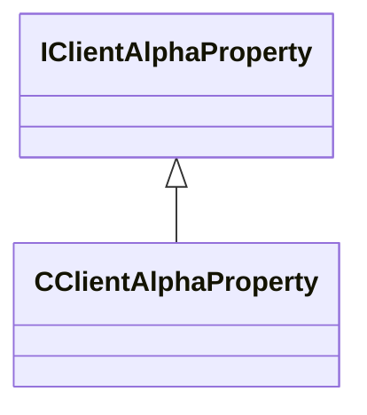

[Schemas](../../schemas.md) / [client](../client.md) / IClientAlphaProperty

# IClientAlphaProperty

**Kind:** class · **Size:** 8 bytes (`0x8`) · **Align:** 255 · **Module:** client

**Derived by:** [CClientAlphaProperty](../client/CClientAlphaProperty.md)

**Relationships:**

