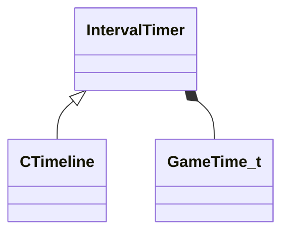

[Schemas](../../schemas.md) / [client](../client.md) / IntervalTimer

# IntervalTimer

> Source: **Build 25000182** · 2026-08-28 · `windows-x86_64` · schema `0.10.0`

**Kind:** class · **Size:** 16 bytes (`0x10`) · **Align:** 8 · **Module:** client

**Twin:** [IntervalTimer (server)](../server/IntervalTimer.md)

**Derived by:** [CTimeline](../client/CTimeline.md)

**Relationships:**

## Memory layout

2 fields (2 declared here, 0 inherited). Offsets are absolute from the object base.

| Offset | Field | Type | From | Annotations |
|--------|-------|------|------|-------------|
| `0x8` | `m_timestamp` | [GameTime_t](../entity2/GameTime_t.md) |  |  |
| `0xc` | `m_nWorldGroupId` | WorldGroupId_t |  |  |

KV3 class defaults

<pre>null</pre>

