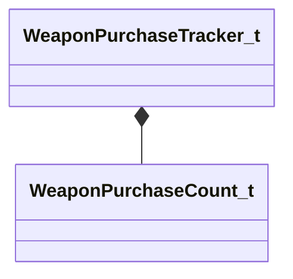

[Schemas](../../schemas.md) / [client](../client.md) / WeaponPurchaseTracker_t

# WeaponPurchaseTracker_t

**Kind:** class · **Size:** 112 bytes (`0x70`) · **Align:** 255 · **Module:** client

**Relationships:**

## Memory layout

1 fields (1 declared here, 0 inherited). Offsets are absolute from the object base.

| Offset | Field | Type | From | Annotations |
|--------|-------|------|------|-------------|
| `0x8` | `m_weaponPurchases` | C_UtlVectorEmbeddedNetworkVar< [WeaponPurchaseCount_t](../client/WeaponPurchaseCount_t.md) > |  |  |
