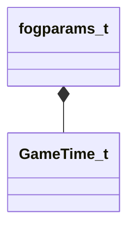

[Schemas](../../schemas.md) / [client](../client.md) / fogparams_t

# fogparams_t

**Kind:** class · **Size:** 104 bytes (`0x68`) · **Align:** 8 · **Module:** client

**Relationships:**

## Memory layout

25 fields (25 declared here, 0 inherited). Offsets are absolute from the object base.

| Offset | Field | Type | From | Annotations |
|--------|-------|------|------|-------------|
| `0x8` | `dirPrimary` | Vector |  |  |
| `0x14` | `colorPrimary` | Color |  |  |
| `0x18` | `colorSecondary` | Color |  |  |
| `0x1c` | `colorPrimaryLerpTo` | Color |  | `MNotSaved` |
| `0x20` | `colorSecondaryLerpTo` | Color |  | `MNotSaved` |
| `0x24` | `start` | float32 |  |  |
| `0x28` | `end` | float32 |  |  |
| `0x2c` | `farz` | float32 |  |  |
| `0x30` | `maxdensity` | float32 |  |  |
| `0x34` | `exponent` | float32 |  |  |
| `0x38` | `HDRColorScale` | float32 |  |  |
| `0x3c` | `skyboxFogFactor` | float32 |  | `MNotSaved` |
| `0x40` | `skyboxFogFactorLerpTo` | float32 |  | `MNotSaved` |
| `0x44` | `startLerpTo` | float32 |  | `MNotSaved` |
| `0x48` | `endLerpTo` | float32 |  | `MNotSaved` |
| `0x4c` | `maxdensityLerpTo` | float32 |  | `MNotSaved` |
| `0x50` | `lerptime` | [GameTime_t](../entity2/GameTime_t.md) |  | `MNotSaved` |
| `0x54` | `duration` | float32 |  |  |
| `0x58` | `blendtobackground` | float32 |  |  |
| `0x5c` | `scattering` | float32 |  |  |
| `0x60` | `locallightscale` | float32 |  |  |
| `0x64` | `enable` | bool |  |  |
| `0x65` | `blend` | bool |  |  |
| `0x66` | `m_bPadding2` | bool |  | `MNotSaved` |
| `0x67` | `m_bPadding` | bool |  | `MNotSaved` |

KV3 class defaults

<pre>{
	&quot;_class&quot;: &quot;fogparams_t&quot;,
	&quot;dirPrimary&quot;:
	[
		1.000000,
		0.000000,
		0.000000
	],
	&quot;colorPrimary&quot;:
	[
		0,
		0,
		0,
		0
	],
	&quot;colorSecondary&quot;:
	[
		0,
		0,
		0,
		0
	],
	&quot;start&quot;: 0.000000,
	&quot;end&quot;: 0.000000,
	&quot;farz&quot;: 0.000000,
	&quot;maxdensity&quot;: 0.000000,
	&quot;exponent&quot;: 0.000000,
	&quot;HDRColorScale&quot;: 0.000000,
	&quot;duration&quot;: 0.000000,
	&quot;blendtobackground&quot;: 0.000000,
	&quot;scattering&quot;: 0.000000,
	&quot;locallightscale&quot;: 1.000000,
	&quot;enable&quot;: false,
	&quot;blend&quot;: false
}</pre>

