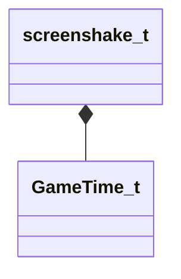

[Schemas](../../schemas.md) / [client](../client.md) / screenshake_t

# screenshake_t

> Source: **Build 25000182** · 2026-08-28 · `windows-x86_64` · schema `0.10.0`

**Kind:** class · **Size:** 56 bytes (`0x38`) · **Align:** 4 · **Module:** client

**Relationships:**

## Memory layout

9 fields (9 declared here, 0 inherited). Offsets are absolute from the object base.

| Offset | Field | Type | From | Annotations |
|--------|-------|------|------|-------------|
| `0x0` | `endtime` | [GameTime_t](../entity2/GameTime_t.md) |  |  |
| `0x4` | `duration` | float32 |  |  |
| `0x8` | `amplitude` | float32 |  |  |
| `0xc` | `frequency` | float32 |  |  |
| `0x10` | `nextShake` | [GameTime_t](../entity2/GameTime_t.md) |  |  |
| `0x14` | `offset` | Vector |  |  |
| `0x20` | `angle` | float32 |  |  |
| `0x28` | `direction` | Vector |  |  |
| `0x34` | `nShakeType` | uint8 |  |  |

KV3 class defaults

<pre>{
	&quot;endtime&quot;: null,
	&quot;duration&quot;: 0.000000,
	&quot;amplitude&quot;: 0.000000,
	&quot;frequency&quot;: 0.000000,
	&quot;nextShake&quot;: null,
	&quot;offset&quot;:
	[
		0.000000,
		0.000000,
		0.000000
	],
	&quot;angle&quot;: 0.000000,
	&quot;direction&quot;:
	[
		0.000000,
		0.000000,
		0.000000
	],
	&quot;nShakeType&quot;: 0
}</pre>

