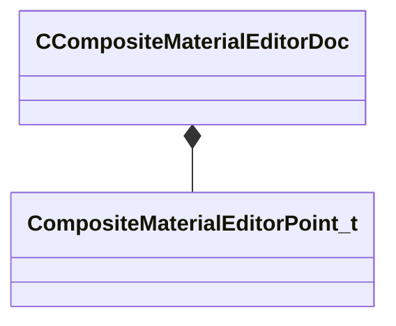
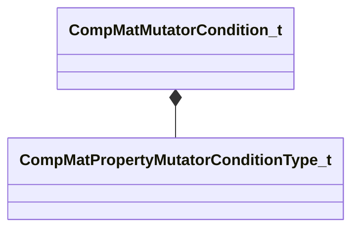
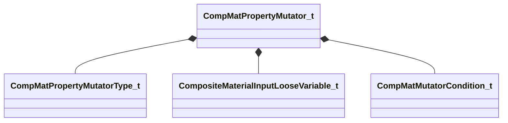
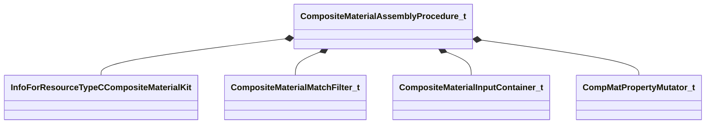
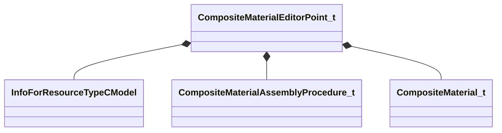
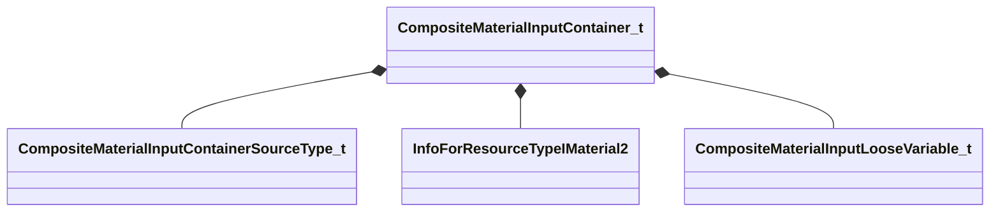
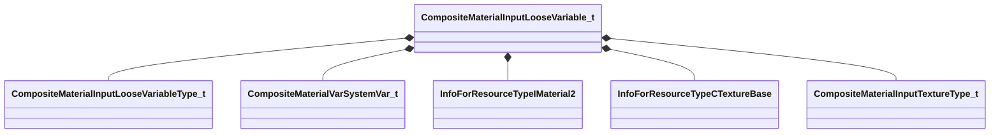
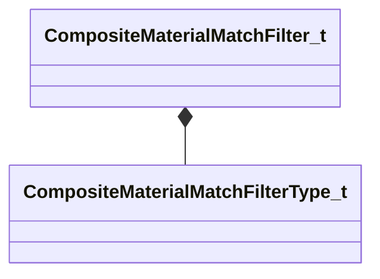
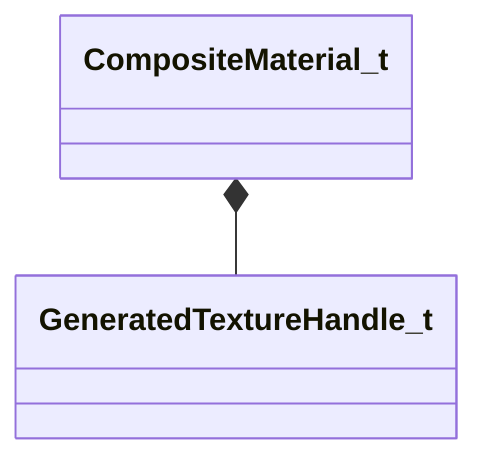

# Module: compositematerialslib

[📊 View UML Diagram](../diagrams/compositematerialslib.md)

| Name | Kind | Bases | Fields |
|------|------|-------|--------|
| [CCompositeMaterialEditorDoc](#ccompositematerialeditordoc) | class |  | 3 |
| [CompMatMutatorCondition_t](#compmatmutatorcondition_t) | class |  | 5 |
| [CompMatPropertyMutatorConditionType_t](#compmatpropertymutatorconditiontype_t) | enum |  | 3 |
| [CompMatPropertyMutatorType_t](#compmatpropertymutatortype_t) | enum |  | 10 |
| [CompMatPropertyMutator_t](#compmatpropertymutator_t) | class |  | 29 |
| [CompositeMaterialAssemblyProcedure_t](#compositematerialassemblyprocedure_t) | class |  | 4 |
| [CompositeMaterialEditorPoint_t](#compositematerialeditorpoint_t) | class |  | 8 |
| [CompositeMaterialInputContainerSourceType_t](#compositematerialinputcontainersourcetype_t) | enum |  | 6 |
| [CompositeMaterialInputContainer_t](#compositematerialinputcontainer_t) | class |  | 8 |
| [CompositeMaterialInputLooseVariableType_t](#compositematerialinputloosevariabletype_t) | enum |  | 15 |
| [CompositeMaterialInputLooseVariable_t](#compositematerialinputloosevariable_t) | class |  | 37 |
| [CompositeMaterialInputTextureType_t](#compositematerialinputtexturetype_t) | enum |  | 8 |
| [CompositeMaterialMatchFilterType_t](#compositematerialmatchfiltertype_t) | enum |  | 6 |
| [CompositeMaterialMatchFilter_t](#compositematerialmatchfilter_t) | class |  | 4 |
| [CompositeMaterialVarSystemVar_t](#compositematerialvarsystemvar_t) | enum |  | 2 |
| [CompositeMaterial_t](#compositematerial_t) | class |  | 4 |
| [GeneratedTextureHandle_t](#generatedtexturehandle_t) | class |  | 1 |

---

### CCompositeMaterialEditorDoc

**Metadata:** `MGetKV3ClassDefaults {
	"_class": "CCompositeMaterialEditorDoc",
	"m_nVersion": 1,
	"m_Points":
	[
	],
	"m_KVthumbnail": null
}`

**Relationships:**

**Fields:**

| Name | Type | Annotations |
|------|------|-------------|
| `m_nVersion` | int32 |  |
| `m_Points` | CUtlVector<[CompositeMaterialEditorPoint_t](../schemas/compositematerialslib.md#compositematerialeditorpoint_t)> |  |
| `m_KVthumbnail` | KeyValues3 |  |

### CompMatMutatorCondition_t

**Metadata:** `MGetKV3ClassDefaults {
	"m_nMutatorCondition": "COMP_MAT_MUTATOR_CONDITION_INPUT_CONTAINER_EXISTS",
	"m_strMutatorConditionContainerName": "",
	"m_strMutatorConditionContainerVarName": "",
	"m_strMutatorConditionContainerVarValue": "",
	"m_bPassWhenTrue": true
}`, `MPropertyElementNameFn`

**Relationships:**

**Fields:**

| Name | Type | Annotations |
|------|------|-------------|
| `m_nMutatorCondition` | [CompMatPropertyMutatorConditionType_t](../schemas/compositematerialslib.md#compmatpropertymutatorconditiontype_t) | `MPropertyAutoRebuildOnChange` `MPropertyFriendlyName "Condition"` |
| `m_strMutatorConditionContainerName` | CUtlString | `MPropertyFriendlyName "Container Name"` `MPropertyAttrStateCallback` |
| `m_strMutatorConditionContainerVarName` | CUtlString | `MPropertyFriendlyName "Variable Name"` `MPropertyAttrStateCallback` |
| `m_strMutatorConditionContainerVarValue` | CUtlString | `MPropertyFriendlyName "Variable Value"` `MPropertyAttrStateCallback` |
| `m_bPassWhenTrue` | bool | `MPropertyFriendlyName "Pass when True"` |

### CompMatPropertyMutatorConditionType_t

**Values:**

| Name | Value | Description |
|------|-------|-------------|
| `COMP_MAT_MUTATOR_CONDITION_INPUT_CONTAINER_EXISTS` | 0 | Input Container Exists |
| `COMP_MAT_MUTATOR_CONDITION_INPUT_CONTAINER_VALUE_EXISTS` | 1 | Input Container Variable Exists |
| `COMP_MAT_MUTATOR_CONDITION_INPUT_CONTAINER_VALUE_EQUALS` | 2 | Input Container Variable Exists and Equals |

### CompMatPropertyMutatorType_t

**Values:**

| Name | Value | Description |
|------|-------|-------------|
| `COMP_MAT_PROPERTY_MUTATOR_INIT` | 0 | Init With |
| `COMP_MAT_PROPERTY_MUTATOR_COPY_MATCHING_KEYS` | 1 | Copy Matching Keys From |
| `COMP_MAT_PROPERTY_MUTATOR_COPY_KEYS_WITH_SUFFIX` | 2 | Copy Keys with Suffix |
| `COMP_MAT_PROPERTY_MUTATOR_COPY_PROPERTY` | 3 | Copy Property From |
| `COMP_MAT_PROPERTY_MUTATOR_SET_VALUE` | 4 | Set Value |
| `COMP_MAT_PROPERTY_MUTATOR_GENERATE_TEXTURE` | 5 | Generate Texture |
| `COMP_MAT_PROPERTY_MUTATOR_CONDITIONAL_MUTATORS` | 6 | Mutators |
| `COMP_MAT_PROPERTY_MUTATOR_POP_INPUT_QUEUE` | 7 | Pop Input Variable Queue |
| `COMP_MAT_PROPERTY_MUTATOR_DRAW_TEXT` | 8 | Draw Text |
| `COMP_MAT_PROPERTY_MUTATOR_RANDOM_ROLL_INPUT_VARIABLES` | 9 | Random Roll Input Variables |

### CompMatPropertyMutator_t

**Metadata:** `MGetKV3ClassDefaults {
	"m_bEnabled": true,
	"m_nMutatorCommandType": "COMP_MAT_PROPERTY_MUTATOR_SET_VALUE",
	"m_strInitWith_Container": "",
	"m_strCopyProperty_InputContainerSrc": "",
	"m_strCopyProperty_InputContainerProperty": "",
	"m_strCopyProperty_TargetProperty": "",
	"m_strRandomRollInputVars_SeedInputVar": "",
	"m_vecRandomRollInputVars_InputVarsToRoll":
	[
	],
	"m_strCopyMatchingKeys_InputContainerSrc": "",
	"m_strCopyKeysWithSuffix_InputContainerSrc": "",
	"m_strCopyKeysWithSuffix_FindSuffix": "",
	"m_strCopyKeysWithSuffix_ReplaceSuffix": "",
	"m_nSetValue_Value":
	{
		"m_strName": "",
		"m_bExposeExternally": false,
		"m_strExposedFriendlyName": "",
		"m_strExposedFriendlyGroupName": "",
		"m_bExposedVariableIsFixedRange": false,
		"m_strExposedVisibleWhenTrue": "",
		"m_strExposedHiddenWhenTrue": "",
		"m_strExposedValueList": "",
		"m_nVariableType": "LOOSE_VARIABLE_TYPE_FLOAT1",
		"m_bValueBoolean": false,
		"m_nValueIntX": 0,
		"m_nValueIntY": 0,
		"m_nValueIntZ": 0,
		"m_nValueIntW": 0,
		"m_bHasFloatBounds": false,
		"m_flValueFloatX": 0.000000,
		"m_flValueFloatX_Min": 0.000000,
		"m_flValueFloatX_Max": 1.000000,
		"m_flValueFloatY": 0.000000,
		"m_flValueFloatY_Min": 0.000000,
		"m_flValueFloatY_Max": 1.000000,
		"m_flValueFloatZ": 0.000000,
		"m_flValueFloatZ_Min": 0.000000,
		"m_flValueFloatZ_Max": 1.000000,
		"m_flValueFloatW": 0.000000,
		"m_flValueFloatW_Min": 0.000000,
		"m_flValueFloatW_Max": 1.000000,
		"m_cValueColor4":
		[
			0,
			0,
			0,
			0
		],
		"m_nValueSystemVar": "COMPMATSYSVAR_COMPOSITETIME",
		"m_strResourceMaterial": "",
		"m_strTextureContentAssetPath": "",
		"m_strTextureRuntimeResourcePath": "",
		"m_strTextureCompilationVtexTemplate": "",
		"m_nTextureType": "INPUT_TEXTURE_TYPE_DEFAULT",
		"m_strString": "",
		"m_strPanoramaPanelPath": "",
		"m_nPanoramaRenderRes": 512
	},
	"m_strGenerateTexture_TargetParam": "",
	"m_strGenerateTexture_InitialContainer": "",
	"m_nResolution": 256,
	"m_bIsScratchTarget": false,
	"m_strCompressionFormat": "",
	"m_bSplatDebugInfo": false,
	"m_bCaptureInRenderDoc": false,
	"m_vecTexGenInstructions":
	[
	],
	"m_vecConditionalMutators":
	[
	],
	"m_strPopInputQueue_Container": "",
	"m_strDrawText_InputContainerSrc": "",
	"m_strDrawText_InputContainerProperty": "",
	"m_vecDrawText_Position":
	[
		0.000000,
		0.000000
	],
	"m_colDrawText_Color":
	[
		255,
		255,
		255
	],
	"m_strDrawText_Font": "Times New Roman",
	"m_vecConditions":
	[
	]
}`, `MPropertyElementNameFn`

**Relationships:**

**Fields:**

| Name | Type | Annotations |
|------|------|-------------|
| `m_bEnabled` | bool | `MPropertyAutoRebuildOnChange` `MPropertyFriendlyName "Enabled"` |
| `m_nMutatorCommandType` | [CompMatPropertyMutatorType_t](../schemas/compositematerialslib.md#compmatpropertymutatortype_t) | `MPropertyAutoRebuildOnChange` `MPropertyFriendlyName "Mutator Command"` `MPropertyAttrStateCallback` |
| `m_strInitWith_Container` | CUtlString | `MPropertyFriendlyName "Container to Init With"` `MPropertyAttrStateCallback` |
| `m_strCopyProperty_InputContainerSrc` | CUtlString | `MPropertyFriendlyName "Input Container"` `MPropertyAttrStateCallback` |
| `m_strCopyProperty_InputContainerProperty` | CUtlString | `MPropertyFriendlyName "Input Container Property"` `MPropertyAttrStateCallback` |
| `m_strCopyProperty_TargetProperty` | CUtlString | `MPropertyFriendlyName "Target Property"` `MPropertyAttrStateCallback` |
| `m_strRandomRollInputVars_SeedInputVar` | CUtlString | `MPropertyFriendlyName "Seed Input Var"` `MPropertyAttrStateCallback` |
| `m_vecRandomRollInputVars_InputVarsToRoll` | CUtlVector<CUtlString> | `MPropertyFriendlyName "Input Vars"` `MPropertyAttrStateCallback` |
| `m_strCopyMatchingKeys_InputContainerSrc` | CUtlString | `MPropertyFriendlyName "Input Container"` `MPropertyAttrStateCallback` |
| `m_strCopyKeysWithSuffix_InputContainerSrc` | CUtlString | `MPropertyFriendlyName "Input Container"` `MPropertyAttrStateCallback` |
| `m_strCopyKeysWithSuffix_FindSuffix` | CUtlString | `MPropertyFriendlyName "Find Suffix"` `MPropertyAttrStateCallback` |
| `m_strCopyKeysWithSuffix_ReplaceSuffix` | CUtlString | `MPropertyFriendlyName "Replace Suffix"` `MPropertyAttrStateCallback` |
| `m_nSetValue_Value` | [CompositeMaterialInputLooseVariable_t](../schemas/compositematerialslib.md#compositematerialinputloosevariable_t) | `MPropertyFriendlyName "Value"` `MPropertyAttrStateCallback` |
| `m_strGenerateTexture_TargetParam` | CUtlString | `MPropertyFriendlyName "Target Texture Param"` `MPropertyAttrStateCallback` |
| `m_strGenerateTexture_InitialContainer` | CUtlString | `MPropertyFriendlyName "Initial Container"` `MPropertyAttrStateCallback` |
| `m_nResolution` | int32 | `MPropertyFriendlyName "Resolution"` `MPropertyAttrStateCallback` |
| `m_bIsScratchTarget` | bool | `MPropertyAutoRebuildOnChange` `MPropertyFriendlyName "Scratch Target"` `MPropertyAttrStateCallback` |
| `m_strCompressionFormat` | CUtlString | `MPropertyFriendlyName "Compression Format"` `MPropertyAttrStateCallback` |
| `m_bSplatDebugInfo` | bool | `MPropertyAutoRebuildOnChange` `MPropertyFriendlyName "Splat Debug info on Texture"` `MPropertyAttrStateCallback` |
| `m_bCaptureInRenderDoc` | bool | `MPropertyAutoRebuildOnChange` `MPropertyFriendlyName "Capture in RenderDoc"` `MPropertyAttrStateCallback` |
| `m_vecTexGenInstructions` | CUtlVector<[CompMatPropertyMutator_t](../schemas/compositematerialslib.md#compmatpropertymutator_t)> | `MPropertyFriendlyName "Texture Generation Instructions"` `MPropertyAttrStateCallback` |
| `m_vecConditionalMutators` | CUtlVector<[CompMatPropertyMutator_t](../schemas/compositematerialslib.md#compmatpropertymutator_t)> | `MPropertyFriendlyName "Mutators"` `MPropertyAttrStateCallback` |
| `m_strPopInputQueue_Container` | CUtlString | `MPropertyFriendlyName "Container to Pop"` `MPropertyAttrStateCallback` |
| `m_strDrawText_InputContainerSrc` | CUtlString | `MPropertyFriendlyName "Input Container"` `MPropertyAttrStateCallback` |
| `m_strDrawText_InputContainerProperty` | CUtlString | `MPropertyFriendlyName "Input Container Property"` `MPropertyAttrStateCallback` |
| `m_vecDrawText_Position` | Vector2D | `MPropertyFriendlyName "Text Position"` `MPropertyAttrStateCallback` |
| `m_colDrawText_Color` | Color | `MPropertyFriendlyName "Text Color"` `MPropertyAttrStateCallback` |
| `m_strDrawText_Font` | CUtlString | `MPropertyFriendlyName "Font"` `MPropertyAttrStateCallback` |
| `m_vecConditions` | CUtlVector<[CompMatMutatorCondition_t](../schemas/compositematerialslib.md#compmatmutatorcondition_t)> | `MPropertyFriendlyName "Conditions"` `MPropertyAttrStateCallback` |

### CompositeMaterialAssemblyProcedure_t

**Metadata:** `MGetKV3ClassDefaults {
	"m_vecCompMatIncludes":
	[
	],
	"m_vecMatchFilters":
	[
	],
	"m_vecCompositeInputContainers":
	[
	],
	"m_vecPropertyMutators":
	[
	]
}`, `MPropertyElementNameFn`

**Relationships:**

**Fields:**

| Name | Type | Annotations |
|------|------|-------------|
| `m_vecCompMatIncludes` | CUtlVector<CResourceNameTyped<CWeakHandle<[InfoForResourceTypeCCompositeMaterialKit](../schemas/resourcesystem.md#infoforresourcetypeccompositematerialkit)>>> | `MPropertyFriendlyName "Includes"` |
| `m_vecMatchFilters` | CUtlVector<[CompositeMaterialMatchFilter_t](../schemas/compositematerialslib.md#compositematerialmatchfilter_t)> | `MPropertyFriendlyName "Match Filters"` |
| `m_vecCompositeInputContainers` | CUtlVector<[CompositeMaterialInputContainer_t](../schemas/compositematerialslib.md#compositematerialinputcontainer_t)> | `MPropertyFriendlyName "Composite Inputs"` |
| `m_vecPropertyMutators` | CUtlVector<[CompMatPropertyMutator_t](../schemas/compositematerialslib.md#compmatpropertymutator_t)> | `MPropertyFriendlyName "Property Mutators"` |

### CompositeMaterialEditorPoint_t

**Metadata:** `MGetKV3ClassDefaults {
	"m_ModelName": "",
	"m_nSequenceIndex": 0,
	"m_flCycle": 0.000000,
	"m_KVModelStateChoices": null,
	"m_bEnableChildModel": false,
	"m_ChildModelName": "",
	"m_vecCompositeMaterialAssemblyProcedures":
	[
	]
}`

**Relationships:**

**Fields:**

| Name | Type | Annotations |
|------|------|-------------|
| `m_ModelName` | CResourceNameTyped<CWeakHandle<[InfoForResourceTypeCModel](../schemas/resourcesystem.md#infoforresourcetypecmodel)>> | `MPropertyGroupName "Preview Model"` `MPropertyFriendlyName "Target Model"` |
| `m_nSequenceIndex` | int32 | `MPropertyGroupName "Preview Model"` `MPropertyFriendlyName "Animation"` |
| `m_flCycle` | float32 | `MPropertyGroupName "Preview Model"` `MPropertyFriendlyName "Animation Cycle"` `MPropertyAttributeRange "0.0 1.0"` |
| `m_KVModelStateChoices` | KeyValues3 | `MPropertyGroupName "Preview Model"` `MPropertyFriendlyName "Model Preview State"` `MPropertyAttributeEditor "CompositeMaterialUserModelStateSetting"` |
| `m_bEnableChildModel` | bool | `MPropertyAutoRebuildOnChange` `MPropertyGroupName "Preview Model"` `MPropertyFriendlyName "Enable Child Model"` |
| `m_ChildModelName` | CResourceNameTyped<CWeakHandle<[InfoForResourceTypeCModel](../schemas/resourcesystem.md#infoforresourcetypecmodel)>> | `MPropertyGroupName "Preview Model"` `MPropertyFriendlyName "Child Model"` `MPropertyAttrStateCallback` |
| `m_vecCompositeMaterialAssemblyProcedures` | CUtlVector<[CompositeMaterialAssemblyProcedure_t](../schemas/compositematerialslib.md#compositematerialassemblyprocedure_t)> | `MPropertyGroupName "Composite Material Assembly"` `MPropertyFriendlyName "Composite Material Assembly Procedures"` |
| `m_vecCompositeMaterials` | CUtlVector<[CompositeMaterial_t](../schemas/compositematerialslib.md#compositematerial_t)> | `MPropertyFriendlyName "Generated Composite Materials"` |

### CompositeMaterialInputContainerSourceType_t

**Values:**

| Name | Value | Description |
|------|-------|-------------|
| `CONTAINER_SOURCE_TYPE_TARGET_MATERIAL` | 0 | Target Material |
| `CONTAINER_SOURCE_TYPE_MATERIAL_FROM_TARGET_ATTR` | 1 | Material from Target Material Attr |
| `CONTAINER_SOURCE_TYPE_SPECIFIC_MATERIAL` | 2 | Specified Material |
| `CONTAINER_SOURCE_TYPE_LOOSE_VARIABLES` | 3 | Loose Variables |
| `CONTAINER_SOURCE_TYPE_VARIABLE_FROM_TARGET_ATTR` | 4 | Variable from Target Material Attr |
| `CONTAINER_SOURCE_TYPE_TARGET_INSTANCE_MATERIAL` | 5 | Target Instance Material |

### CompositeMaterialInputContainer_t

**Metadata:** `MGetKV3ClassDefaults {
	"m_bEnabled": true,
	"m_nCompositeMaterialInputContainerSourceType": "CONTAINER_SOURCE_TYPE_TARGET_MATERIAL",
	"m_strSpecificContainerMaterial": "",
	"m_strAttrName": "",
	"m_strAlias": "",
	"m_vecLooseVariables":
	[
	],
	"m_strAttrNameForVar": "",
	"m_bExposeExternally": false
}`, `MPropertyElementNameFn`

**Relationships:**

**Fields:**

| Name | Type | Annotations |
|------|------|-------------|
| `m_bEnabled` | bool | `MPropertyAutoRebuildOnChange` `MPropertyFriendlyName "Enabled"` |
| `m_nCompositeMaterialInputContainerSourceType` | [CompositeMaterialInputContainerSourceType_t](../schemas/compositematerialslib.md#compositematerialinputcontainersourcetype_t) | `MPropertyAutoRebuildOnChange` `MPropertyFriendlyName "Input Container Source"` `MPropertyAttrStateCallback` |
| `m_strSpecificContainerMaterial` | CResourceNameTyped<CWeakHandle<[InfoForResourceTypeIMaterial2](../schemas/resourcesystem.md#infoforresourcetypeimaterial2)>> | `MPropertyFriendlyName "Specific Material"` `MPropertyAttrStateCallback` |
| `m_strAttrName` | CUtlString | `MPropertyFriendlyName "Attribute Name"` `MPropertyAttrStateCallback` |
| `m_strAlias` | CUtlString | `MPropertyFriendlyName "Alias"` `MPropertyAttrStateCallback` |
| `m_vecLooseVariables` | CUtlVector<[CompositeMaterialInputLooseVariable_t](../schemas/compositematerialslib.md#compositematerialinputloosevariable_t)> | `MPropertyFriendlyName "Variables"` `MPropertyAttrStateCallback` |
| `m_strAttrNameForVar` | CUtlString | `MPropertyFriendlyName "Attribute Name"` `MPropertyAttrStateCallback` |
| `m_bExposeExternally` | bool | `MPropertyFriendlyName "Expose Externally"` `MPropertyAttrStateCallback` |

### CompositeMaterialInputLooseVariableType_t

**Values:**

| Name | Value | Description |
|------|-------|-------------|
| `LOOSE_VARIABLE_TYPE_BOOLEAN` | 0 | Boolean |
| `LOOSE_VARIABLE_TYPE_INTEGER1` | 1 | Integer |
| `LOOSE_VARIABLE_TYPE_INTEGER2` | 2 | Integer2 |
| `LOOSE_VARIABLE_TYPE_INTEGER3` | 3 | Integer3 |
| `LOOSE_VARIABLE_TYPE_INTEGER4` | 4 | Integer4 |
| `LOOSE_VARIABLE_TYPE_FLOAT1` | 5 | Float |
| `LOOSE_VARIABLE_TYPE_FLOAT2` | 6 | Float2 |
| `LOOSE_VARIABLE_TYPE_FLOAT3` | 7 | Float3 |
| `LOOSE_VARIABLE_TYPE_FLOAT4` | 8 | Float4 |
| `LOOSE_VARIABLE_TYPE_COLOR4` | 9 | Color4 |
| `LOOSE_VARIABLE_TYPE_STRING` | 10 | String |
| `LOOSE_VARIABLE_TYPE_SYSTEMVAR` | 11 | System Variable |
| `LOOSE_VARIABLE_TYPE_RESOURCE_MATERIAL` | 12 | Material |
| `LOOSE_VARIABLE_TYPE_RESOURCE_TEXTURE` | 13 | Texture |
| `LOOSE_VARIABLE_TYPE_PANORAMA_RENDER` | 14 | Panorama Render |

### CompositeMaterialInputLooseVariable_t

**Metadata:** `MGetKV3ClassDefaults {
	"m_strName": "",
	"m_bExposeExternally": false,
	"m_strExposedFriendlyName": "",
	"m_strExposedFriendlyGroupName": "",
	"m_bExposedVariableIsFixedRange": false,
	"m_strExposedVisibleWhenTrue": "",
	"m_strExposedHiddenWhenTrue": "",
	"m_strExposedValueList": "",
	"m_nVariableType": "LOOSE_VARIABLE_TYPE_FLOAT1",
	"m_bValueBoolean": false,
	"m_nValueIntX": 0,
	"m_nValueIntY": 0,
	"m_nValueIntZ": 0,
	"m_nValueIntW": 0,
	"m_bHasFloatBounds": false,
	"m_flValueFloatX": 0.000000,
	"m_flValueFloatX_Min": 0.000000,
	"m_flValueFloatX_Max": 1.000000,
	"m_flValueFloatY": 0.000000,
	"m_flValueFloatY_Min": 0.000000,
	"m_flValueFloatY_Max": 1.000000,
	"m_flValueFloatZ": 0.000000,
	"m_flValueFloatZ_Min": 0.000000,
	"m_flValueFloatZ_Max": 1.000000,
	"m_flValueFloatW": 0.000000,
	"m_flValueFloatW_Min": 0.000000,
	"m_flValueFloatW_Max": 1.000000,
	"m_cValueColor4":
	[
		0,
		0,
		0,
		0
	],
	"m_nValueSystemVar": "COMPMATSYSVAR_COMPOSITETIME",
	"m_strResourceMaterial": "",
	"m_strTextureContentAssetPath": "",
	"m_strTextureRuntimeResourcePath": "",
	"m_strTextureCompilationVtexTemplate": "",
	"m_nTextureType": "INPUT_TEXTURE_TYPE_DEFAULT",
	"m_strString": "",
	"m_strPanoramaPanelPath": "",
	"m_nPanoramaRenderRes": 512
}`, `MPropertyElementNameFn`

**Relationships:**

**Fields:**

| Name | Type | Annotations |
|------|------|-------------|
| `m_strName` | CUtlString | `MPropertyFriendlyName "Name"` `MPropertyAttrStateCallback` |
| `m_bExposeExternally` | bool | `MPropertyAutoRebuildOnChange` `MPropertyFriendlyName "Expose Externally"` |
| `m_strExposedFriendlyName` | CUtlString | `MPropertyFriendlyName "Exposed Friendly Name"` `MPropertyAttrStateCallback` |
| `m_strExposedFriendlyGroupName` | CUtlString | `MPropertyFriendlyName "Exposed Friendly Group"` `MPropertyAttrStateCallback` |
| `m_bExposedVariableIsFixedRange` | bool | `MPropertyFriendlyName "Exposed Fixed Range"` `MPropertyAttrStateCallback` |
| `m_strExposedVisibleWhenTrue` | CUtlString | `MPropertyFriendlyName "Exposed SetVisible When True"` `MPropertyAttrStateCallback` |
| `m_strExposedHiddenWhenTrue` | CUtlString | `MPropertyFriendlyName "Exposed SetHidden When True"` `MPropertyAttrStateCallback` |
| `m_strExposedValueList` | CUtlString | `MPropertyFriendlyName "Exposed Value List"` `MPropertyAttrStateCallback` |
| `m_nVariableType` | [CompositeMaterialInputLooseVariableType_t](../schemas/compositematerialslib.md#compositematerialinputloosevariabletype_t) | `MPropertyAutoRebuildOnChange` `MPropertyFriendlyName "Type"` |
| `m_bValueBoolean` | bool | `MPropertyFriendlyName "Value"` `MPropertyAttrStateCallback` |
| `m_nValueIntX` | int32 | `MPropertyFriendlyName "X Value"` `MPropertyAttrStateCallback` `MPropertyAttributeRange "0 255"` |
| `m_nValueIntY` | int32 | `MPropertyFriendlyName "Y Value"` `MPropertyAttrStateCallback` `MPropertyAttributeRange "0 255"` |
| `m_nValueIntZ` | int32 | `MPropertyFriendlyName "Z Value"` `MPropertyAttrStateCallback` `MPropertyAttributeRange "0 255"` |
| `m_nValueIntW` | int32 | `MPropertyFriendlyName "W Value"` `MPropertyAttrStateCallback` `MPropertyAttributeRange "0 255"` |
| `m_bHasFloatBounds` | bool | `MPropertyFriendlyName "Specify Min/Max"` `MPropertyAttrStateCallback` |
| `m_flValueFloatX` | float32 | `MPropertyFriendlyName "X Value"` `MPropertyAttrStateCallback` `MPropertyAttributeRange "0.0 1.0"` |
| `m_flValueFloatX_Min` | float32 | `MPropertyFriendlyName "X Min"` `MPropertyAttrStateCallback` |
| `m_flValueFloatX_Max` | float32 | `MPropertyFriendlyName "X Max"` `MPropertyAttrStateCallback` |
| `m_flValueFloatY` | float32 | `MPropertyFriendlyName "Y Value"` `MPropertyAttrStateCallback` `MPropertyAttributeRange "0.0 1.0"` |
| `m_flValueFloatY_Min` | float32 | `MPropertyFriendlyName "Y Min"` `MPropertyAttrStateCallback` |
| `m_flValueFloatY_Max` | float32 | `MPropertyFriendlyName "Y Max"` `MPropertyAttrStateCallback` |
| `m_flValueFloatZ` | float32 | `MPropertyFriendlyName "Z Value"` `MPropertyAttrStateCallback` `MPropertyAttributeRange "0.0 1.0"` |
| `m_flValueFloatZ_Min` | float32 | `MPropertyFriendlyName "Z Min"` `MPropertyAttrStateCallback` |
| `m_flValueFloatZ_Max` | float32 | `MPropertyFriendlyName "Z Max"` `MPropertyAttrStateCallback` |
| `m_flValueFloatW` | float32 | `MPropertyFriendlyName "W Value"` `MPropertyAttrStateCallback` `MPropertyAttributeRange "0.0 1.0"` |
| `m_flValueFloatW_Min` | float32 | `MPropertyFriendlyName "W Min"` `MPropertyAttrStateCallback` |
| `m_flValueFloatW_Max` | float32 | `MPropertyFriendlyName "W Max"` `MPropertyAttrStateCallback` |
| `m_cValueColor4` | Color | `MPropertyFriendlyName "Value"` `MPropertyAttrStateCallback` |
| `m_nValueSystemVar` | [CompositeMaterialVarSystemVar_t](../schemas/compositematerialslib.md#compositematerialvarsystemvar_t) | `MPropertyFriendlyName "Value"` `MPropertyAttrStateCallback` |
| `m_strResourceMaterial` | CResourceNameTyped<CWeakHandle<[InfoForResourceTypeIMaterial2](../schemas/resourcesystem.md#infoforresourcetypeimaterial2)>> | `MPropertyFriendlyName "Material"` `MPropertyAttrStateCallback` |
| `m_strTextureContentAssetPath` | CUtlString | `MPropertyFriendlyName "Texture"` `MPropertyAttributeEditor "AssetBrowse( jpg, png, psd, tga )"` `MPropertyAttrStateCallback` |
| `m_strTextureRuntimeResourcePath` | CResourceNameTyped<CWeakHandle<[InfoForResourceTypeCTextureBase](../schemas/resourcesystem.md#infoforresourcetypectexturebase)>> | `MPropertyHideField` |
| `m_strTextureCompilationVtexTemplate` | CUtlString | `MPropertyHideField` |
| `m_nTextureType` | [CompositeMaterialInputTextureType_t](../schemas/compositematerialslib.md#compositematerialinputtexturetype_t) | `MPropertyFriendlyName "Texture Type"` `MPropertyAttrStateCallback` |
| `m_strString` | CUtlString | `MPropertyFriendlyName "String"` `MPropertyAttrStateCallback` |
| `m_strPanoramaPanelPath` | CUtlString | `MPropertyFriendlyName "Layout XML"` `MPropertyAttrStateCallback` |
| `m_nPanoramaRenderRes` | int32 | `MPropertyFriendlyName "Render Resolution"` `MPropertyAttrStateCallback` |

### CompositeMaterialInputTextureType_t

**Values:**

| Name | Value | Description |
|------|-------|-------------|
| `INPUT_TEXTURE_TYPE_DEFAULT` | 0 | Default |
| `INPUT_TEXTURE_TYPE_NORMALMAP` | 1 | Normal Map |
| `INPUT_TEXTURE_TYPE_COLOR` | 2 | Color |
| `INPUT_TEXTURE_TYPE_MASKS` | 3 | Masks |
| `INPUT_TEXTURE_TYPE_ROUGHNESS` | 4 | Roughness |
| `INPUT_TEXTURE_TYPE_PEARLESCENCE_MASK` | 5 | Pearlescence Mask |
| `INPUT_TEXTURE_TYPE_AO` | 6 | Ambient Occlusion |
| `INPUT_TEXTURE_TYPE_POSITION` | 7 | Position |

### CompositeMaterialMatchFilterType_t

**Values:**

| Name | Value | Description |
|------|-------|-------------|
| `MATCH_FILTER_MATERIAL_ATTRIBUTE_EXISTS` | 0 | Target Material Attribute Exists |
| `MATCH_FILTER_MATERIAL_SHADER` | 1 | Target Material Shader Name |
| `MATCH_FILTER_MATERIAL_NAME_SUBSTR` | 2 | Target Material Name SubStr |
| `MATCH_FILTER_MATERIAL_ATTRIBUTE_EQUALS` | 3 | Target Material Attribute Equals |
| `MATCH_FILTER_MATERIAL_PROPERTY_EXISTS` | 4 | Target Material Property Exists |
| `MATCH_FILTER_MATERIAL_PROPERTY_EQUALS` | 5 | Target Material Property Equals |

### CompositeMaterialMatchFilter_t

**Metadata:** `MGetKV3ClassDefaults {
	"m_nCompositeMaterialMatchFilterType": "MATCH_FILTER_MATERIAL_ATTRIBUTE_EXISTS",
	"m_strMatchFilter": "composite_inputs",
	"m_strMatchValue": "",
	"m_bPassWhenTrue": true
}`, `MPropertyElementNameFn`

**Relationships:**

**Fields:**

| Name | Type | Annotations |
|------|------|-------------|
| `m_nCompositeMaterialMatchFilterType` | [CompositeMaterialMatchFilterType_t](../schemas/compositematerialslib.md#compositematerialmatchfiltertype_t) | `MPropertyFriendlyName "Match Type"` |
| `m_strMatchFilter` | CUtlString | `MPropertyFriendlyName "Name"` |
| `m_strMatchValue` | CUtlString | `MPropertyFriendlyName "Value"` `MPropertyAttrStateCallback` |
| `m_bPassWhenTrue` | bool | `MPropertyFriendlyName "Pass when True"` |

### CompositeMaterialVarSystemVar_t

**Values:**

| Name | Value | Description |
|------|-------|-------------|
| `COMPMATSYSVAR_COMPOSITETIME` | 0 | Composite Generation Time |
| `COMPMATSYSVAR_EMPTY_RESOURCE_SPACER` | 1 | Empty Resource Spacer |

### CompositeMaterial_t

**Metadata:** `MPropertyElementNameFn`

**Relationships:**

**Fields:**

| Name | Type | Annotations |
|------|------|-------------|
| `m_TargetKVs` | KeyValues3 | `MPropertyGroupName "Target Material"` `MPropertyAttributeEditor "CompositeMaterialKVInspector"` |
| `m_PreGenerationKVs` | KeyValues3 | `MPropertyGroupName "Pre-Generated Output Material"` `MPropertyAttributeEditor "CompositeMaterialKVInspector"` |
| `m_FinalKVs` | KeyValues3 | `MPropertyGroupName "Generated Composite Material"` `MPropertyAttributeEditor "CompositeMaterialKVInspector"` |
| `m_vecGeneratedTextures` | CUtlVector<[GeneratedTextureHandle_t](../schemas/compositematerialslib.md#generatedtexturehandle_t)> | `MPropertyFriendlyName "Generated Textures"` |

### GeneratedTextureHandle_t

**Metadata:** `MPropertyElementNameFn`

**Fields:**

| Name | Type | Annotations |
|------|------|-------------|
| `m_strBitmapName` | CUtlString | `MPropertyFriendlyName "Generated Texture"` `MPropertyAttributeEditor "CompositeMaterialTextureViewer"` |
